Tugas 1 Praktikum MPDW
================
Fadly Syabani
2026-09-01

## Packages

``` r
library(forecast)
```

    ## Warning: package 'forecast' was built under R version 4.5.3

``` r
library(graphics)
library(TTR)
```

    ## Warning: package 'TTR' was built under R version 4.5.3

``` r
library(TSA)
```

    ## Warning: package 'TSA' was built under R version 4.5.3

    ## Registered S3 methods overwritten by 'TSA':
    ##   method       from    
    ##   fitted.Arima forecast
    ##   plot.Arima   forecast

    ## 
    ## Attaching package: 'TSA'

    ## The following objects are masked from 'package:stats':
    ## 
    ##     acf, arima

    ## The following object is masked from 'package:utils':
    ## 
    ##     tar

``` r
library(rio)
```

    ## Warning: package 'rio' was built under R version 4.5.3

``` r
library(ggplot2)
```

    ## Warning: package 'ggplot2' was built under R version 4.5.2

## Impor Data

``` r
data <- read.csv("C:/Users/hp/Downloads/dataset_mpdw.csv")
data$tanggal <- as.Date(data$tanggal, format = "%m/%d/%Y")
head(data)
```

    ##      tanggal pm25
    ## 1 2024-09-18   76
    ## 2 2024-09-19   83
    ## 3 2024-09-20   88
    ## 4 2024-09-21   94
    ## 5 2024-09-22  101
    ## 6 2024-09-23   87

## Eksplorasi Data

`View()` : menampilkan data dalam bentuk tabel, `str()` : menampilkan
struktur data, `dim()` : menampilkan dimensi data

``` r
View(data)
str(data)
```

    ## 'data.frame':    161 obs. of  2 variables:
    ##  $ tanggal: Date, format: "2024-09-18" "2024-09-19" ...
    ##  $ pm25   : int  76 83 88 94 101 87 74 89 71 70 ...

``` r
dim(data)
```

    ## [1] 161   2

Mengubah data agar terbaca sebagai data deret waktu dengan fungsi `ts()`
dan menampilkan ringkasan data.

``` r
data.ts <- ts(data$pm25)
summary(data.ts)
```

    ##    Min. 1st Qu.  Median    Mean 3rd Qu.    Max. 
    ##   10.00   51.00   64.00   64.24   79.00  115.00

Membuat plot data deret waktu

``` r
ts.plot(data.ts, xlab="Periode", ylab="Konsentrasi PM2.5 (µg/m³)", 
        main = "Time Series Plot Konsentrasi PM2.5")
points(data.ts)
```

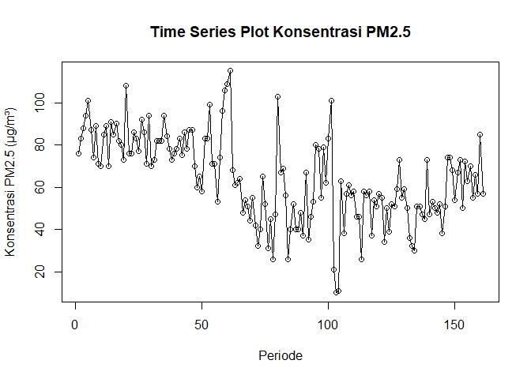<!-- -->

## Moving Average

### Pembagian Data

Pembagian data latih dan data uji dilakukan dengan perbandingan 80% data
latih dan 20% data uji.

``` r
# hitung jumlah data
n <- nrow(data)

# tentukan batas 80%
n_train <- floor(0.8 * n)

# bagi data
training_ma <- data[1:n_train, ]
testing_ma  <- data[(n_train+1):n, ]

# ubah ke time series
train_ma.ts <- ts(training_ma$pm25)
test_ma.ts  <- ts(testing_ma$pm25)

n_train
```

    ## [1] 128

``` r
nrow(testing_ma)
```

    ## [1] 33

Eksplorasi data dilakukan pada keseluruhan data, data latih, serta data
uji menggunakan plot data deret waktu.

``` r
#eksplorasi keseluruhan data
plot(
  data.ts,
  col = "red",
  main = "Plot Semua Data",
  xlab = "Periode",
  ylab = "Konsentrasi PM2.5 (µg/m³)"
)
points(data.ts)
```

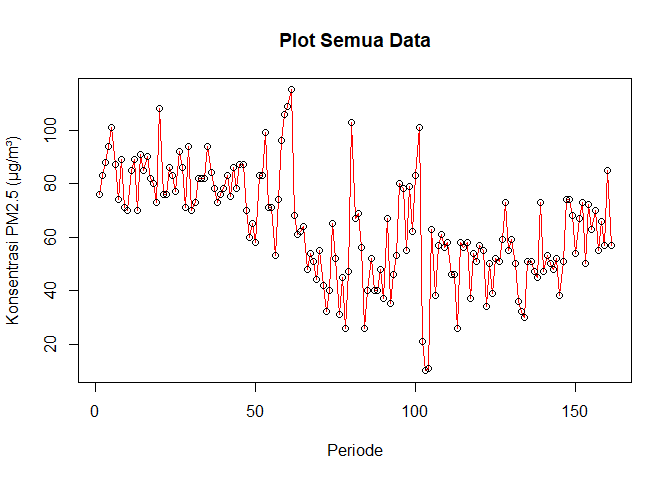<!-- -->

``` r
#eksplorasi data latih
plot(
  train_ma.ts,
  col = "blue",
  main = "Plot Data Latih",
  xlab = "Periode",
  ylab = "Konsentrasi PM2.5 (µg/m³)"
)
points(train_ma.ts)
```

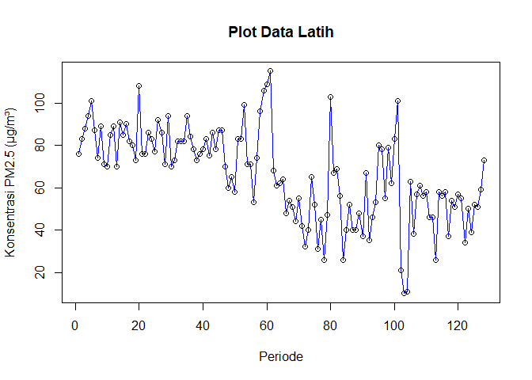<!-- -->

``` r
#eksplorasi data uji
plot(
  test_ma.ts,
  col = "blue",
  main = "Plot Data Uji",
  xlab = "Periode",
  ylab = "Konsentrasi PM2.5 (µg/m³)"
)
points(test_ma.ts)
```

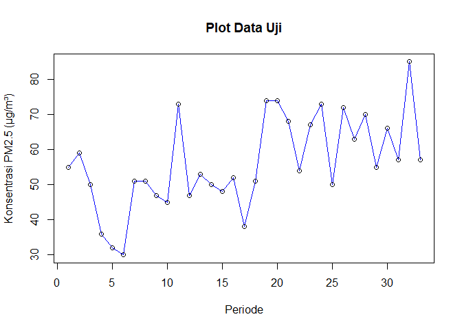<!-- -->

Eksplorasi data juga dapat dilakukan menggunakan package `ggplot2`

``` r
ggplot() + 
  geom_line(data = training_ma, aes(x = tanggal, y = pm25, col = "Data Latih")) +
  geom_line(data = testing_ma, aes(x = tanggal, y = pm25, col = "Data Uji")) +
  labs(x = "Periode", y = "Konsentrasi PM2.5 (µg/m³)", color = "Legend") +
   scale_colour_manual(name="Keterangan:", breaks = c("Data Latih", "Data Uji"),
                      values = c("blue", "red")) + 
  theme_bw() + theme(legend.position = "bottom",
                     plot.caption = element_text(hjust=0.5, size=12))
```

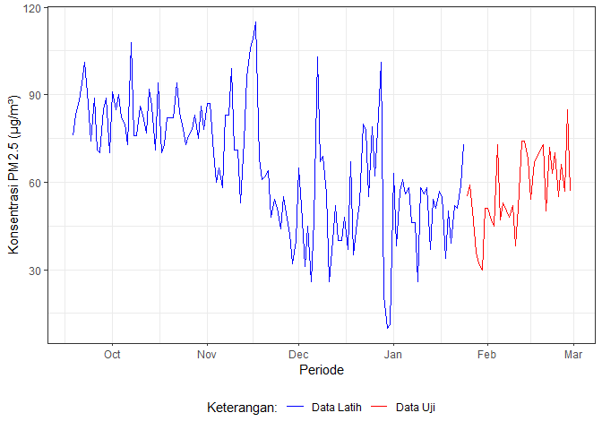<!-- -->

### Single Moving Average (SMA)

Ide dasar dari Single Moving Average (SMA) adalah data suatu periode
dipengaruhi oleh data periode sebelumnya. Metode pemulusan ini cocok
digunakan untuk pola data stasioner atau konstan. Prinsip dasar metode
pemulusan ini adalah data pemulusan pada periode ke-t merupakan rata
rata dari m buah data pada periode ke-t hingga periode ke (t-m+1).


Data pemulusan pada periode ke-t selanjutnya digunakan sebagai nilai
peramalan pada periode ke t+1.


Pemulusan menggunakan metode SMA dilakukan dengan fungsi `SMA()`. Dalam
hal ini akan dilakukan pemulusan dengan parameter `m=4`.

``` r
data.sma<-SMA(train_ma.ts, n=4)
data.sma
```

    ## Time Series:
    ## Start = 1 
    ## End = 128 
    ## Frequency = 1 
    ##   [1]     NA     NA     NA  85.25  91.50  92.50  89.00  87.75  80.25  76.00
    ##  [11]  78.75  78.75  78.50  83.75  83.75  84.00  87.00  84.25  81.25  85.75
    ##  [21]  84.25  83.25  86.50  80.25  80.50  84.50  84.50  81.50  85.75  80.25
    ##  [31]  77.00  79.75  76.75  79.75  85.00  85.50  84.50  82.25  77.75  76.25
    ##  [41]  77.50  78.00  80.50  80.50  81.50  84.50  80.50  76.00  70.50  63.25
    ##  [51]  66.50  72.25  80.75  84.00  81.00  73.50  67.25  73.50  82.25  96.25
    ##  [61] 106.50  99.50  88.25  76.50  63.75  58.75  57.00  54.25  49.25  51.00
    ##  [71]  48.00  43.25  42.25  44.75  47.25  47.00  48.25  38.50  37.25  55.25
    ##  [81]  60.75  71.50  73.75  54.50  47.75  43.50  39.50  43.00  45.00  41.25
    ##  [91]  48.00  46.75  46.25  50.25  53.50  64.25  66.50  73.00  68.50  69.75
    ## [101]  81.25  66.75  53.75  35.75  26.25  30.50  42.25  54.75  53.00  58.00
    ## [111]  55.25  51.50  44.00  44.00  46.50  49.50  52.25  51.25  50.00  49.75
    ## [121]  54.25  49.25  49.00  44.50  43.75  48.00  50.25  58.75

Data pemulusan pada periode ke-t selanjutnya digunakan sebagai nilai
peramalan pada periode ke t+1 sehingga hasil peramalan 1 periode kedepan
adalah sebagai berikut.

``` r
data.ramal<-c(NA,data.sma)
data.ramal
```

    ##   [1]     NA     NA     NA     NA  85.25  91.50  92.50  89.00  87.75  80.25
    ##  [11]  76.00  78.75  78.75  78.50  83.75  83.75  84.00  87.00  84.25  81.25
    ##  [21]  85.75  84.25  83.25  86.50  80.25  80.50  84.50  84.50  81.50  85.75
    ##  [31]  80.25  77.00  79.75  76.75  79.75  85.00  85.50  84.50  82.25  77.75
    ##  [41]  76.25  77.50  78.00  80.50  80.50  81.50  84.50  80.50  76.00  70.50
    ##  [51]  63.25  66.50  72.25  80.75  84.00  81.00  73.50  67.25  73.50  82.25
    ##  [61]  96.25 106.50  99.50  88.25  76.50  63.75  58.75  57.00  54.25  49.25
    ##  [71]  51.00  48.00  43.25  42.25  44.75  47.25  47.00  48.25  38.50  37.25
    ##  [81]  55.25  60.75  71.50  73.75  54.50  47.75  43.50  39.50  43.00  45.00
    ##  [91]  41.25  48.00  46.75  46.25  50.25  53.50  64.25  66.50  73.00  68.50
    ## [101]  69.75  81.25  66.75  53.75  35.75  26.25  30.50  42.25  54.75  53.00
    ## [111]  58.00  55.25  51.50  44.00  44.00  46.50  49.50  52.25  51.25  50.00
    ## [121]  49.75  54.25  49.25  49.00  44.50  43.75  48.00  50.25  58.75

Selanjutnya dilakukan peramalan sebanyak 33 periode sesuai dengan jumlah
data uji. Pada metode SMA, seluruh hasil peramalan untuk 33 periode ke
depan akan memiliki nilai yang sama dengan hasil ramalan satu periode ke
depan.

``` r
n_test <- nrow(testing_ma)

data.gab <- cbind(
  aktual = c(data.ts),
  pemulusan = c(data.sma, rep(NA, n_test)),
  ramalan = c(data.ramal,
              rep(data.ramal[length(data.ramal)], n_test - 1))
)

data.gab 
```

    ##        aktual pemulusan ramalan
    ##   [1,]     76        NA      NA
    ##   [2,]     83        NA      NA
    ##   [3,]     88        NA      NA
    ##   [4,]     94     85.25      NA
    ##   [5,]    101     91.50   85.25
    ##   [6,]     87     92.50   91.50
    ##   [7,]     74     89.00   92.50
    ##   [8,]     89     87.75   89.00
    ##   [9,]     71     80.25   87.75
    ##  [10,]     70     76.00   80.25
    ##  [11,]     85     78.75   76.00
    ##  [12,]     89     78.75   78.75
    ##  [13,]     70     78.50   78.75
    ##  [14,]     91     83.75   78.50
    ##  [15,]     85     83.75   83.75
    ##  [16,]     90     84.00   83.75
    ##  [17,]     82     87.00   84.00
    ##  [18,]     80     84.25   87.00
    ##  [19,]     73     81.25   84.25
    ##  [20,]    108     85.75   81.25
    ##  [21,]     76     84.25   85.75
    ##  [22,]     76     83.25   84.25
    ##  [23,]     86     86.50   83.25
    ##  [24,]     83     80.25   86.50
    ##  [25,]     77     80.50   80.25
    ##  [26,]     92     84.50   80.50
    ##  [27,]     86     84.50   84.50
    ##  [28,]     71     81.50   84.50
    ##  [29,]     94     85.75   81.50
    ##  [30,]     70     80.25   85.75
    ##  [31,]     73     77.00   80.25
    ##  [32,]     82     79.75   77.00
    ##  [33,]     82     76.75   79.75
    ##  [34,]     82     79.75   76.75
    ##  [35,]     94     85.00   79.75
    ##  [36,]     84     85.50   85.00
    ##  [37,]     78     84.50   85.50
    ##  [38,]     73     82.25   84.50
    ##  [39,]     76     77.75   82.25
    ##  [40,]     78     76.25   77.75
    ##  [41,]     83     77.50   76.25
    ##  [42,]     75     78.00   77.50
    ##  [43,]     86     80.50   78.00
    ##  [44,]     78     80.50   80.50
    ##  [45,]     87     81.50   80.50
    ##  [46,]     87     84.50   81.50
    ##  [47,]     70     80.50   84.50
    ##  [48,]     60     76.00   80.50
    ##  [49,]     65     70.50   76.00
    ##  [50,]     58     63.25   70.50
    ##  [51,]     83     66.50   63.25
    ##  [52,]     83     72.25   66.50
    ##  [53,]     99     80.75   72.25
    ##  [54,]     71     84.00   80.75
    ##  [55,]     71     81.00   84.00
    ##  [56,]     53     73.50   81.00
    ##  [57,]     74     67.25   73.50
    ##  [58,]     96     73.50   67.25
    ##  [59,]    106     82.25   73.50
    ##  [60,]    109     96.25   82.25
    ##  [61,]    115    106.50   96.25
    ##  [62,]     68     99.50  106.50
    ##  [63,]     61     88.25   99.50
    ##  [64,]     62     76.50   88.25
    ##  [65,]     64     63.75   76.50
    ##  [66,]     48     58.75   63.75
    ##  [67,]     54     57.00   58.75
    ##  [68,]     51     54.25   57.00
    ##  [69,]     44     49.25   54.25
    ##  [70,]     55     51.00   49.25
    ##  [71,]     42     48.00   51.00
    ##  [72,]     32     43.25   48.00
    ##  [73,]     40     42.25   43.25
    ##  [74,]     65     44.75   42.25
    ##  [75,]     52     47.25   44.75
    ##  [76,]     31     47.00   47.25
    ##  [77,]     45     48.25   47.00
    ##  [78,]     26     38.50   48.25
    ##  [79,]     47     37.25   38.50
    ##  [80,]    103     55.25   37.25
    ##  [81,]     67     60.75   55.25
    ##  [82,]     69     71.50   60.75
    ##  [83,]     56     73.75   71.50
    ##  [84,]     26     54.50   73.75
    ##  [85,]     40     47.75   54.50
    ##  [86,]     52     43.50   47.75
    ##  [87,]     40     39.50   43.50
    ##  [88,]     40     43.00   39.50
    ##  [89,]     48     45.00   43.00
    ##  [90,]     37     41.25   45.00
    ##  [91,]     67     48.00   41.25
    ##  [92,]     35     46.75   48.00
    ##  [93,]     46     46.25   46.75
    ##  [94,]     53     50.25   46.25
    ##  [95,]     80     53.50   50.25
    ##  [96,]     78     64.25   53.50
    ##  [97,]     55     66.50   64.25
    ##  [98,]     79     73.00   66.50
    ##  [99,]     62     68.50   73.00
    ## [100,]     83     69.75   68.50
    ## [101,]    101     81.25   69.75
    ## [102,]     21     66.75   81.25
    ## [103,]     10     53.75   66.75
    ## [104,]     11     35.75   53.75
    ## [105,]     63     26.25   35.75
    ## [106,]     38     30.50   26.25
    ## [107,]     57     42.25   30.50
    ## [108,]     61     54.75   42.25
    ## [109,]     56     53.00   54.75
    ## [110,]     58     58.00   53.00
    ## [111,]     46     55.25   58.00
    ## [112,]     46     51.50   55.25
    ## [113,]     26     44.00   51.50
    ## [114,]     58     44.00   44.00
    ## [115,]     56     46.50   44.00
    ## [116,]     58     49.50   46.50
    ## [117,]     37     52.25   49.50
    ## [118,]     54     51.25   52.25
    ## [119,]     51     50.00   51.25
    ## [120,]     57     49.75   50.00
    ## [121,]     55     54.25   49.75
    ## [122,]     34     49.25   54.25
    ## [123,]     50     49.00   49.25
    ## [124,]     39     44.50   49.00
    ## [125,]     52     43.75   44.50
    ## [126,]     51     48.00   43.75
    ## [127,]     59     50.25   48.00
    ## [128,]     73     58.75   50.25
    ## [129,]     55        NA   58.75
    ## [130,]     59        NA   58.75
    ## [131,]     50        NA   58.75
    ## [132,]     36        NA   58.75
    ## [133,]     32        NA   58.75
    ## [134,]     30        NA   58.75
    ## [135,]     51        NA   58.75
    ## [136,]     51        NA   58.75
    ## [137,]     47        NA   58.75
    ## [138,]     45        NA   58.75
    ## [139,]     73        NA   58.75
    ## [140,]     47        NA   58.75
    ## [141,]     53        NA   58.75
    ## [142,]     50        NA   58.75
    ## [143,]     48        NA   58.75
    ## [144,]     52        NA   58.75
    ## [145,]     38        NA   58.75
    ## [146,]     51        NA   58.75
    ## [147,]     74        NA   58.75
    ## [148,]     74        NA   58.75
    ## [149,]     68        NA   58.75
    ## [150,]     54        NA   58.75
    ## [151,]     67        NA   58.75
    ## [152,]     73        NA   58.75
    ## [153,]     50        NA   58.75
    ## [154,]     72        NA   58.75
    ## [155,]     63        NA   58.75
    ## [156,]     70        NA   58.75
    ## [157,]     55        NA   58.75
    ## [158,]     66        NA   58.75
    ## [159,]     57        NA   58.75
    ## [160,]     85        NA   58.75
    ## [161,]     57        NA   58.75

Adapun plot data deret waktu dari hasil peramalan yang dilakukan adalah
sebagai berikut.

``` r
ts.plot(data.ts, xlab="Periode", ylab="Konsentrasi PM2.5 (µg/m³)", main= "SMA N=4 Data Konsentrasi PM2.5")
points(data.ts)
lines(data.gab[,2],col="green",lwd=2)
lines(data.gab[,3],col="red",lwd=2)
legend("topleft",c("data aktual","data pemulusan","data peramalan"), lty=1, col=c("black","green","red"), cex=0.7)
```

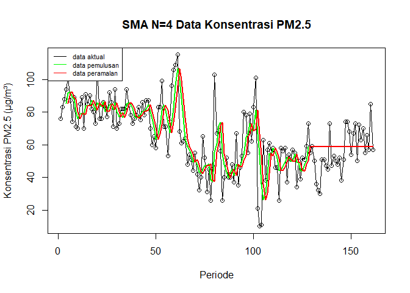<!-- -->

Selanjutnya perhitungan akurasi dilakukan dengan ukuran akurasi *Sum
Squares Error* (SSE), *Mean Square Error* (MSE) dan *Mean Absolute
Percentage Error* (MAPE). Perhitungan akurasi dilakukan baik pada data
latih maupun pada data uji.

^2")

^2")


#### Akurasi Data Latih

``` r
error_train.sma = train_ma.ts-data.ramal[1:length(train_ma.ts)]

SSE_train.sma = sum(error_train.sma[5:length(train_ma.ts)]^2)
MSE_train.sma = mean(error_train.sma[5:length(train_ma.ts)]^2)
MAPE_train.sma = mean(abs((error_train.sma[5:length(train_ma.ts)]/train_ma.ts[5:length(train_ma.ts)])*100))

akurasi_train.sma <- matrix(c(SSE_train.sma, MSE_train.sma, MAPE_train.sma))
row.names(akurasi_train.sma)<- c("SSE", "MSE", "MAPE")
colnames(akurasi_train.sma) <- c("Akurasi m = 4")
akurasi_train.sma
```

    ##      Akurasi m = 4
    ## SSE    41070.93750
    ## MSE      331.21724
    ## MAPE      30.69689

Berdasarkan hasil perhitungan akurasi data latih, metode SMA dengan m =
4 menghasilkan nilai SSE sebesar 41.070,94, MSE sebesar 331,22, dan MAPE
sebesar 30,70%. Nilai MAPE sebesar 30,70% menunjukkan bahwa rata-rata
kesalahan hasil pemulusan terhadap data aktual adalah sebesar 30,70%.
Berdasarkan nilai tersebut, metode SMA dengan m = 4 memiliki tingkat
akurasi yang cukup pada data latih, meskipun masih terdapat kesalahan
pemulusan yang relatif cukup besar.

#### Akurasi Data Uji

``` r
error_test.sma <- test_ma.ts -
  data.gab[(n_train + 1):n, 3]

SSE_test.sma = sum(error_test.sma^2)
MSE_test.sma = mean(error_test.sma^2)
MAPE_test.sma = mean(abs((error_test.sma/test_ma.ts*100)))

akurasi_test.sma <- matrix(c(SSE_test.sma, MSE_test.sma, MAPE_test.sma))
row.names(akurasi_test.sma)<- c("SSE", "MSE", "MAPE")
colnames(akurasi_test.sma) <- c("Akurasi m = 4")
akurasi_test.sma
```

    ##      Akurasi m = 4
    ## SSE     5703.06250
    ## MSE      172.82008
    ## MAPE      22.43497

Berdasarkan hasil perhitungan akurasi data uji, metode SMA dengan m = 4
menghasilkan nilai SSE sebesar 5.703,06, MSE sebesar 172,82, dan MAPE
sebesar 22,43%. Nilai MAPE sebesar 22,43% menunjukkan bahwa rata-rata
kesalahan peramalan terhadap data aktual adalah sekitar 22,43%, sehingga
metode SMA dengan m = 4 memiliki tingkat akurasi yang cukup pada data
uji.

### Double Moving Average (DMA)

Metode pemulusan Double Moving Average (DMA) pada dasarnya mirip dengan
SMA. Namun demikian, metode ini lebih cocok digunakan untuk pola data
trend. Proses pemulusan dengan rata rata dalam metode ini dilakukan
sebanyak 2 kali.

- **Tahap I:**


- **Tahap II:**


Forecast  langkah ke
depan dihitung dengan:

")

dengan komponen level
() dan tren
():

")

``` r
# Pemulusan Pertama dan Kedua
dma <- SMA(data.sma, n = 4)

At <- 2 * data.sma - dma
Bt <- 2/(4-1) * (data.sma - dma)

data.dma <- At + Bt

# Forecast
data.ramal2 <- c(NA, data.dma)
t <- 1:nrow(testing_ma)
f <- c()
for (i in t) {
  f[i] <-
    At[length(At)] +
    Bt[length(Bt)] * i
}

# Gabungkan hasil
data.gab2 <- cbind(
  aktual = c(data.ts),

  pemulusan1 = c(
    data.sma,
    rep(NA, nrow(testing_ma))
  ),

  pemulusan2 = c(
    dma,
    rep(NA, nrow(testing_ma))
  ),

  At = c(
    At,
    rep(NA, nrow(testing_ma))
  ),

  Bt = c(
    Bt,
    rep(NA, nrow(testing_ma))
  ),

  ramalan = c(
    rep(
      NA,
      n_train
    ),
    f
  )
)

data.gab2
```

    ##        aktual pemulusan1 pemulusan2       At          Bt   ramalan
    ##   [1,]     76         NA         NA       NA          NA        NA
    ##   [2,]     83         NA         NA       NA          NA        NA
    ##   [3,]     88         NA         NA       NA          NA        NA
    ##   [4,]     94      85.25         NA       NA          NA        NA
    ##   [5,]    101      91.50         NA       NA          NA        NA
    ##   [6,]     87      92.50         NA       NA          NA        NA
    ##   [7,]     74      89.00    89.5625  88.4375  -0.3750000        NA
    ##   [8,]     89      87.75    90.1875  85.3125  -1.6250000        NA
    ##   [9,]     71      80.25    87.3750  73.1250  -4.7500000        NA
    ##  [10,]     70      76.00    83.2500  68.7500  -4.8333333        NA
    ##  [11,]     85      78.75    80.6875  76.8125  -1.2916667        NA
    ##  [12,]     89      78.75    78.4375  79.0625   0.2083333        NA
    ##  [13,]     70      78.50    78.0000  79.0000   0.3333333        NA
    ##  [14,]     91      83.75    79.9375  87.5625   2.5416667        NA
    ##  [15,]     85      83.75    81.1875  86.3125   1.7083333        NA
    ##  [16,]     90      84.00    82.5000  85.5000   1.0000000        NA
    ##  [17,]     82      87.00    84.6250  89.3750   1.5833333        NA
    ##  [18,]     80      84.25    84.7500  83.7500  -0.3333333        NA
    ##  [19,]     73      81.25    84.1250  78.3750  -1.9166667        NA
    ##  [20,]    108      85.75    84.5625  86.9375   0.7916667        NA
    ##  [21,]     76      84.25    83.8750  84.6250   0.2500000        NA
    ##  [22,]     76      83.25    83.6250  82.8750  -0.2500000        NA
    ##  [23,]     86      86.50    84.9375  88.0625   1.0416667        NA
    ##  [24,]     83      80.25    83.5625  76.9375  -2.2083333        NA
    ##  [25,]     77      80.50    82.6250  78.3750  -1.4166667        NA
    ##  [26,]     92      84.50    82.9375  86.0625   1.0416667        NA
    ##  [27,]     86      84.50    82.4375  86.5625   1.3750000        NA
    ##  [28,]     71      81.50    82.7500  80.2500  -0.8333333        NA
    ##  [29,]     94      85.75    84.0625  87.4375   1.1250000        NA
    ##  [30,]     70      80.25    83.0000  77.5000  -1.8333333        NA
    ##  [31,]     73      77.00    81.1250  72.8750  -2.7500000        NA
    ##  [32,]     82      79.75    80.6875  78.8125  -0.6250000        NA
    ##  [33,]     82      76.75    78.4375  75.0625  -1.1250000        NA
    ##  [34,]     82      79.75    78.3125  81.1875   0.9583333        NA
    ##  [35,]     94      85.00    80.3125  89.6875   3.1250000        NA
    ##  [36,]     84      85.50    81.7500  89.2500   2.5000000        NA
    ##  [37,]     78      84.50    83.6875  85.3125   0.5416667        NA
    ##  [38,]     73      82.25    84.3125  80.1875  -1.3750000        NA
    ##  [39,]     76      77.75    82.5000  73.0000  -3.1666667        NA
    ##  [40,]     78      76.25    80.1875  72.3125  -2.6250000        NA
    ##  [41,]     83      77.50    78.4375  76.5625  -0.6250000        NA
    ##  [42,]     75      78.00    77.3750  78.6250   0.4166667        NA
    ##  [43,]     86      80.50    78.0625  82.9375   1.6250000        NA
    ##  [44,]     78      80.50    79.1250  81.8750   0.9166667        NA
    ##  [45,]     87      81.50    80.1250  82.8750   0.9166667        NA
    ##  [46,]     87      84.50    81.7500  87.2500   1.8333333        NA
    ##  [47,]     70      80.50    81.7500  79.2500  -0.8333333        NA
    ##  [48,]     60      76.00    80.6250  71.3750  -3.0833333        NA
    ##  [49,]     65      70.50    77.8750  63.1250  -4.9166667        NA
    ##  [50,]     58      63.25    72.5625  53.9375  -6.2083333        NA
    ##  [51,]     83      66.50    69.0625  63.9375  -1.7083333        NA
    ##  [52,]     83      72.25    68.1250  76.3750   2.7500000        NA
    ##  [53,]     99      80.75    70.6875  90.8125   6.7083333        NA
    ##  [54,]     71      84.00    75.8750  92.1250   5.4166667        NA
    ##  [55,]     71      81.00    79.5000  82.5000   1.0000000        NA
    ##  [56,]     53      73.50    79.8125  67.1875  -4.2083333        NA
    ##  [57,]     74      67.25    76.4375  58.0625  -6.1250000        NA
    ##  [58,]     96      73.50    73.8125  73.1875  -0.2083333        NA
    ##  [59,]    106      82.25    74.1250  90.3750   5.4166667        NA
    ##  [60,]    109      96.25    79.8125 112.6875  10.9583333        NA
    ##  [61,]    115     106.50    89.6250 123.3750  11.2500000        NA
    ##  [62,]     68      99.50    96.1250 102.8750   2.2500000        NA
    ##  [63,]     61      88.25    97.6250  78.8750  -6.2500000        NA
    ##  [64,]     62      76.50    92.6875  60.3125 -10.7916667        NA
    ##  [65,]     64      63.75    82.0000  45.5000 -12.1666667        NA
    ##  [66,]     48      58.75    71.8125  45.6875  -8.7083333        NA
    ##  [67,]     54      57.00    64.0000  50.0000  -4.6666667        NA
    ##  [68,]     51      54.25    58.4375  50.0625  -2.7916667        NA
    ##  [69,]     44      49.25    54.8125  43.6875  -3.7083333        NA
    ##  [70,]     55      51.00    52.8750  49.1250  -1.2500000        NA
    ##  [71,]     42      48.00    50.6250  45.3750  -1.7500000        NA
    ##  [72,]     32      43.25    47.8750  38.6250  -3.0833333        NA
    ##  [73,]     40      42.25    46.1250  38.3750  -2.5833333        NA
    ##  [74,]     65      44.75    44.5625  44.9375   0.1250000        NA
    ##  [75,]     52      47.25    44.3750  50.1250   1.9166667        NA
    ##  [76,]     31      47.00    45.3125  48.6875   1.1250000        NA
    ##  [77,]     45      48.25    46.8125  49.6875   0.9583333        NA
    ##  [78,]     26      38.50    45.2500  31.7500  -4.5000000        NA
    ##  [79,]     47      37.25    42.7500  31.7500  -3.6666667        NA
    ##  [80,]    103      55.25    44.8125  65.6875   6.9583333        NA
    ##  [81,]     67      60.75    47.9375  73.5625   8.5416667        NA
    ##  [82,]     69      71.50    56.1875  86.8125  10.2083333        NA
    ##  [83,]     56      73.75    65.3125  82.1875   5.6250000        NA
    ##  [84,]     26      54.50    65.1250  43.8750  -7.0833333        NA
    ##  [85,]     40      47.75    61.8750  33.6250  -9.4166667        NA
    ##  [86,]     52      43.50    54.8750  32.1250  -7.5833333        NA
    ##  [87,]     40      39.50    46.3125  32.6875  -4.5416667        NA
    ##  [88,]     40      43.00    43.4375  42.5625  -0.2916667        NA
    ##  [89,]     48      45.00    42.7500  47.2500   1.5000000        NA
    ##  [90,]     37      41.25    42.1875  40.3125  -0.6250000        NA
    ##  [91,]     67      48.00    44.3125  51.6875   2.4583333        NA
    ##  [92,]     35      46.75    45.2500  48.2500   1.0000000        NA
    ##  [93,]     46      46.25    45.5625  46.9375   0.4583333        NA
    ##  [94,]     53      50.25    47.8125  52.6875   1.6250000        NA
    ##  [95,]     80      53.50    49.1875  57.8125   2.8750000        NA
    ##  [96,]     78      64.25    53.5625  74.9375   7.1250000        NA
    ##  [97,]     55      66.50    58.6250  74.3750   5.2500000        NA
    ##  [98,]     79      73.00    64.3125  81.6875   5.7916667        NA
    ##  [99,]     62      68.50    68.0625  68.9375   0.2916667        NA
    ## [100,]     83      69.75    69.4375  70.0625   0.2083333        NA
    ## [101,]    101      81.25    73.1250  89.3750   5.4166667        NA
    ## [102,]     21      66.75    71.5625  61.9375  -3.2083333        NA
    ## [103,]     10      53.75    67.8750  39.6250  -9.4166667        NA
    ## [104,]     11      35.75    59.3750  12.1250 -15.7500000        NA
    ## [105,]     63      26.25    45.6250   6.8750 -12.9166667        NA
    ## [106,]     38      30.50    36.5625  24.4375  -4.0416667        NA
    ## [107,]     57      42.25    33.6875  50.8125   5.7083333        NA
    ## [108,]     61      54.75    38.4375  71.0625  10.8750000        NA
    ## [109,]     56      53.00    45.1250  60.8750   5.2500000        NA
    ## [110,]     58      58.00    52.0000  64.0000   4.0000000        NA
    ## [111,]     46      55.25    55.2500  55.2500   0.0000000        NA
    ## [112,]     46      51.50    54.4375  48.5625  -1.9583333        NA
    ## [113,]     26      44.00    52.1875  35.8125  -5.4583333        NA
    ## [114,]     58      44.00    48.6875  39.3125  -3.1250000        NA
    ## [115,]     56      46.50    46.5000  46.5000   0.0000000        NA
    ## [116,]     58      49.50    46.0000  53.0000   2.3333333        NA
    ## [117,]     37      52.25    48.0625  56.4375   2.7916667        NA
    ## [118,]     54      51.25    49.8750  52.6250   0.9166667        NA
    ## [119,]     51      50.00    50.7500  49.2500  -0.5000000        NA
    ## [120,]     57      49.75    50.8125  48.6875  -0.7083333        NA
    ## [121,]     55      54.25    51.3125  57.1875   1.9583333        NA
    ## [122,]     34      49.25    50.8125  47.6875  -1.0416667        NA
    ## [123,]     50      49.00    50.5625  47.4375  -1.0416667        NA
    ## [124,]     39      44.50    49.2500  39.7500  -3.1666667        NA
    ## [125,]     52      43.75    46.6250  40.8750  -1.9166667        NA
    ## [126,]     51      48.00    46.3125  49.6875   1.1250000        NA
    ## [127,]     59      50.25    46.6250  53.8750   2.4166667        NA
    ## [128,]     73      58.75    50.1875  67.3125   5.7083333        NA
    ## [129,]     55         NA         NA       NA          NA  73.02083
    ## [130,]     59         NA         NA       NA          NA  78.72917
    ## [131,]     50         NA         NA       NA          NA  84.43750
    ## [132,]     36         NA         NA       NA          NA  90.14583
    ## [133,]     32         NA         NA       NA          NA  95.85417
    ## [134,]     30         NA         NA       NA          NA 101.56250
    ## [135,]     51         NA         NA       NA          NA 107.27083
    ## [136,]     51         NA         NA       NA          NA 112.97917
    ## [137,]     47         NA         NA       NA          NA 118.68750
    ## [138,]     45         NA         NA       NA          NA 124.39583
    ## [139,]     73         NA         NA       NA          NA 130.10417
    ## [140,]     47         NA         NA       NA          NA 135.81250
    ## [141,]     53         NA         NA       NA          NA 141.52083
    ## [142,]     50         NA         NA       NA          NA 147.22917
    ## [143,]     48         NA         NA       NA          NA 152.93750
    ## [144,]     52         NA         NA       NA          NA 158.64583
    ## [145,]     38         NA         NA       NA          NA 164.35417
    ## [146,]     51         NA         NA       NA          NA 170.06250
    ## [147,]     74         NA         NA       NA          NA 175.77083
    ## [148,]     74         NA         NA       NA          NA 181.47917
    ## [149,]     68         NA         NA       NA          NA 187.18750
    ## [150,]     54         NA         NA       NA          NA 192.89583
    ## [151,]     67         NA         NA       NA          NA 198.60417
    ## [152,]     73         NA         NA       NA          NA 204.31250
    ## [153,]     50         NA         NA       NA          NA 210.02083
    ## [154,]     72         NA         NA       NA          NA 215.72917
    ## [155,]     63         NA         NA       NA          NA 221.43750
    ## [156,]     70         NA         NA       NA          NA 227.14583
    ## [157,]     55         NA         NA       NA          NA 232.85417
    ## [158,]     66         NA         NA       NA          NA 238.56250
    ## [159,]     57         NA         NA       NA          NA 244.27083
    ## [160,]     85         NA         NA       NA          NA 249.97917
    ## [161,]     57         NA         NA       NA          NA 255.68750

Hasil pemulusan menggunakan metode DMA divisualisasikan sebagai berikut

``` r
ts.plot(data.ts,
        xlab = "Periode",
        ylab = "Konsentrasi PM2.5 (µg/m³)",
        main = "DMA N=4 Data Konsentrasi PM2.5")

points(data.ts)

lines(data.gab2[,3], col="green", lwd=2)
lines(data.gab2[,6], col="red", lwd=2)

legend("topleft",
       c("Data Aktual", "Data Pemulusan", "Data Peramalan"),
       lty=8,
       col=c("black","green","red"),
       cex=0.8)
```

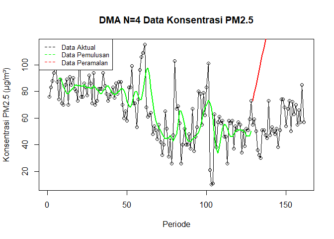<!-- -->

Selanjutnya perhitungan akurasi dilakukan baik pada data latih maupun
data uji. Perhitungan akurasi dilakukan dengan ukuran akurasi SSE, MSE
dan MAPE.

#### Akurasi Data Latih

``` r
error_train.dma <- train_ma.ts -
  data.ramal2[1:length(train_ma.ts)]

SSE_train.dma <- sum(
  error_train.dma[8:length(train_ma.ts)]^2
)

MSE_train.dma <- mean(
  error_train.dma[8:length(train_ma.ts)]^2
)

MAPE_train.dma <- mean(
  abs(
    error_train.dma[8:length(train_ma.ts)] /
      train_ma.ts[8:length(train_ma.ts)]
  ) * 100
)

akurasi_train.dma <- matrix(
  c(SSE_train.dma, MSE_train.dma, MAPE_train.dma)
)

row.names(akurasi_train.dma) <- c("SSE", "MSE", "MAPE")
colnames(akurasi_train.dma) <- c("Akurasi m = 4")

akurasi_train.dma
```

    ##      Akurasi m = 4
    ## SSE    61507.82075
    ## MSE      508.32910
    ## MAPE      35.26034

Berdasarkan hasil perhitungan akurasi data latih, metode Double Moving
Average (DMA) dengan m = 4 menghasilkan nilai SSE sebesar 61.507,82, MSE
sebesar 508,33, dan MAPE sebesar 35,26%. Nilai MAPE sebesar 35,26%
menunjukkan bahwa rata-rata kesalahan hasil pemulusan terhadap data
aktual adalah sekitar 35,26%. Berdasarkan nilai tersebut, metode DMA
dengan m = 4 memiliki tingkat akurasi yang cukup pada data latih,
meskipun masih terdapat kesalahan pemulusan yang relatif cukup besar.

#### Akurasi Data Uji

``` r
error_test.dma <-
  test_ma.ts -
  data.gab2[
    (n_train + 1):n,
    6
  ]

SSE_test.dma <-
  sum(error_test.dma^2)

MSE_test.dma <-
  mean(error_test.dma^2)

MAPE_test.dma <-
  mean(
    abs(
      error_test.dma /
      test_ma.ts
    ) * 100
  )

akurasi_test.dma <- matrix(
  c(
    SSE_test.dma,
    MSE_test.dma,
    MAPE_test.dma
  )
)

row.names(akurasi_test.dma) <-
  c("SSE", "MSE", "MAPE")

colnames(akurasi_test.dma) <-
  "Akurasi m = 4"

akurasi_test.dma
```

    ##      Akurasi m = 4
    ## SSE    462651.8754
    ## MSE     14019.7538
    ## MAPE      195.3331

Berdasarkan hasil perhitungan akurasi data uji, metode Double Moving
Average (DMA) dengan m = 4 menghasilkan nilai SSE sebesar 462.651,88,
MSE sebesar 14.019,75, dan MAPE sebesar 195,33%. Nilai MAPE sebesar
195,33% menunjukkan bahwa rata-rata kesalahan hasil peramalan terhadap
data aktual sangat besar, yaitu sekitar 195,33%. Berdasarkan nilai
tersebut, metode DMA dengan m = 4 memiliki tingkat akurasi yang sangat
rendah pada data uji.

## Exponential Smoothing

Metode Exponential Smoothing merupakan metode pemulusan deret waktu
dengan memberikan bobot yang menurun secara eksponensial pada data
historis, di mana nilai terbaru mendapat bobot lebih besar dibanding
nilai yang lebih lama. Metode ini menggunakan satu atau lebih parameter
pemulusan yang secara langsung menentukan besar kecilnya bobot setiap
pengamatan. Pemilihan parameter yang tepat akan sangat berpengaruh
terhadap hasil ramalan. Secara umum, Exponential Smoothing dibedakan
menjadi dua jenis, yaitu model tunggal (single) yang digunakan untuk
data tanpa tren maupun musiman, serta model ganda (double) yang mampu
menangkap adanya tren pada data.

### Pembagian Data

Pembagian data latih dan data uji dilakukan dengan perbandingan 80% data
latih dan 20% data uji.

``` r
n <- nrow(data)

n_train <- floor(
  0.8 * n
)

training <- data[
  1:n_train,
]

testing <- data[
  (n_train + 1):n,
]

train.ts <- ts(
  training$pm25
)

test.ts <- ts(
  testing$pm25
)

h_test <- nrow(testing)

n_train
```

    ## [1] 128

``` r
h_test
```

    ## [1] 33

### Eksplorasi

Eksplorasi dilakukan dengan membuat plot data deret waktu untuk
keseluruhan data, data latih, dan data uji.

``` r
# eksplorasi data keseluruhan
plot(
  data.ts,
  col = "black",
  main = "Plot Semua Data",
  xlab = "Periode",
  ylab = "Konsentrasi PM2.5 (µg/m³)"
)

points(data.ts)
```

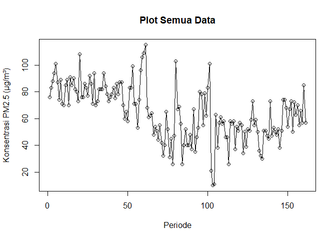<!-- -->

``` r
# eksplorasi data latih
plot(
  train.ts,
  col = "red",
  main = "Plot Data Latih",
  xlab = "Periode",
  ylab = "Konsentrasi PM2.5 (µg/m³)"
)

points(train.ts)
```

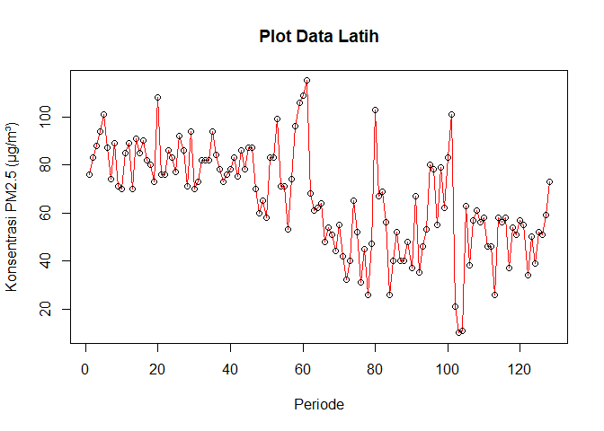<!-- -->

``` r
# eksplorasi data uji
plot(
  test.ts,
  col = "blue",
  main = "Plot Data Uji",
  xlab = "Periode",
  ylab = "Konsentrasi PM2.5 (µg/m³)"
)

points(test.ts)
```

<!-- -->

``` r
ggplot() + 
  geom_line(data = training,
            aes(x = tanggal, y = pm25, color = "Data Latih")) +
  geom_line(data = testing,
            aes(x = tanggal, y = pm25, color = "Data Uji")) +
  labs(
    x = "Periode",
    y = "Konsentrasi PM2.5 (µg/m³)",
    color = "Keterangan"
  ) +
  scale_colour_manual(
    values = c(
      "Data Latih" = "blue",
      "Data Uji" = "red"
    )
  ) +
  theme_bw() +
  theme(
    legend.position = "bottom"
  )
```

<!-- -->

### Single Exponential Smoothing

Single Exponential Smoothing (SES) adalah metode peramalan deret waktu
yang dikembangkan untuk mengatasi kelemahan Moving Average. Jika pada
Moving Average setiap data periode sebelumnya dianggap memiliki bobot
yang sama, maka SES memberikan bobot yang semakin mengecil secara
eksponensial terhadap data lama, sehingga data terbaru diberi bobot
lebih besar.

Single Exponential Smoothing merupakan metode pemulusan yang tepat
digunakan untuk data dengan pola stasioner atau konstan.

Nilai pemulusan pada periode ke-t didapat dari persamaan:

\tilde{y}_{T-1}")

Nilai parameter

adalah nilai antara 0 dan 1.

Nilai pemulusan periode ke-t bertindak sebagai nilai ramalan pada
periode
ke-").

=\tilde{y}_T")

Pemulusan dengan metode SES dapat dilakukan dengan dua fungsi dari
*packages* berbeda, yaitu (1) fungsi `ses()` dari *packages* `forecast`
dan (2) fungsi `HoltWinters` dari *packages* `stats` .

``` r
# SES alpha = 0.2
ses.1 <- ses(train.ts, h = h_test, alpha = 0.2)

# SES alpha = 0.7
ses.2 <- ses(train.ts, h = h_test, alpha = 0.7)

# SES dengan alpha optimum
ses.opt <- ses(train.ts, h = h_test, alpha = NULL)

ses.1
```

    ##     Point Forecast    Lo 80    Hi 80     Lo 95     Hi 95
    ## 129       55.05754 33.68469 76.43039 22.370583  87.74449
    ## 130       55.05754 33.26142 76.85365 21.723254  88.39182
    ## 131       55.05754 32.84622 77.26885 21.088258  89.02681
    ## 132       55.05754 32.43864 77.67643 20.464917  89.65016
    ## 133       55.05754 32.03827 78.07680 19.852610  90.26246
    ## 134       55.05754 31.64475 78.47032 19.250773  90.86430
    ## 135       55.05754 31.25774 78.85733 18.658886  91.45619
    ## 136       55.05754 30.87692 79.23816 18.076470  92.03860
    ## 137       55.05754 30.50200 79.61307 17.503086  92.61199
    ## 138       55.05754 30.13272 79.98235 16.938326  93.17675
    ## 139       55.05754 29.76884 80.34623 16.381812  93.73326
    ## 140       55.05754 29.41012 80.70496 15.833193  94.28188
    ## 141       55.05754 29.05634 81.05873 15.292142  94.82293
    ## 142       55.05754 28.70732 81.40776 14.758354  95.35672
    ## 143       55.05754 28.36286 81.75222 14.231545  95.88353
    ## 144       55.05754 28.02278 82.09229 13.711448  96.40362
    ## 145       55.05754 27.68693 82.42814 13.197812  96.91726
    ## 146       55.05754 27.35516 82.75992 12.690403  97.42467
    ## 147       55.05754 27.02731 83.08777 12.188999  97.92607
    ## 148       55.05754 26.70325 83.41183 11.693393  98.42168
    ## 149       55.05754 26.38285 83.73222 11.203387  98.91169
    ## 150       55.05754 26.06599 84.04908 10.718796  99.39628
    ## 151       55.05754 25.75256 84.36251 10.239444  99.87563
    ## 152       55.05754 25.44245 84.67263  9.765165 100.34991
    ## 153       55.05754 25.13555 84.97953  9.295802 100.81927
    ## 154       55.05754 24.83176 85.28331  8.831204 101.28387
    ## 155       55.05754 24.53100 85.58407  8.371229 101.74384
    ## 156       55.05754 24.23317 85.88190  7.915742 102.19933
    ## 157       55.05754 23.93820 86.17688  7.464614 102.65046
    ## 158       55.05754 23.64599 86.46908  7.017722 103.09735
    ## 159       55.05754 23.35648 86.75860  6.574950 103.54012
    ## 160       55.05754 23.06958 87.04549  6.136184 103.97889
    ## 161       55.05754 22.78524 87.32983  5.701319 104.41375

``` r
ses.2
```

    ##     Point Forecast        Lo 80     Hi 80      Lo 95    Hi 95
    ## 129       68.02137  46.30830990  89.73443  34.814110 101.2286
    ## 130       68.02137  41.51720244  94.52554  27.486744 108.5560
    ## 131       68.02137  37.46838622  98.57435  21.294614 114.7481
    ## 132       68.02137  33.89661744 102.14612  15.832065 120.2107
    ## 133       68.02137  30.66480891 105.37793  10.889440 125.1533
    ## 134       68.02137  27.69115086 108.35159   6.341622 129.7011
    ## 135       68.02137  24.92217632 111.12056   2.106841 133.9359
    ## 136       68.02137  22.32066525 113.72207  -1.871826 137.9146
    ## 137       68.02137  19.85947288 116.18327  -5.635895 141.6786
    ## 138       68.02137  17.51808047 118.52466  -9.216746 145.2595
    ## 139       68.02137  15.28053029 120.76221 -12.638784 148.6815
    ## 140       68.02137  13.13412109 122.90862 -15.921433 151.9642
    ## 141       68.02137  11.06854731 124.97419 -19.080456 155.1232
    ## 142       68.02137   9.07531049 126.96743 -22.128849 158.1716
    ## 143       68.02137   7.14730450 128.89544 -25.077479 161.1202
    ## 144       68.02137   5.27851566 130.76422 -27.935545 163.9783
    ## 145       68.02137   3.46380120 132.57894 -30.710911 166.7537
    ## 146       68.02137   1.69872221 134.34402 -33.410367 169.4531
    ## 147       68.02137  -0.02058418 136.06332 -36.039819 172.0826
    ## 148       68.02137  -1.69750440 137.74024 -38.604447 174.6472
    ## 149       68.02137  -3.33502682 139.37777 -41.108822 177.1516
    ## 150       68.02137  -4.93580433 140.97854 -43.556999 179.5997
    ## 151       68.02137  -6.50220484 142.54494 -45.952602 181.9953
    ## 152       68.02137  -8.03635233 144.07909 -48.298878 184.3416
    ## 153       68.02137  -9.54016070 145.58290 -50.598755 186.6415
    ## 154       68.02137 -11.01536174 147.05810 -52.854880 188.8976
    ## 155       68.02137 -12.46352848 148.50627 -55.069660 191.1124
    ## 156       68.02137 -13.88609488 149.92883 -57.245288 193.2880
    ## 157       68.02137 -15.28437244 151.32711 -59.383769 195.4265
    ## 158       68.02137 -16.65956435 152.70230 -61.486943 197.5297
    ## 159       68.02137 -18.01277765 154.05552 -63.556504 199.5992
    ## 160       68.02137 -19.34503362 155.38777 -65.594014 201.6368
    ## 161       68.02137 -20.65727681 156.70002 -67.600917 203.6437

``` r
ses.opt
```

    ##     Point Forecast    Lo 80     Hi 80       Lo 95     Hi 95
    ## 129        59.3812 38.09987  80.66254  26.8342083  91.92820
    ## 130        59.3812 36.86161  81.90079  24.9404642  93.82194
    ## 131        59.3812 35.68799  83.07442  23.1455560  95.61685
    ## 132        59.3812 34.56981  84.19259  21.4354557  97.32695
    ## 133        59.3812 33.49990  85.26250  19.7991697  98.96324
    ## 134        59.3812 32.47250  86.28991  18.2278922 100.53451
    ## 135        59.3812 31.48291  87.27950  16.7144406 102.04796
    ## 136        59.3812 30.52723  88.23517  15.2528647 103.50954
    ## 137        59.3812 29.60221  89.16019  13.8381699 104.92424
    ## 138        59.3812 28.70508  90.05733  12.4661150 106.29629
    ## 139        59.3812 27.83344  90.92897  11.1330620 107.62934
    ## 140        59.3812 26.98525  91.77716   9.8358628 108.92654
    ## 141        59.3812 26.15870  92.60370   8.5717712 110.19063
    ## 142        59.3812 25.35223  93.41018   7.3383746 111.42403
    ## 143        59.3812 24.56443  94.19798   6.1335400 112.62887
    ## 144        59.3812 23.79406  94.96834   4.9553706 113.80703
    ## 145        59.3812 23.04003  95.72238   3.8021705 114.96023
    ## 146        59.3812 22.30132  96.46108   2.6724163 116.08999
    ## 147        59.3812 21.57705  97.18536   1.5647338 117.19767
    ## 148        59.3812 20.86639  97.89602   0.4778777 118.28453
    ## 149        59.3812 20.16861  98.59380  -0.5892844 119.35169
    ## 150        59.3812 19.48303  99.27937  -1.6377857 120.40019
    ## 151        59.3812 18.80904  99.95337  -2.6685722 121.43098
    ## 152        59.3812 18.14606 100.61635  -3.6825126 122.44492
    ## 153        59.3812 17.49357 101.26884  -4.6804068 123.44281
    ## 154        59.3812 16.85109 101.91132  -5.6629934 124.42540
    ## 155        59.3812 16.21817 102.54423  -6.6309558 125.39336
    ## 156        59.3812 15.59440 103.16800  -7.5849282 126.34733
    ## 157        59.3812 14.97940 103.78301  -8.5255003 127.28791
    ## 158        59.3812 14.37279 104.38961  -9.4532214 128.21563
    ## 159        59.3812 13.77426 104.98815 -10.3686042 129.13101
    ## 160        59.3812 13.18347 105.57893 -11.2721283 130.03453
    ## 161        59.3812 12.60015 106.16225 -12.1642430 130.92665

Pada fungsi `ses()` , terdapat beberapa argumen yang umum digunakan,
yaitu

- `y` : nilai data deret waktu

- `alpha` : parameter pemulusan utama (0–1), mengatur bobot data terbaru
  vs data lama.

- `beta` : parameter pemulusan tren.

- `gamma` : parameter pemulusan musiman.

- `h` : jumlah periode ke depan yang ingin diramalkan (forecast
  horizon).

Untuk mendapatkan gambar hasil pemulusan pada data latih dengan fungsi
`ses()` , perlu digunakan fungsi `autoplot()` dan `autolayer()` .

``` r
autoplot(ses.1) +
  autolayer(fitted(ses.1), series="Fitted") +
  ylab("Konsentrasi PM2.5 (µg/m³)") + xlab("Periode")
```

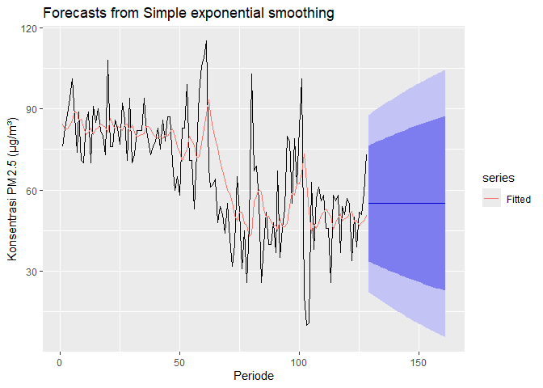<!-- -->

Selanjutnya akan digunakan fungsi `HoltWinters()` dengan nilai
inisialisasi parameter dan panjang periode peramalan yang sama dengan
fungsi `ses()` .

``` r
# Holt-Winters SES
ses1<- HoltWinters(train.ts, gamma = FALSE, beta = FALSE, alpha = 0.2)
plot(ses1)
```

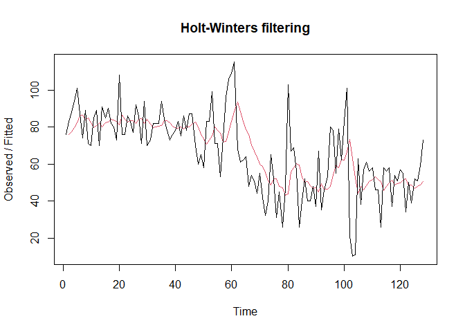<!-- -->

``` r
ses2<- HoltWinters(train.ts, gamma = FALSE, beta = FALSE, alpha = 0.7)
plot(ses2)
```

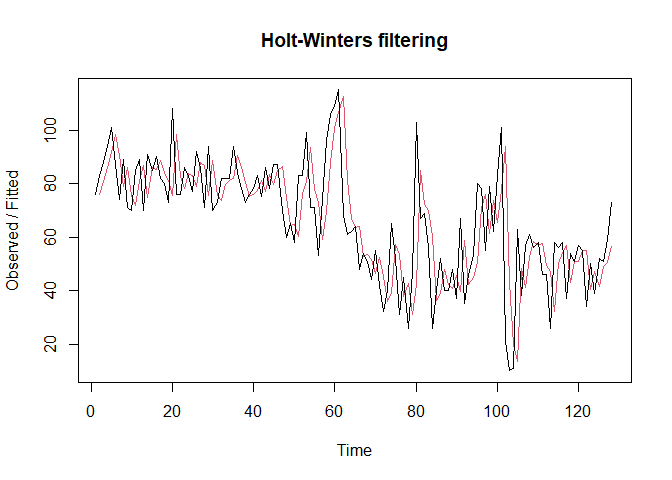<!-- -->

``` r
HWopt <- HoltWinters(
  train.ts,
  gamma = FALSE,
  beta = FALSE,
  alpha = NULL
)
plot(HWopt)
```

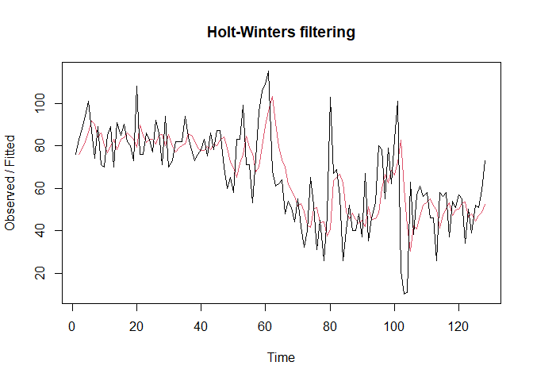<!-- -->

``` r
# Forecast
ramalan1<- forecast(ses1, h=h_test)
ramalan1
```

    ##     Point Forecast    Lo 80    Hi 80     Lo 95     Hi 95
    ## 129       55.05754 33.65353 76.46154 22.322935  87.79214
    ## 130       55.05754 33.22965 76.88542 21.674662  88.44041
    ## 131       55.05754 32.81384 77.30123 21.038740  89.07633
    ## 132       55.05754 32.40567 77.70941 20.414490  89.70058
    ## 133       55.05754 32.00472 78.11036 19.801291  90.31378
    ## 134       55.05754 31.61062 78.50445 19.198577  90.91650
    ## 135       55.05754 31.22304 78.89203 18.605827  91.50925
    ## 136       55.05754 30.84167 79.27340 18.022562  92.09251
    ## 137       55.05754 30.46621 79.64887 17.448342  92.66673
    ## 138       55.05754 30.09639 80.01868 16.882759  93.23231
    ## 139       55.05754 29.73198 80.38310 16.325433  93.78964
    ## 140       55.05754 29.37273 80.74234 15.776014  94.33906
    ## 141       55.05754 29.01844 81.09663 15.234175  94.88090
    ## 142       55.05754 28.66891 81.44617 14.699609  95.41546
    ## 143       55.05754 28.32394 81.79113 14.172032  95.94304
    ## 144       55.05754 27.98337 82.13170 13.651176  96.46390
    ## 145       55.05754 27.64703 82.46804 13.136792  96.97828
    ## 146       55.05754 27.31477 82.80030 12.628643  97.48643
    ## 147       55.05754 26.98645 83.12863 12.126509  97.98856
    ## 148       55.05754 26.66191 83.45316 11.630180  98.48489
    ## 149       55.05754 26.34105 83.77402 11.139460  98.97561
    ## 150       55.05754 26.02373 84.09134 10.654162  99.46091
    ## 151       55.05754 25.70984 84.40523 10.174112  99.94096
    ## 152       55.05754 25.39928 84.71580  9.699142 100.41593
    ## 153       55.05754 25.09193 85.02314  9.229094 100.88598
    ## 154       55.05754 24.78770 85.32737  8.763819 101.35125
    ## 155       55.05754 24.48650 85.62857  8.303173 101.81190
    ## 156       55.05754 24.18824 85.92683  7.847022 102.26805
    ## 157       55.05754 23.89283 86.22224  7.395237 102.71984
    ## 158       55.05754 23.60020 86.51487  6.947694 103.16738
    ## 159       55.05754 23.31027 86.80481  6.504276 103.61080
    ## 160       55.05754 23.02295 87.09212  6.064871 104.05020
    ## 161       55.05754 22.73820 87.37688  5.629372 104.48570

``` r
ramalan2<- forecast(ses2, h=h_test)
ramalan2
```

    ##     Point Forecast        Lo 80     Hi 80      Lo 95    Hi 95
    ## 129       68.02137  46.30616357  89.73658  34.810828 101.2319
    ## 130       68.02137  41.51458250  94.52816  27.482737 108.5600
    ## 131       68.02137  37.46536606  98.57737  21.289995 114.7527
    ## 132       68.02137  33.89324421 102.14950  15.826906 120.2158
    ## 133       68.02137  30.66111622 105.38162  10.883793 125.1589
    ## 134       68.02137  27.68716422 108.35558   6.335525 129.7072
    ## 135       68.02137  24.91791597 111.12482   2.100326 133.9424
    ## 136       68.02137  22.31614774 113.72659  -1.878735 137.9215
    ## 137       68.02137  19.85471208 116.18803  -5.643176 141.6859
    ## 138       68.02137  17.51308822 118.52965  -9.224381 145.2671
    ## 139       68.02137  15.27531686 120.76742 -12.646757 148.6895
    ## 140       68.02137  13.12869549 122.91404 -15.929731 151.9725
    ## 141       68.02137  11.06291753 124.97982 -19.089066 155.1318
    ## 142       68.02137   9.06948368 126.97326 -22.137760 158.1805
    ## 143       68.02137   7.14128710 128.90145 -25.086682 161.1294
    ## 144       68.02137   5.27231354 130.77043 -27.945030 163.9878
    ## 145       68.02137   3.45741969 132.58532 -30.720671 166.7634
    ## 146       68.02137   1.69216623 134.35057 -33.420393 169.4631
    ## 147       68.02137  -0.02731012 136.07005 -36.050105 172.0928
    ## 148       68.02137  -1.70439611 137.74714 -38.614987 174.6577
    ## 149       68.02137  -3.34208039 139.38482 -41.119609 177.1623
    ## 150       68.02137  -4.94301614 140.98576 -43.568029 179.6108
    ## 151       68.02137  -6.50957148 142.55231 -45.963869 182.0066
    ## 152       68.02137  -8.04387063 144.08661 -48.310377 184.3531
    ## 153       68.02137  -9.54782765 145.59057 -50.610480 186.6532
    ## 154       68.02137 -11.02317451 147.06591 -52.866829 188.9096
    ## 155       68.02137 -12.47148441 148.51422 -55.081828 191.1246
    ## 156       68.02137 -13.89419143 149.93693 -57.257670 193.3004
    ## 157       68.02137 -15.29260720 151.33535 -59.396363 195.4391
    ## 158       68.02137 -16.66793505 152.71068 -61.499745 197.5425
    ## 159       68.02137 -18.02128211 154.06402 -63.569511 199.6123
    ## 160       68.02137 -19.35366978 155.39641 -65.607222 201.6500
    ## 161       68.02137 -20.66604269 156.70878 -67.614323 203.6571

``` r
ramalanopt <- forecast(
  HWopt,
  h = h_test
)
ramalanopt
```

    ##     Point Forecast    Lo 80     Hi 80       Lo 95     Hi 95
    ## 129       59.97166 38.66771  81.27561  27.3900797  92.55324
    ## 130       59.97166 37.28131  82.66200  25.2697689  94.67355
    ## 131       59.97166 35.97488  83.96844  23.2717538  96.67156
    ## 132       59.97166 34.73599  85.20733  21.3770362  98.56628
    ## 133       59.97166 33.55514  86.38818  19.5710801 100.37224
    ## 134       59.97166 32.42486  87.51845  17.8424691 102.10085
    ## 135       59.97166 31.33917  88.60415  16.1820425 103.76127
    ## 136       59.97166 30.29316  89.65015  14.5823169 105.36100
    ## 137       59.97166 29.28279  90.66053  13.0370849 106.90623
    ## 138       59.97166 28.30464  91.63868  11.5411303 108.40219
    ## 139       59.97166 27.35581  92.58751  10.0900193 109.85330
    ## 140       59.97166 26.43381  93.50951   8.6799458 111.26337
    ## 141       59.97166 25.53649  94.40683   7.3076133 112.63570
    ## 142       59.97166 24.66197  95.28135   5.9701444 113.97317
    ## 143       59.97166 23.80858  96.13473   4.6650098 115.27831
    ## 144       59.97166 22.97488  96.96843   3.3899719 116.55335
    ## 145       59.97166 22.15956  97.78376   2.1430400 117.80028
    ## 146       59.97166 21.36145  98.58187   0.9224334 119.02088
    ## 147       59.97166 20.57950  99.36382  -0.2734479 120.21676
    ## 148       59.97166 19.81278 100.13054  -1.4460484 121.38937
    ## 149       59.97166 19.06042 100.88289  -2.5966768 122.53999
    ## 150       59.97166 18.32166 101.62166  -3.7265239 123.66984
    ## 151       59.97166 17.59577 102.34755  -4.8366767 124.77999
    ## 152       59.97166 16.88210 103.06121  -5.9281304 125.87145
    ## 153       59.97166 16.18007 103.76325  -7.0017992 126.94512
    ## 154       59.97166 15.48911 104.45420  -8.0585253 128.00184
    ## 155       59.97166 14.80873 105.13459  -9.0990862 129.04240
    ## 156       59.97166 14.13844 105.80488 -10.1242018 130.06752
    ## 157       59.97166 13.47781 106.46550 -11.1345403 131.07786
    ## 158       59.97166 12.82645 107.11687 -12.1307226 132.07404
    ## 159       59.97166 12.18395 107.75936 -13.1133279 133.05664
    ## 160       59.97166 11.54999 108.39333 -14.0828964 134.02621
    ## 161       59.97166 10.92421 109.01910 -15.0399337 134.98325

Fungsi `HoltWinters` memiliki argumen yang sama dengan fungsi `ses()` .
Nilai parameter
 dari
kedua fungsi dapat dioptimalkan menyesuaikan dari *error*-nya paling
minimumnya. Caranya adalah dengan membuat parameter

`NULL` .

#### Akurasi Data Latih

Perhitungan akurasi data dapat dilakukan dengan cara langsung maupun
manual. Dalam hal ini, kita akan menggunakan cara langsung dengan
mengakses nilai-nilai dari objek hasil pemulusan.

``` r
# Alpha = 0.2
SSE1 <- ses1$SSE
MSE1 <- SSE1 / length(train.ts)
RMSE1 <- sqrt(MSE1)

# Alpha = 0.7
SSE2 <- ses2$SSE
MSE2 <- SSE2 / length(train.ts)
RMSE2 <- sqrt(MSE2)

# Alpha optimum
SSEopt <- HWopt$SSE
MSEopt <- SSEopt / length(train.ts)
RMSEopt <- sqrt(MSEopt)

# Tabel ringkas
akurasi_ses_train <- data.frame(
  Model = c(
    "SES Alpha 0.2",
    "SES Alpha 0.7",
    "SES Optimal"
  ),

  SSE = c(
    SSE1,
    SSE2,
    SSEopt
  ),

  MSE = c(
    MSE1,
    MSE2,
    MSEopt
  ),

  RMSE = c(
    RMSE1,
    RMSE2,
    RMSEopt
  )
)

akurasi_ses_train
```

    ##           Model      SSE      MSE     RMSE
    ## 1 SES Alpha 0.2 35233.35 275.2606 16.59098
    ## 2 SES Alpha 0.7 36177.50 282.6367 16.81180
    ## 3   SES Optimal 34834.24 272.1425 16.49674

Berdasarkan hasil akurasi data latih, SES optimal merupakan model
terbaik karena menghasilkan nilai SSE, MSE, dan RMSE paling kecil, yaitu
masing-masing 34.834,24; 272,14; dan 16,50. Hal ini menunjukkan bahwa
SES optimal memberikan hasil pemulusan yang paling mendekati data aktual
dibandingkan SES dengan alpha 0,2 dan 0,7.

#### Akurasi Data Uji

``` r
# error (ramalan - aktual), samakan panjang dan tipe numeric
e1   <- as.numeric(ramalan1$mean)[1:n_test] - as.numeric(testing$pm25)
e2   <- as.numeric(ramalan2$mean)[1:n_test] - as.numeric(testing$pm25)
eopt <- as.numeric(ramalanopt$mean)[1:n_test] - as.numeric(testing$pm25)

# SSE / MSE / RMSE untuk masing-masing model (abaikan NA)
SSEtesting1  <- sum(e1^2,  na.rm = TRUE)
MSEtesting1  <- mean(e1^2, na.rm = TRUE)
RMSEtesting1 <- sqrt(MSEtesting1)

SSEtesting2  <- sum(e2^2,  na.rm = TRUE)
MSEtesting2  <- mean(e2^2, na.rm = TRUE)
RMSEtesting2 <- sqrt(MSEtesting2)

SSEtestingopt  <- sum(eopt^2,  na.rm = TRUE)
MSEtestingopt  <- mean(eopt^2, na.rm = TRUE)
RMSEtestingopt <- sqrt(MSEtestingopt)

# Tabel ringkas
akurasi_ses_test <- data.frame(
  Model = c(
    "SES Alpha 0.2",
    "SES Alpha 0.7",
    "SES Optimal"
  ),

  SSE = c(
    SSEtesting1,
    SSEtesting2,
    SSEtestingopt
  ),

  MSE = c(
    MSEtesting1,
    MSEtesting2,
    MSEtestingopt
  ),

  RMSE = c(
    RMSEtesting1,
    RMSEtesting2,
    RMSEtestingopt
  )
)

akurasi_ses_test
```

    ##           Model       SSE      MSE     RMSE
    ## 1 SES Alpha 0.2  5519.736 167.2647 12.93309
    ## 2 SES Alpha 0.7 10129.726 306.9614 17.52031
    ## 3   SES Optimal  5961.828 180.6614 13.44104

Berdasarkan hasil akurasi data uji, SES Alpha 0,2 menghasilkan SSE
sebesar 5.519,74, MSE sebesar 167,26, dan RMSE sebesar 12,93. Model SES
Alpha 0,2 memiliki nilai error paling kecil dibandingkan model lainnya,
sehingga memberikan hasil peramalan terbaik pada data uji.

### *Double Exponential Smoothing* (DES)

Metode pemulusan *Double Exponential Smoothing* (DES) digunakan untuk
data yang memiliki pola tren. Metode DES adalah metode semacam SES,
hanya saja dilakukan dua kali, yaitu pertama untuk tahapan ‘level’ dan
kedua untuk tahapan ‘tren’. Pemulusan menggunakan metode ini akan
menghasilkan peramalan tidak konstan untuk periode berikutnya.

Pemulusan dengan metode DES kali ini akan menggunakan fungsi
`HoltWinters()` . Jika sebelumnya nilai argumen `beta` dibuat `FALSE` ,
kali ini argumen tersebut akan diinisialisasi bersamaan dengan nilai
`alpha` .

``` r
# Model 1
des.1 <- HoltWinters(
  train.ts,
  gamma = FALSE,
  beta = 0.2,
  alpha = 0.2
)

ramalandes1 <- forecast(
  des.1,
  h = h_test
)

# Model 2
des.2 <- HoltWinters(
  train.ts,
  gamma = FALSE,
  beta = 0.3,
  alpha = 0.6
)

ramalandes2 <- forecast(
  des.2,
  h = h_test
)
```

Selanjutnya jika ingin membandingkan plot data latih dan data uji adalah
sebagai berikut.

``` r
plot(
  data.ts,
  main = "Double Exponential Smoothing",
  xlab = "Periode",
  ylab = "Konsentrasi PM2.5 (µg/m³)"
)

lines(
  des.1$fitted[, 1],
  lty = 2,
  col = "blue"
)

lines(
  ramalandes1$mean,
  col = "red"
)
```

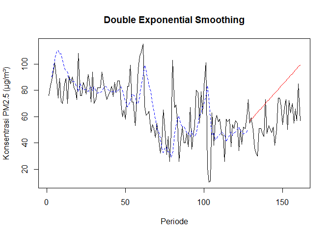<!-- --> Untuk
mendapatkan nilai parameter optimum dari DES, argumen `alpha` dan `beta`
dapat dibuat `NULL` seperti berikut.

``` r
des.opt <- HoltWinters(
  train.ts,
  gamma = FALSE
)
plot(des.opt)
```

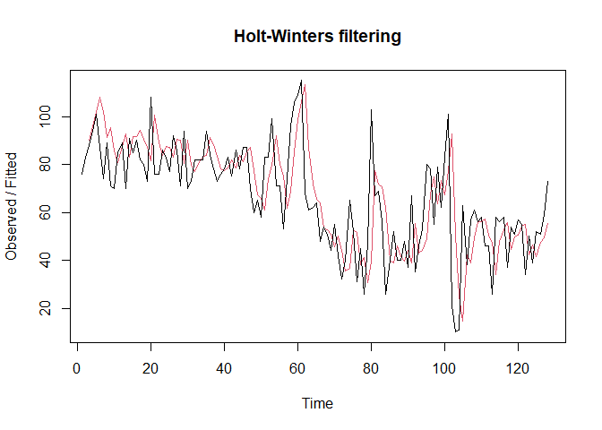<!-- -->

``` r
ramalandesopt <- forecast(
  des.opt,
  h = h_test
)
```

#### Akurasi Data Latih

``` r
ssedes.train1 <- des.1$SSE
msedes.train1 <- ssedes.train1 / length(train.ts)

sisaandes1 <- ramalandes1$residuals

mapedes.train1 <-
  mean(
    abs(
      sisaandes1[3:length(train.ts)] /
      train.ts[3:length(train.ts)]
    ) * 100,
    na.rm = TRUE
  )


ssedes.train2 <- des.2$SSE
msedes.train2 <- ssedes.train2 / length(train.ts)

sisaandes2 <- ramalandes2$residuals

mapedes.train2 <-
  mean(
    abs(
      sisaandes2[3:length(train.ts)] /
      train.ts[3:length(train.ts)]
    ) * 100,
    na.rm = TRUE
  )


ssedes.trainopt <- des.opt$SSE
msedes.trainopt <-
  ssedes.trainopt / length(train.ts)

sisaandesopt <- ramalandesopt$residuals

mapedes.trainopt <-
  mean(
    abs(
      sisaandesopt[3:length(train.ts)] /
      train.ts[3:length(train.ts)]
    ) * 100,
    na.rm = TRUE
  )

# Tabel ringkas
akurasi_des_train <- data.frame(
  Model = c(
    "DES Skenario 1",
    "DES Skenario 2",
    "DES Optimal"
  ),

  SSE = c(
    ssedes.train1,
    ssedes.train2,
    ssedes.trainopt
  ),

  MSE = c(
    msedes.train1,
    msedes.train2,
    msedes.trainopt
  ),

  MAPE = c(
    mapedes.train1,
    mapedes.train2,
    mapedes.trainopt
  )
)

akurasi_des_train
```

    ##            Model      SSE      MSE     MAPE
    ## 1 DES Skenario 1 45271.06 353.6802 31.35653
    ## 2 DES Skenario 2 44899.28 350.7756 27.06199
    ## 3    DES Optimal 38414.89 300.1163 26.66994

Berdasarkan hasil akurasi data latih, DES Optimal menghasilkan SSE
sebesar 38.414,89, MSE sebesar 300,12, dan MAPE sebesar 26,67%. Model
DES Optimal memiliki nilai error paling kecil dibandingkan kedua
skenario lainnya, sehingga memberikan hasil pemulusan terbaik pada data
latih.

#### Akurasi Data Uji

``` r
selisihdes1 <-
  as.numeric(ramalandes1$mean) -
  as.numeric(testing$pm25)

selisihdes2 <-
  as.numeric(ramalandes2$mean) -
  as.numeric(testing$pm25)

selisihdesopt <-
  as.numeric(ramalandesopt$mean) -
  as.numeric(testing$pm25)

SSEtestingdes1 <-
  sum(selisihdes1^2)

MSEtestingdes1 <-
  mean(selisihdes1^2)

MAPEtestingdes1 <-
  mean(
    abs(
      selisihdes1 /
      testing$pm25
    ) * 100
  )

SSEtestingdes2 <-
  sum(selisihdes2^2)

MSEtestingdes2 <-
  mean(selisihdes2^2)

MAPEtestingdes2 <-
  mean(
    abs(
      selisihdes2 /
      testing$pm25
    ) * 100
  )

SSEtestingdesopt <-
  sum(selisihdesopt^2)

MSEtestingdesopt <-
  mean(selisihdesopt^2)

MAPEtestingdesopt <-
  mean(
    abs(
      selisihdesopt /
      testing$pm25
    ) * 100
  )

# Tabel ringkas
akurasi_des_test <- data.frame(
  Model = c(
    "DES Skenario 1",
    "DES Skenario 2",
    "DES Optimal"
  ),

  SSE = c(
    SSEtestingdes1,
    SSEtestingdes2,
    SSEtestingdesopt
  ),

  MSE = c(
    MSEtestingdes1,
    MSEtestingdes2,
    MSEtestingdesopt
  ),

  MAPE = c(
    MAPEtestingdes1,
    MAPEtestingdes2,
    MAPEtestingdesopt
  )
)

akurasi_des_test
```

    ##            Model       SSE        MSE      MAPE
    ## 1 DES Skenario 1  20183.53   611.6220  43.98177
    ## 2 DES Skenario 2 377976.96 11453.8474 177.77658
    ## 3    DES Optimal  19066.96   577.7867  44.94684

Berdasarkan hasil akurasi data uji, DES Optimal menghasilkan MSE
terkecil sebesar 577,79, sedangkan DES Skenario 1 menghasilkan MAPE
terkecil sebesar 43,98%. Dengan demikian, DES Optimal memiliki kinerja
terbaik berdasarkan MSE, sementara DES Skenario 1 lebih baik berdasarkan
MAPE. DES Skenario 2 memiliki tingkat kesalahan paling tinggi
berdasarkan kedua ukuran tersebut.

#### Perbandingan SES dan DES

``` r
MSEfull <- data.frame(
  Model = c(
    "SES Alpha 0.2",
    "SES Alpha 0.7",
    "SES Optimal",
    "DES Skenario 1",
    "DES Skenario 2",
    "DES Optimal"
  ),

  MSE = c(
    MSEtesting1,
    MSEtesting2,
    MSEtestingopt,
    MSEtestingdes1,
    MSEtestingdes2,
    MSEtestingdesopt
  )
)

MSEfull
```

    ##            Model        MSE
    ## 1  SES Alpha 0.2   167.2647
    ## 2  SES Alpha 0.7   306.9614
    ## 3    SES Optimal   180.6614
    ## 4 DES Skenario 1   611.6220
    ## 5 DES Skenario 2 11453.8474
    ## 6    DES Optimal   577.7867

``` r
# Menentukan model terbaik berdasarkan MSE terkecil
MSEfull[
  which.min(MSEfull$MSE),
]
```

    ##           Model      MSE
    ## 1 SES Alpha 0.2 167.2647

Berdasarkan hasil perbandingan MSE pada data uji, metode SES Alpha 0,2
menghasilkan nilai MSE paling kecil, yaitu 167,26. Oleh karena itu, SES
Alpha 0,2 dipilih sebagai metode terbaik dalam melakukan peramalan data
PM2.5 karena menghasilkan error peramalan paling rendah dibandingkan
metode lainnya.

## Seasonal Smoothing

Karena data yang digunakan merupakan data harian, frekuensi 7 digunakan
untuk mengakomodasi pola musiman mingguan. Selanjutnya, dilakukan
pemodelan menggunakan metode Holt-Winters aditif dan multiplikatif.

``` r
# Pembagian Data

n <- nrow(data)

n_train <- floor(
  0.8 * n
)

training_hw <- data[
  1:n_train,
]

testing_hw <- data[
  (n_train + 1):n,
]

train_hw.ts <- ts(
  training_hw$pm25,
  frequency = 7
)

test_hw.ts <- ts(
  testing_hw$pm25,
  frequency = 7
)

n_train
```

    ## [1] 128

``` r
nrow(testing_hw)
```

    ## [1] 33

Kemudian akan dilakukan ekSplorasi dengan plot data deret waktu sebagai
berikut.

``` r
## Eksplorasi Data

plot(data$tanggal, data$pm25,
     type = "o",
     xlab = "Periode",
     ylab = "Konsentrasi PM2.5 (µg/m³)",
     main = "Plot Data PM2.5")
```

<!-- -->

``` r
# Data Latih
plot(training_hw$tanggal, training_hw$pm25,
     type = "o",
     col = "blue",
     xlab = "Periode",
     ylab = "Konsentrasi PM2.5 (µg/m³)",
     main = "Data Latih PM2.5")
```

<!-- -->

``` r
# Data Uji
plot(testing_hw$tanggal, testing_hw$pm25,
     type = "o",
     col = "red",
     xlab = "Periode",
     ylab = "Konsentrasi PM2.5 (µg/m³)",
     main = "Data Uji PM2.5")
```

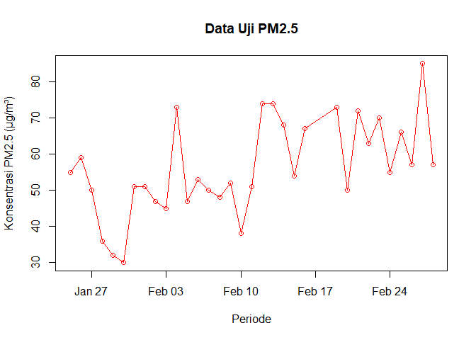<!-- --> Metode
Holt-Winter untuk peramalan data musiman menggunakan tiga persamaan
pemulusan yang terdiri atas persamaan untuk level
"), trend
"), dan
komponen seasonal / musiman
") dengan
parameter pemulusan berupa
,
, dan
.
Metode Holt-Winter musiman terbagi menjadi dua, yaitu metode aditif dan
metode multiplikatif. Perbedaan persamaan dan contoh datanya adalah
sebagai berikut.

 + (1-\alpha)(L_{t-1} + B_{t-1})")

 + (1-\beta)B_{t-1}")

 + (1-\gamma)S_{t-s}")


Pemulusan data musiman dengan metode Winter dilakukan menggunakan fungsi
`HoltWinters()` dengan memasukkan argumen tambahan, yaitu `gamma()` dan
`seasonal()` . Arguman `seasonal()` diinisialisasi menyesuaikan jenis
musiman, aditif atau multiplikatif.

#### Winter Aditif

``` r
# Model Aditif
winter1 <- HoltWinters(
  train_hw.ts,
  alpha = 0.2,
  beta = 0.1,
  gamma = 0.1,
  seasonal = "additive"
)

winter1
```

    ## Holt-Winters exponential smoothing with trend and additive seasonal component.
    ## 
    ## Call:
    ## HoltWinters(x = train_hw.ts, alpha = 0.2, beta = 0.1, gamma = 0.1,     seasonal = "additive")
    ## 
    ## Smoothing parameters:
    ##  alpha: 0.2
    ##  beta : 0.1
    ##  gamma: 0.1
    ## 
    ## Coefficients:
    ##          [,1]
    ## a  54.4727422
    ## b   0.5928781
    ## s1  3.2838657
    ## s2  4.1250190
    ## s3  2.0746832
    ## s4 -3.1749200
    ## s5 -0.6912022
    ## s6 -1.8129926
    ## s7  3.5466512

``` r
winter1$fitted
```

    ## Time Series:
    ## Start = c(2, 1) 
    ## End = c(19, 2) 
    ## Frequency = 7 
    ##               xhat    level        trend       season
    ##  2.000000 94.40816 88.88776 -1.244897959  6.765306122
    ##  2.142857 75.68776 86.56122 -1.353061224 -9.520408163
    ##  2.285714 74.73196 84.27061 -1.446816327 -8.091836735
    ##  2.428571 86.60125 81.87740 -1.541455510  6.265306122
    ##  2.571429 91.63609 80.01570 -1.573480604 13.193877551
    ##  2.714286 77.19696 77.91500 -1.626202496  0.908163265
    ##  2.857143 63.55885 74.84940 -1.770141673 -9.520408163
    ##  3.000000 83.67883 78.56749 -1.221318753  6.332653061
    ##  3.142857 66.52008 77.61041 -1.194895267 -9.895428571
    ##  3.285714 71.91581 81.11150 -0.725296940 -8.470393469
    ##  3.428571 88.01663 82.40304 -0.523613041  6.137205747
    ##  3.571429 92.57514 80.27610 -0.683945646 12.982989985
    ##  3.714286 74.93408 75.67712 -1.075448501  0.332406555
    ##  3.857143 73.47561 81.21486 -0.414130147 -7.325116484
    ##  4.000000 87.38031 81.30561 -0.363642400  6.438347007
    ##  4.142857 70.05762 78.66590 -0.591248624 -8.017035263
    ##  4.285714 73.32707 81.26313 -0.272400986 -7.663657875
    ##  4.428571 88.34225 82.92531 -0.078942403  5.495875328
    ##  4.571429 91.68911 80.57792 -0.305787353 11.416978562
    ##  4.714286 83.01242 80.33431 -0.299569630  2.977679971
    ##  4.857143 73.26927 80.63226 -0.239818088 -7.123165495
    ##  5.000000 85.18130 79.93859 -0.285203583  5.527922111
    ##  5.142857 74.56665 81.41712 -0.108829659 -6.741644708
    ##  5.285714 73.30498 80.39496 -0.200162591 -6.889823544
    ##  5.428571 84.51604 80.13380 -0.206262107  4.588495529
    ##  5.571429 90.60960 79.42433 -0.256582860 11.441849453
    ##  5.714286 80.23374 77.44583 -0.428774884  3.216686141
    ##  5.857143 69.67215 77.37031 -0.393449738 -7.304707475
    ##  6.000000 88.16895 81.84243  0.093107245  6.233417805
    ##  6.142857 74.00450 81.10174  0.009728181 -7.106976435
    ##  6.285714 75.08599 81.91057  0.089638251 -6.914221611
    ##  6.428571 86.01814 81.58301  0.047918445  4.387212518
    ##  6.571429 90.22794 79.62730 -0.152444450 10.753081359
    ##  6.714286 79.99025 77.02927 -0.397003255  3.357986722
    ##  6.857143 71.53893 77.23422 -0.336808341 -5.358479542
    ##  7.000000 83.22194 77.58962 -0.267586917  5.899901549
    ##  7.142857 70.87829 77.87765 -0.212025662 -6.787336155
    ##  7.285714 71.93927 79.08997 -0.069591390 -7.081100833
    ##  7.428571 85.84990 82.03252  0.231623148  3.585760935
    ##  7.571429 92.52363 82.49416  0.254625081  9.774846141
    ##  7.714286 81.64698 78.24406 -0.195847579  3.598766379
    ##  7.857143 68.00844 73.71882 -0.628787160 -5.081593848
    ##  8.000000 77.92153 72.48834 -0.688955877  6.122146570
    ##  8.142857 60.51009 67.81508 -1.087386541 -6.217599068
    ##  8.285714 64.71184 71.22567 -0.637588429 -5.876242678
    ##  8.428571 77.65166 74.24572 -0.271825299  3.677768665
    ##  8.571429 86.37166 78.24356  0.155141485  7.972955502
    ##  8.714286 77.03909 75.32437 -0.152291655  1.867008055
    ##  8.857143 68.36892 73.96426 -0.273073385 -5.322268716
    ##  9.000000 74.56538 70.61740 -0.580451765  4.528423913
    ##  9.142857 64.91371 69.92388 -0.591759287 -4.418406620
    ##  9.285714 71.16615 75.54938  0.029966492 -4.413190157
    ##  9.428571 88.65839 82.54611  0.726643456  5.385635799
    ##  9.571429 95.21778 87.34108  1.133475639  6.743222943
    ##  9.714286 95.34400 92.43100  1.529120130  1.383881136
    ##  9.857143 82.92178 88.49132  0.982240156 -6.551782239
    ## 10.000000 90.11620 85.08920  0.543804641  4.483193826
    ## 10.142857 78.05974 80.00977 -0.018519385 -1.931503504
    ## 10.285714 75.25310 77.17930 -0.299714271 -1.626482300
    ## 10.428571 77.59715 71.42896 -0.844776319  7.012964531
    ## 10.571429 72.87384 65.86476 -1.316719367  8.325800906
    ## 10.714286 57.61544 60.17327 -1.754196146 -0.803638759
    ## 10.857143 45.36396 55.69599 -2.026504853 -8.305524298
    ## 11.000000 55.99680 55.59669 -1.833784011  2.233897722
    ## 11.142857 45.79354 50.96355 -2.113720097 -3.056283050
    ## 11.285714 39.89480 46.09112 -2.389590949 -3.806730492
    ## 11.428571 46.46027 43.72257 -2.387486862  5.125192337
    ## 11.571429 49.60223 45.04303 -2.016692313  6.575893791
    ## 11.714286 39.64428 43.50589 -1.968736856 -1.892873587
    ## 11.857143 30.13203 39.80830 -2.141622405 -7.534640928
    ## 12.000000 39.91016 40.64027 -1.844263050  1.114153377
    ## 12.142857 29.73174 36.01397 -2.122466191 -4.159766457
    ## 12.285714 31.76974 37.34516 -1.777100983 -3.798314146
    ## 12.428571 56.06998 49.81411 -0.352495844  6.608370536
    ## 12.571429 58.28144 51.64762 -0.133895509  6.767715619
    ## 12.714286 51.15349 53.65743  0.080475768 -2.584415786
    ## 12.857143 48.53941 54.70721  0.177405902 -6.345203508
    ## 13.000000 50.10469 50.37673 -0.273382355  0.001340813
    ## 13.142857 44.82863 48.08241 -0.475476199 -2.778305626
    ## 13.285714 50.60927 49.04121 -0.332048822  1.900106413
    ## 13.428571 53.52585 46.58731 -0.544234185  7.482771876
    ## 13.571429 50.14835 43.33790 -0.814751100  7.625200725
    ## 13.714286 39.03907 42.09348 -0.857718188 -2.196695250
    ## 13.857143 31.78109 40.82795 -0.898499575 -8.148356534
    ## 14.000000 45.97208 46.97323 -0.194121467 -0.807034565
    ## 14.142857 41.96654 44.58470 -0.413562991 -2.204596117
    ## 14.285714 45.69630 44.97783 -0.332893719  1.051364962
    ## 14.428571 52.31956 46.10567 -0.186819649  6.400704214
    ## 14.571429 59.27506 51.45494  0.366789216  7.453332375
    ## 14.714286 53.94819 55.56672  0.741287959 -2.359820797
    ## 14.857143 51.94985 56.51837  0.762324259 -5.330844102
    ## 15.000000 62.30925 62.69072  1.303327279 -1.684800660
    ## 15.142857 63.34742 63.93220  1.297142281 -1.881919030
    ## 15.285714 72.48571 69.15986  1.690193804  1.635661243
    ## 15.428571 87.42853 76.55291  2.260479541  8.615139670
    ## 15.571429 75.41092 65.52768  0.931908971  8.951327350
    ## 15.714286 50.72542 53.37741 -0.376309417 -2.275675600
    ## 15.857143 40.71836 45.05601 -1.170817881 -3.166832021
    ## 16.000000 45.90680 48.34152 -0.725185166 -1.709540653
    ## 16.142857 44.84194 46.03498 -0.883321118 -0.309712937
    ## 16.285714 50.85991 47.58327 -0.640160011  3.916804192
    ## 16.428571 51.83463 48.97113 -0.437358269  3.300857391
    ## 16.571429 52.73125 49.36684 -0.354050773  3.718453795
    ## 16.714286 44.36416 50.06654 -0.248675689 -5.453709455
    ## 16.857143 48.54478 50.14504 -0.215958843 -1.384301161
    ## 17.000000 46.81118 49.42012 -0.266854356 -2.342084461
    ## 17.142857 44.97088 44.99103 -0.683078012  0.662931489
    ## 17.285714 51.21929 46.91378 -0.422495696  4.728011163
    ## 17.428571 50.75463 47.44742 -0.326881523  3.634087374
    ## 17.571429 52.52759 48.56961 -0.181974078  4.139954130
    ## 17.714286 39.46675 45.28212 -0.492525976 -5.322842071
    ## 17.857143 45.90650 47.69625 -0.201861051 -1.587883210
    ## 18.000000 44.40611 48.51308 -0.099991067 -4.006979088
    ## 18.142857 52.78902 50.93187  0.151886659  1.705260753
    ## 18.285714 56.83253 51.52595  0.196106310  5.110467856
    ## 18.428571 51.10873 47.15555 -0.260544237  4.213717153
    ## 18.571429 49.28829 46.67326 -0.282718776  2.897746539
    ## 18.714286 39.68422 44.33289 -0.488484620 -4.160182370
    ## 18.857143 44.88499 46.30756 -0.242169024 -1.180403274
    ## 19.000000 44.16906 47.28839 -0.119868749 -2.999468183
    ## 19.142857 52.19360 50.13471  0.176750144  1.882139356

``` r
# Model Aditif Optimal
winter1.opt <- HoltWinters(
  train_hw.ts,
  alpha = NULL,
  beta = NULL,
  gamma = NULL,
  seasonal = "additive"
)

winter1.opt
```

    ## Holt-Winters exponential smoothing with trend and additive seasonal component.
    ## 
    ## Call:
    ## HoltWinters(x = train_hw.ts, alpha = NULL, beta = NULL, gamma = NULL,     seasonal = "additive")
    ## 
    ## Smoothing parameters:
    ##  alpha: 0.3745335
    ##  beta : 0.007144506
    ##  gamma: 0.2173608
    ## 
    ## Coefficients:
    ##          [,1]
    ## a  55.5464985
    ## b  -0.6370214
    ## s1  8.4907279
    ## s2  6.2634731
    ## s3  1.7091289
    ## s4 -0.3426872
    ## s5  5.2566858
    ## s6 -0.5371225
    ## s7 10.0440882

``` r
winter1.opt$fitted
```

    ## Time Series:
    ## Start = c(2, 1) 
    ## End = c(19, 2) 
    ## Frequency = 7 
    ##                xhat    level      trend       season
    ##  2.000000  94.40816 88.88776 -1.2448980   6.76530612
    ##  2.142857  74.83754 85.61732 -1.2593694  -9.52040816
    ##  2.285714  73.55919 82.92066 -1.2696381  -8.09183673
    ##  2.428571  85.30413 80.31799 -1.2791620   6.26530612
    ##  2.571429  90.83882 78.92492 -1.2799758  13.19387755
    ##  2.714286  76.57951 76.95624 -1.2848963   0.90816327
    ##  2.857143  62.38419 73.20710 -1.3025021  -9.52040816
    ##  3.000000  87.42630 82.62218 -1.2259303   6.03005622
    ##  3.142857  69.21296 80.48752 -1.2324227 -10.04212906
    ##  3.285714  77.28802 87.04053 -1.1767996  -8.57571481
    ##  3.428571  92.68830 87.62853 -1.1641910   6.22395870
    ##  3.571429  93.45789 81.71215 -1.1981431  12.94388647
    ##  3.714286  71.61262 72.85184 -1.2528854   0.01366658
    ##  3.857143  78.44169 85.22725 -1.1555180  -5.63003523
    ##  4.000000  87.69538 83.15723 -1.1620516   5.70019569
    ##  4.142857  69.20543 77.61487 -1.1933468  -7.21609261
    ##  4.285714  73.62813 82.71165 -1.1484069  -7.93511234
    ##  4.428571  88.44896 85.07332 -1.1233292   4.49896100
    ##  4.571429  88.67061 79.66198 -1.1539649  10.16259818
    ##  4.714286  83.57052 79.75498 -1.1450559   4.96059908
    ##  4.857143  72.41930 79.51984 -1.1385550  -5.96198793
    ##  5.000000  80.81755 77.84971 -1.1423529   4.11018742
    ##  5.142857  75.60471 81.64463 -1.1070785  -4.93283953
    ##  5.285714  70.65533 78.43840 -1.1220759  -6.66098953
    ##  5.428571  80.02113 78.19448 -1.1158019   2.94245408
    ##  5.571429  87.32456 77.81983 -1.1105068  10.61523494
    ##  5.714286  78.88123 74.71510 -1.1247545   5.29089098
    ##  5.857143  67.48707 74.75843 -1.1164091  -6.15494465
    ##  6.000000  88.42890 83.57200 -1.0454643   5.90236640
    ##  6.142857  74.11564 80.86776 -1.0573154  -5.69481070
    ##  6.285714  73.87612 81.26527 -1.0469214  -6.34222781
    ##  6.428571  82.05243 79.89021 -1.0492658   3.21148492
    ##  6.571429  85.40000 76.57411 -1.0654613   9.89135128
    ##  6.714286  77.36673 72.73710 -1.0852626   5.71489301
    ##  6.857143  70.14103 73.76169 -1.0701888  -2.55046249
    ##  7.000000  78.75440 74.51134 -1.0571869   5.30024934
    ##  7.142857  69.96335 76.16787 -1.0377987  -5.16672404
    ##  7.285714  70.66244 78.14007 -1.0162938  -6.46133816
    ##  7.428571  84.65881 83.24274 -0.9725768   2.38864554
    ##  7.571429  91.06601 83.14702 -0.9663121   8.88530770
    ##  7.714286  79.74884 74.29078 -1.0226817   6.48074660
    ##  7.857143  62.90609 65.87149 -1.0755268  -1.88987700
    ##  8.000000  70.79558 65.58021 -1.0699238   6.28530157
    ##  8.142857  54.53962 59.71791 -1.1041630  -4.07412657
    ##  8.285714  64.00489 69.27311 -1.0280070  -4.24021599
    ##  8.428571  77.08917 75.35941 -0.9771788   2.70693482
    ##  8.571429  87.69137 82.58857 -0.9185486   6.02134377
    ##  8.714286  78.25119 75.41855 -0.9632123   3.79585453
    ##  8.857143  69.15170 71.73952 -0.9826154  -1.60520585
    ##  9.000000  68.22744 64.70755 -1.0258351   4.54571808
    ##  9.142857  64.62846 65.84374 -1.0103885  -0.20488437
    ##  9.285714  73.99880 76.58304 -0.9264428  -1.65779502
    ##  9.428571  92.48706 87.64212 -0.8408122   5.68575365
    ##  9.571429  95.94145 92.98596 -0.7966259   3.75212107
    ##  9.714286 101.39181 99.32740 -0.7456280   2.81004172
    ##  9.857143  81.43938 86.07542 -0.8349797  -3.80105971
    ## 10.000000  82.02604 77.58520 -0.8896725   5.33050893
    ## 10.142857  72.31198 69.19511 -0.9432593   4.06013463
    ## 10.285714  66.86606 65.13873 -0.9655010   2.69282766
    ## 10.428571  64.02200 57.10726 -1.0159839   7.93071874
    ## 10.571429  57.63807 52.33770 -1.0428013   6.34316645
    ## 10.714286  46.01852 48.80872 -1.0605638  -1.72963713
    ## 10.857143  39.34636 46.99215 -1.0659651  -6.57983112
    ## 11.000000  53.37286 51.78900 -1.0240782   2.60793123
    ## 11.142857  48.38100 46.50541 -1.0545103   2.93010489
    ## 11.285714  38.34527 39.31566 -1.0983435   0.12795162
    ## 11.428571  44.31137 38.83707 -1.0939157   6.56820979
    ## 11.571429  49.89390 45.49174 -1.0385559   5.44070865
    ## 11.714286  42.20501 45.24199 -1.0329203  -2.00405896
    ## 11.857143  34.49783 40.01242 -1.0629033  -4.45168933
    ## 12.000000  42.90990 42.88293 -1.0348010   1.06177017
    ## 12.142857  35.13783 35.51481 -1.0800495   0.70307682
    ## 12.285714  38.18214 38.87754 -1.0483080   0.35291499
    ## 12.428571  70.61169 62.10569 -0.8748647   9.38086832
    ## 12.571429  64.72063 59.87812 -0.8845291   5.72703749
    ## 12.714286  56.19588 60.59636 -0.8730781  -3.52740160
    ## 12.857143  55.75242 59.64992 -0.8736022  -3.02389931
    ## 13.000000  45.44266 47.63304 -0.9532154  -1.23716255
    ## 13.142857  45.98935 44.64136 -0.9677792   2.31576048
    ## 13.285714  54.13811 45.92478 -0.9516956   9.16502385
    ## 13.428571  47.57821 39.67789 -0.9895271   8.88985212
    ## 13.571429  41.14909 35.85007 -1.0098053   6.30882557
    ## 13.714286  32.86065 37.40616 -0.9914733  -3.55403207
    ## 13.857143  29.91582 37.96501 -0.9803970  -7.06879608
    ## 14.000000  48.01561 50.87388 -0.8811650  -1.97710252
    ## 14.142857  47.33486 45.11793 -0.9159929   3.13292013
    ## 14.285714  50.02535 43.70199 -0.9195648   7.24292202
    ## 14.428571  50.84451 43.89653 -0.9116051   7.85958002
    ## 14.571429  60.31127 53.90464 -0.8335891   7.24022016
    ## 14.714286  55.91853 59.69607 -0.7862566  -2.99127996
    ## 14.857143  55.74995 58.56579 -0.7887145  -2.02713188
    ## 15.000000  62.01190 66.48500 -0.7265007  -3.74659959
    ## 15.142857  67.97895 65.75404 -0.7265325   2.95144340
    ## 15.285714  77.61439 70.65340 -0.6863383   7.64733161
    ## 15.428571  89.92531 78.72575 -0.6237618  11.82332374
    ## 15.571429  61.12399 52.28715 -0.8081961   9.64503640
    ## 15.714286  28.27015 32.33131 -0.9449966  -3.11615637
    ## 15.857143  25.06061 24.91806 -0.9912090   1.13375645
    ## 16.000000  33.49852 38.13642 -0.8896886  -3.74821768
    ## 16.142857  43.04863 38.93269 -0.8776433   4.99358258
    ## 16.285714  53.26664 43.28030 -0.8403114  10.82664907
    ## 16.428571  46.96957 45.33639 -0.8196181   2.45279835
    ## 16.571429  49.79815 47.89897 -0.7954540   2.69463427
    ## 16.714286  43.93781 50.17539 -0.7735070  -5.46406602
    ## 16.857143  55.69794 50.17424 -0.7679889   6.29168799
    ## 17.000000  41.84387 45.77405 -0.7939392  -3.13623277
    ## 17.142857  45.10001 39.04604 -0.8363351   6.89029731
    ## 17.285714  54.11739 43.04119 -0.8018166  11.87801366
    ## 17.428571  45.82820 42.94447 -0.7967790   3.68050159
    ## 17.571429  49.75193 46.70644 -0.7642090   3.80969064
    ## 17.714286  35.18417 41.16621 -0.7983313  -5.18370779
    ## 17.857143  51.64029 47.41504 -0.7479828   4.97323546
    ## 18.000000  40.38731 46.42724 -0.7496961  -5.29023706
    ## 18.142857  59.83839 51.89956 -0.7052430   8.64407545
    ## 18.285714  60.79794 49.38218 -0.7181898  12.13395847
    ## 18.428571  43.17264 38.62726 -0.7898973   5.33528091
    ## 18.571429  41.69885 40.39443 -0.7716282   2.07604253
    ## 18.714286  35.20749 38.61200 -0.7788500  -2.62566084
    ## 18.857143  48.27478 44.12251 -0.7339156   4.88618672
    ## 19.000000  40.65094 44.40928 -0.7266233  -3.03171104
    ## 19.142857  57.86375 50.55499 -0.6775239   7.98628731

``` r
# Forecast
h_test <- nrow(testing_hw)
forecast1 <- predict(
  winter1,
  n.ahead = h_test
)

forecast1.opt <- predict(
  winter1.opt,
  n.ahead = h_test
)
```

``` r
# Plot
xhat1 <- winter1$fitted[, 2]

xhat1.opt <- winter1.opt$fitted[, 2]

plot(
  train_hw.ts,
  main = "Winter Aditif PM2.5",
  type = "l",
  xlab = "Periode",
  ylab = "Konsentrasi PM2.5 (µg/m³)"
)

lines(
  xhat1,
  col = "red",
  lwd = 2
)

lines(
  xhat1.opt,
  col = "blue",
  lwd = 2
)

lines(
  forecast1,
  col = "red",
  lwd = 2
)

lines(
  forecast1.opt,
  col = "blue",
  lwd = 2
)

legend(
  "topleft",
  c(
    "Data Aktual",
    "Winter Aditif",
    "Winter Aditif Optimal"
  ),
  col = c(
    "black",
    "red",
    "blue"
  ),
  lty = 1,
  cex = 0.7
)
```

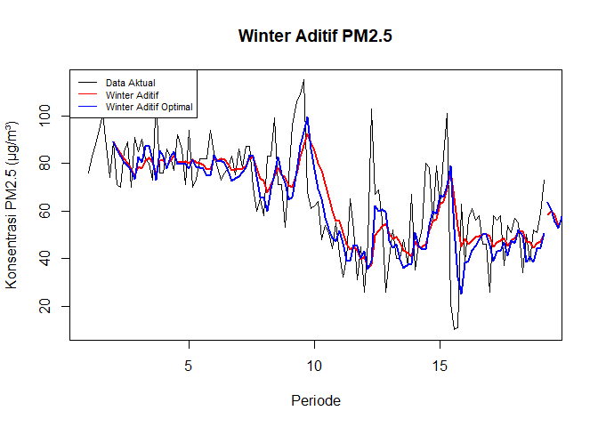<!-- -->

``` r
# Akurasi Data Latih

SSE_hw1 <- winter1$SSE
MSE_hw1 <- SSE_hw1 / length(train_hw.ts)
RMSE_hw1 <- sqrt(MSE_hw1)


SSE_hw1.opt <- winter1.opt$SSE
MSE_hw1.opt <- SSE_hw1.opt / length(train_hw.ts)
RMSE_hw1.opt <- sqrt(MSE_hw1.opt)


akurasi_hw_train <- data.frame(
  Model = c("Winter Aditif", "Winter Aditif Optimal"),
  SSE = c(SSE_hw1, SSE_hw1.opt),
  MSE = c(MSE_hw1, MSE_hw1.opt),
  RMSE = c(RMSE_hw1, RMSE_hw1.opt)
)

akurasi_hw_train
```

    ##                   Model      SSE      MSE     RMSE
    ## 1         Winter Aditif 41747.55 326.1527 18.05970
    ## 2 Winter Aditif Optimal 37820.10 295.4695 17.18923

``` r
best_hw1_train <-
  akurasi_hw_train$Model[
    which.min(
      akurasi_hw_train$RMSE
    )
  ]

cat(
  "Berdasarkan hasil akurasi data latih,",
  best_hw1_train,
  "memiliki nilai RMSE paling kecil. ",
  "Dengan demikian, model tersebut memberikan",
  "hasil pemulusan yang lebih baik pada data latih."
)
```

    ## Berdasarkan hasil akurasi data latih, Winter Aditif Optimal memiliki nilai RMSE paling kecil.  Dengan demikian, model tersebut memberikan hasil pemulusan yang lebih baik pada data latih.

``` r
# Akurasi Data Uji
error_hw1 <-
  as.numeric(forecast1) -
  as.numeric(test_hw.ts)

error_hw1.opt <-
  as.numeric(forecast1.opt) -
  as.numeric(test_hw.ts)

SSE_hw1.test <-
  sum(error_hw1^2)

MSE_hw1.test <-
  mean(error_hw1^2)

RMSE_hw1.test <-
  sqrt(MSE_hw1.test)

SSE_hw1.opt.test <-
  sum(error_hw1.opt^2)

MSE_hw1.opt.test <-
  mean(error_hw1.opt^2)

RMSE_hw1.opt.test <-
  sqrt(MSE_hw1.opt.test)

akurasi_hw_test <- data.frame(
  Model = c(
    "Winter Aditif",
    "Winter Aditif Optimal"
  ),

  SSE = c(
    SSE_hw1.test,
    SSE_hw1.opt.test
  ),

  MSE = c(
    MSE_hw1.test,
    MSE_hw1.opt.test
  ),

  RMSE = c(
    RMSE_hw1.test,
    RMSE_hw1.opt.test
  )
)

akurasi_hw_test
```

    ##                   Model       SSE      MSE     RMSE
    ## 1         Winter Aditif  6956.005 210.7880 14.51854
    ## 2 Winter Aditif Optimal 11779.928 356.9675 18.89358

``` r
best_hw1_test <-
  akurasi_hw_test$Model[
    which.min(
      akurasi_hw_test$RMSE
    )
  ]

cat(
  "Berdasarkan hasil akurasi data uji,",
  best_hw1_test,
  "memiliki nilai RMSE paling kecil. ",
  "Dengan demikian, model tersebut memberikan",
  "hasil peramalan yang lebih baik pada data uji."
)
```

    ## Berdasarkan hasil akurasi data uji, Winter Aditif memiliki nilai RMSE paling kecil.  Dengan demikian, model tersebut memberikan hasil peramalan yang lebih baik pada data uji.

#### Winter Multiplikatif

Model multiplikatif digunakan cocok digunakan jika plot data asli
menunjukkan fluktuasi musiman yang bervariasi.

``` r
# Model Multiplikatif
winter2 <- HoltWinters(
  train_hw.ts,
  alpha = 0.2,
  beta = 0.1,
  gamma = 0.3,
  seasonal = "multiplicative"
)

winter2
```

    ## Holt-Winters exponential smoothing with trend and multiplicative seasonal component.
    ## 
    ## Call:
    ## HoltWinters(x = train_hw.ts, alpha = 0.2, beta = 0.1, gamma = 0.3,     seasonal = "multiplicative")
    ## 
    ## Smoothing parameters:
    ##  alpha: 0.2
    ##  beta : 0.1
    ##  gamma: 0.3
    ## 
    ## Coefficients:
    ##          [,1]
    ## a  56.9238132
    ## b   0.5862737
    ## s1  1.0531988
    ## s2  1.0556284
    ## s3  0.8846290
    ## s4  0.8973818
    ## s5  1.0385799
    ## s6  0.9058656
    ## s7  1.1476404

``` r
winter2$fitted
```

    ## Time Series:
    ## Start = c(2, 1) 
    ## End = c(19, 2) 
    ## Frequency = 7 
    ##               xhat    level       trend    season
    ##  2.000000 95.09667 88.88776 -1.24489796 1.0850475
    ##  2.142857 75.28170 86.51910 -1.35727398 0.8839841
    ##  2.285714 74.34676 84.19310 -1.45414677 0.8985703
    ##  2.428571 86.43297 81.77146 -1.55089514 1.0774415
    ##  2.571429 90.39914 79.95457 -1.57749463 1.1533875
    ##  2.714286 77.54682 78.13447 -1.60175608 1.0132506
    ##  2.857143 65.10696 75.04308 -1.75071856 0.8883184
    ##  3.000000 83.26576 79.12204 -1.16775103 1.0681357
    ##  3.142857 67.25227 78.27901 -1.13527871 0.8717788
    ##  3.285714 72.41430 82.36243 -0.61340937 0.8858125
    ##  3.428571 89.62470 83.91329 -0.39698215 1.0731401
    ##  3.571429 93.24428 81.72256 -0.57635673 1.1490898
    ##  3.714286 75.85913 77.62267 -0.92871005 0.9891147
    ##  3.857143 80.16625 83.19288 -0.27881828 0.9668595
    ##  4.000000 87.68741 82.05225 -0.36499935 1.0734528
    ##  4.142857 74.03858 79.50972 -0.58275290 0.9380645
    ##  4.285714 74.10801 81.47720 -0.32772959 0.9132285
    ##  4.428571 86.68682 83.09684 -0.13299207 1.0448746
    ##  4.571429 87.77948 81.10969 -0.31840807 1.0864969
    ##  4.714286 87.98304 81.56819 -0.24071768 1.0818367
    ##  4.857143 77.02637 80.96086 -0.27737829 0.9546734
    ##  5.000000 82.03379 79.42098 -0.40362825 1.0381743
    ##  5.142857 78.98265 81.32260 -0.17310420 0.9732982
    ##  5.285714 74.12321 79.30368 -0.35768594 0.9389103
    ##  5.428571 79.59491 78.70673 -0.38161165 1.0162118
    ##  5.571429 86.22548 78.79847 -0.33427720 1.0989151
    ##  5.714286 83.15433 77.69516 -0.41117994 1.0759582
    ##  5.857143 71.76746 77.06941 -0.43263674 0.9364624
    ##  6.000000 87.41117 81.38497  0.04218290 1.0734891
    ##  6.142857 76.41784 80.79163 -0.02136998 0.9461136
    ##  6.285714 75.88357 81.10471  0.01207552 0.9354853
    ##  6.428571 82.34430 80.50030 -0.04957303 1.0235371
    ##  6.571429 85.82387 79.21105 -0.17354121 1.0858626
    ##  6.714286 82.87098 77.59646 -0.31764546 1.0723635
    ##  6.857143 77.14354 77.30288 -0.31523924 1.0020250
    ##  7.000000 81.02961 76.55980 -0.35802345 1.0633559
    ##  7.142857 73.08963 77.13663 -0.26453842 0.9507954
    ##  7.285714 72.05977 77.90498 -0.16124868 0.9268884
    ##  7.428571 81.47864 80.96747  0.16112524 1.0043146
    ##  7.571429 87.58643 82.22813  0.27107813 1.0616639
    ##  7.714286 84.88352 79.18621 -0.06022132 1.0727641
    ##  7.857143 73.61549 74.48685 -0.52413543 0.9953054
    ##  8.000000 77.17260 72.23149 -0.69725801 1.0788206
    ##  8.142857 64.64648 67.97987 -1.05269434 0.9659227
    ##  8.285714 68.03528 70.72738 -0.67267377 0.9711736
    ##  8.428571 74.25871 73.13649 -0.36449562 1.0204298
    ##  8.571429 78.39171 77.62118  0.12042335 1.0083624
    ##  8.714286 75.68419 76.27552 -0.02618493 0.9925882
    ##  8.857143 72.67971 75.30550 -0.12056835 0.9666792
    ##  9.000000 71.37139 71.11332 -0.52772949 1.0111326
    ##  9.142857 72.62169 71.10553 -0.47573612 1.0282019
    ##  9.285714 76.68044 75.17721 -0.02099442 1.0202808
    ##  9.428571 89.35283 80.90356  0.55374062 1.0969284
    ##  9.571429 84.67119 85.03952  0.91196216 0.9851045
    ##  9.714286 91.54479 92.10896  1.52771019 0.9776596
    ##  9.857143 80.90311 88.82011  1.04605394 0.9002622
    ## 10.000000 87.76981 85.44454  0.60389140 1.0200048
    ## 10.142857 89.43356 80.99555  0.09860336 1.1028362
    ## 10.285714 84.28344 76.48176 -0.36263587 1.1072571
    ## 10.428571 78.99240 69.56537 -1.01801107 1.1523770
    ## 10.571429 66.78270 64.20982 -1.45176499 1.0641295
    ## 10.714286 53.05391 59.79174 -1.74839622 0.9140395
    ## 10.857143 45.69306 56.06227 -1.94650387 0.8443576
    ## 11.000000 51.51759 56.32027 -1.72605363 0.9436456
    ## 11.142857 51.81547 52.57702 -1.92777328 1.0230256
    ## 11.285714 43.66344 46.77535 -2.31516291 0.9820795
    ## 11.428571 43.76092 43.71413 -2.38976870 1.0589617
    ## 11.571429 43.38079 45.33566 -1.98863839 1.0007788
    ## 11.714286 37.85861 45.06953 -1.81638828 0.8752801
    ## 11.857143 35.10686 41.68596 -1.97310637 0.8840176
    ## 12.000000 36.18966 41.95107 -1.74928417 0.9002003
    ## 12.142857 33.13397 37.93792 -1.97567077 0.9213542
    ## 12.285714 35.87894 38.97218 -1.67467844 0.9619665
    ## 12.428571 59.71001 51.25247 -0.27918158 1.1713982
    ## 12.571429 54.49339 52.21795 -0.15471513 1.0466771
    ## 12.714286 45.93320 54.83517  0.12247842 0.8357928
    ## 12.857143 54.30169 57.36657  0.36337057 0.9406158
    ## 13.000000 43.01871 51.71225 -0.23839890 0.8357393
    ## 13.142857 50.78100 50.75144 -0.31063948 1.0067445
    ## 13.285714 64.31982 50.68297 -0.28642281 1.2762743
    ## 13.428571 55.32672 46.58548 -0.66752923 1.2049038
    ## 13.571429 47.12885 43.37390 -0.92193485 1.1101689
    ## 13.714286 36.61112 42.60890 -0.90624078 0.8779084
    ## 13.857143 33.09401 41.79125 -0.89738147 0.8092657
    ## 14.000000 40.42743 49.27332 -0.05943692 0.8214640
    ## 14.142857 48.29797 47.89248 -0.19157735 1.0125169
    ## 14.285714 54.10773 47.24699 -0.23696850 1.1509830
    ## 14.428571 52.15318 46.81753 -0.25621698 1.1200968
    ## 14.571429 57.73253 51.53353  0.24100467 1.1150758
    ## 14.714286 49.30046 55.40971  0.60452195 0.8801417
    ## 14.857143 56.55835 57.30937  0.73403602 0.9744147
    ## 15.000000 50.70931 62.64959  1.19465403 0.7942659
    ## 15.142857 68.22378 66.68730  1.47895917 1.0008439
    ## 15.285714 83.48495 71.11901  1.77423434 1.1453045
    ## 15.428571 97.52303 75.95182  2.08009268 1.2497839
    ## 15.571429 80.16066 65.78611  0.85551244 1.2028617
    ## 15.714286 49.41768 54.97600 -0.31104994 0.9040102
    ## 15.857143 47.72217 46.16556 -1.16098891 1.0603849
    ## 16.000000 39.25140 47.88614 -0.87283259 0.8348998
    ## 16.142857 48.13370 46.71353 -0.90280984 1.0507081
    ## 16.285714 56.14764 47.49840 -0.73404173 1.2006502
    ## 16.428571 45.54065 47.57265 -0.65321288 0.9706136
    ## 16.571429 43.60655 49.07464 -0.43769244 0.8965725
    ## 16.714286 36.43365 51.84772 -0.11661519 0.7042890
    ## 16.857143 62.08090 54.44770  0.15504461 1.1369557
    ## 17.000000 42.78731 51.77398 -0.12783194 0.8284705
    ## 17.142857 51.55510 47.59355 -0.53309233 1.0955078
    ## 17.285714 58.58771 48.23706 -0.41543175 1.2251300
    ## 17.428571 47.96321 47.39919 -0.45767562 1.0217652
    ## 17.571429 46.85471 48.90611 -0.26121575 0.9631989
    ## 17.714286 34.43614 46.59865 -0.46584040 0.7464565
    ## 17.857143 54.64298 51.37461  0.05833917 1.0624121
    ## 18.000000 37.73898 50.74715 -0.01024033 0.7438171
    ## 18.142857 63.62171 55.91588  0.50765625 1.1275739
    ## 18.285714 66.96332 54.89428  0.35473136 1.2120274
    ## 18.428571 53.14445 49.80965 -0.18920553 1.0710194
    ## 18.571429 44.51386 49.03325 -0.24792443 0.9124435
    ## 18.714286 39.55320 47.57674 -0.36878356 0.8378504
    ## 18.857143 52.37142 50.17908 -0.07167096 1.0451832
    ## 19.000000 41.11538 49.84498 -0.09791367 0.8264885
    ## 19.142857 59.30012 54.07492  0.33487201 1.0898795

``` r
# Model Multiplikatif Optimal
winter2.opt <- HoltWinters(
  train_hw.ts,
  alpha = NULL,
  beta = NULL,
  gamma = NULL,
  seasonal = "multiplicative"
)

winter2.opt
```

    ## Holt-Winters exponential smoothing with trend and multiplicative seasonal component.
    ## 
    ## Call:
    ## HoltWinters(x = train_hw.ts, alpha = NULL, beta = NULL, gamma = NULL,     seasonal = "multiplicative")
    ## 
    ## Smoothing parameters:
    ##  alpha: 0.3373193
    ##  beta : 0.006217193
    ##  gamma: 0.1561606
    ## 
    ## Coefficients:
    ##          [,1]
    ## a  56.6503447
    ## b  -0.6934027
    ## s1  1.0882570
    ## s2  1.0796591
    ## s3  0.9743877
    ## s4  0.9221282
    ## s5  1.0580116
    ## s6  0.9419818
    ## s7  1.1339191

``` r
winter2.opt$fitted
```

    ## Time Series:
    ## Start = c(2, 1) 
    ## End = c(19, 2) 
    ## Frequency = 7 
    ##               xhat    level      trend    season
    ##  2.000000 95.09667 88.88776 -1.2448980 1.0850475
    ##  2.142857 74.68857 85.74753 -1.2566816 0.8839841
    ##  2.285714 73.51913 83.08333 -1.2654324 0.8985703
    ##  2.428571 85.35834 80.49683 -1.2736457 1.0774415
    ##  2.571429 89.77582 79.11099 -1.2743432 1.1533875
    ##  2.714286 77.34548 77.60976 -1.2757539 1.0132506
    ##  2.857143 64.48985 73.88863 -1.2909572 0.8883184
    ##  3.000000 87.76269 82.66432 -1.2283709 1.0776898
    ##  3.142857 69.76857 80.57122 -1.2337471 0.8793898
    ##  3.285714 76.80967 87.09791 -1.1854990 0.8940462
    ##  3.428571 93.37071 87.87070 -1.1733239 1.0769727
    ##  3.571429 93.69802 82.50953 -1.1993606 1.1523530
    ##  3.714286 74.23367 75.25140 -1.2370291 1.0029629
    ##  3.857143 77.59476 85.37076 -1.1664243 0.9215056
    ##  4.000000 88.56351 83.62057 -1.1700537 1.0741414
    ##  4.142857 69.84447 78.50512 -1.1945830 0.9034276
    ##  4.285714 73.98005 83.34264 -1.1570802 0.9001588
    ##  4.428571 89.51248 85.56563 -1.1360656 1.0602030
    ##  4.571429 89.11063 80.44854 -1.1608165 1.1238894
    ##  4.714286 82.46708 80.15492 -1.1554249 1.0438938
    ##  4.857143 72.63639 80.14111 -1.1483273 0.9195320
    ##  5.000000 81.68796 78.39249 -1.1520594 1.0575803
    ##  5.142857 73.91572 81.16741 -1.1276446 0.9234876
    ##  5.285714 70.58309 78.60948 -1.1365370 0.9110677
    ##  5.428571 80.64355 78.36779 -1.1309735 1.0441076
    ##  5.571429 86.31568 77.67504 -1.1282490 1.1276197
    ##  5.714286 77.71103 75.25579 -1.1362754 1.0484558
    ##  5.857143 68.22651 75.49940 -1.1276964 0.9173718
    ##  6.000000 88.84580 83.84867 -1.0687763 1.0732776
    ##  6.142857 73.63069 81.25691 -1.0782450 0.9183328
    ##  6.285714 73.79472 81.78359 -1.0682669 0.9142592
    ##  6.428571 82.99544 80.42210 -1.0700898 1.0459148
    ##  6.571429 85.26130 77.09590 -1.0841165 1.1216852
    ##  6.714286 76.68221 73.82813 -1.0976927 1.0543345
    ##  6.857143 69.92294 74.75172 -1.0851260 0.9491810
    ##  7.000000 79.38947 75.47088 -1.0739084 1.0671062
    ##  7.142857 69.68288 76.48660 -1.0609168 0.9238614
    ##  7.285714 70.70313 78.46242 -1.0420368 0.9132366
    ##  7.428571 85.44624 83.43991 -1.0046123 1.0365249
    ##  7.571429 91.07631 82.94094 -1.0014686 1.1115071
    ##  7.714286 79.20166 75.54325 -1.0412351 1.0630807
    ##  7.857143 64.37722 68.40926 -1.0791149 0.9561426
    ##  8.000000 71.52732 67.54986 -1.0777490 1.0760501
    ##  8.142857 57.14384 62.23158 -1.1041132 0.9348309
    ##  8.285714 64.79173 70.45726 -1.0461080 0.9334484
    ##  8.428571 77.87008 75.99105 -1.0051995 1.0384635
    ##  8.571429 87.57097 81.84939 -0.9625276 1.0826353
    ##  8.714286 77.27250 75.72381 -0.9946273 1.0340338
    ##  8.857143 68.60051 72.68298 -1.0073489 0.9570967
    ##  9.000000 68.62424 66.17739 -1.0415326 1.0535556
    ##  9.142857 64.03620 66.85702 -1.0308317 0.9728074
    ##  9.285714 72.77642 76.90958 -0.9619241 0.9582445
    ##  9.428571 92.40824 87.64296 -0.8892122 1.0651787
    ##  9.571429 96.61956 92.00800 -0.8565455 1.0599893
    ##  9.714286 98.59490 97.00064 -0.8201800 1.0251032
    ##  9.857143 79.49430 86.11294 -0.8827717 0.9327015
    ## 10.000000 82.41987 78.54155 -0.9243561 1.0618765
    ## 10.142857 71.27559 71.13055 -0.9646849 1.0158158
    ## 10.285714 66.60146 67.74987 -0.9797055 0.9974733
    ## 10.428571 64.44603 60.47964 -1.0188149 1.0838400
    ## 10.571429 59.56222 56.20975 -1.0390275 1.0795983
    ## 10.714286 50.83983 52.49547 -1.0556601 0.9883363
    ## 10.857143 43.63199 49.10537 -1.0701737 0.9083338
    ## 11.000000 52.86034 52.25683 -1.0439270 1.0321685
    ## 11.142857 46.81681 47.66367 -1.0659933 1.0047027
    ## 11.285714 39.13388 41.62307 -1.0969214 0.9656450
    ## 11.428571 42.30080 40.82871 -1.0950403 1.0646085
    ## 11.571429 48.75284 46.92587 -1.0503250 1.0627196
    ## 11.714286 44.66632 46.90623 -1.0439170 0.9739221
    ## 11.857143 37.28561 41.12896 -1.0733452 0.9308459
    ## 12.000000 42.15418 42.85115 -1.0559648 1.0085892
    ## 12.142857 34.16845 36.39248 -1.0895545 0.9678647
    ## 12.285714 37.46821 39.77496 -1.0617510 0.9678402
    ## 12.428571 67.58571 61.55287 -0.9197524 1.1146665
    ## 12.571429 63.69553 60.45587 -0.9208544 1.0698835
    ## 12.714286 56.65120 61.20744 -0.9104566 0.9395362
    ## 12.857143 56.16272 60.06319 -0.9119102 0.9494760
    ## 13.000000 45.68452 48.43540 -0.9785328 0.9626536
    ## 13.142857 44.52962 45.46498 -0.9909168 1.0012492
    ## 13.285714 49.60542 46.99082 -0.9752696 1.0780143
    ## 13.428571 46.79168 43.00994 -0.9939561 1.1136639
    ## 13.571429 42.02354 39.95884 -1.0067457 1.0788518
    ## 13.714286 37.37291 40.82072 -0.9951281 0.9384143
    ## 13.857143 34.24683 39.69155 -0.9959615 0.8850319
    ## 14.000000 47.73335 51.17907 -0.9183493 0.9497148
    ## 14.142857 45.58447 45.73809 -0.9464673 1.0177007
    ## 14.285714 46.39859 44.92936 -0.9456110 1.0549031
    ## 14.428571 49.50110 46.09463 -0.9324872 1.0960750
    ## 14.571429 58.71963 54.54825 -0.8741320 1.0940028
    ## 14.714286 55.10449 59.61893 -0.8371720 0.9374420
    ## 14.857143 55.08433 58.74416 -0.8374057 0.9512591
    ## 15.000000 60.41380 66.38732 -0.7846804 0.9209050
    ## 15.142857 66.62285 66.18365 -0.7810682 1.0186578
    ## 15.285714 74.96449 70.82573 -0.7473514 1.0697236
    ## 15.428571 89.53605 78.28824 -0.6963091 1.1539351
    ## 15.571429 63.96869 57.55741 -0.8208676 1.1274690
    ## 15.714286 37.17988 40.59004 -0.9212535 0.9372579
    ## 15.857143 28.93138 30.24664 -0.9798328 0.9885389
    ## 16.000000 36.92109 40.89205 -0.9075564 0.9233852
    ## 16.142857 41.15457 40.37863 -0.9051060 1.0425867
    ## 16.285714 48.28058 44.60016 -0.8732327 1.1041384
    ## 16.428571 48.19988 47.61277 -0.8490737 1.0307116
    ## 16.571429 47.99235 49.31643 -0.8332029 0.9898754
    ## 16.714286 43.30115 51.89353 -0.8120004 0.8476872
    ## 16.857143 55.18886 52.15548 -0.8053234 1.0747556
    ## 17.000000 44.12450 48.46616 -0.8232537 0.9261503
    ## 17.142857 43.36555 41.04167 -0.8642949 1.0793524
    ## 17.285714 49.70236 44.75093 -0.8358602 1.1317836
    ## 17.428571 47.08490 45.79204 -0.8241908 1.0470792
    ## 17.571429 48.15067 48.48418 -0.8023291 1.0098324
    ## 17.714286 36.79311 43.95713 -0.8254863 0.8530421
    ## 17.857143 51.86266 49.93578 -0.7831837 1.0551356
    ## 18.000000 42.34254 48.87681 -0.7848983 0.8804502
    ## 18.142857 58.95199 53.70750 -0.7499851 1.1131940
    ## 18.285714 58.44972 51.75999 -0.7574304 1.1460155
    ## 18.428571 46.03028 43.80600 -0.8021728 1.0703764
    ## 18.571429 42.74689 44.25485 -0.7943949 0.9835813
    ## 18.714286 36.76829 42.17546 -0.8023840 0.8887009
    ## 18.857143 48.86096 47.15449 -0.7664398 1.0533091
    ## 19.000000 42.08236 47.07307 -0.7621809 0.9086925
    ## 19.142857 57.32912 52.59096 -0.7231365 1.1052927

``` r
# Forecast
forecast2 <- predict(
  winter2,
  n.ahead = h_test
)

forecast2.opt <- predict(
  winter2.opt,
  n.ahead = h_test
)
```

``` r
# Plot
xhat2 <-
  winter2$fitted[, 2]

xhat2.opt <-
  winter2.opt$fitted[, 2]

plot(
  train_hw.ts,
  main = "Winter Multiplikatif PM2.5",
  type = "l",
  xlab = "Periode",
  ylab = "Konsentrasi PM2.5 (µg/m³)"
)

lines(
  xhat2,
  col = "red",
  lwd = 2
)

lines(
  xhat2.opt,
  col = "blue",
  lwd = 2
)

lines(
  forecast2,
  col = "red",
  lwd = 2
)

lines(
  forecast2.opt,
  col = "blue",
  lwd = 2
)

legend(
  "topleft",
  c(
    "Data Aktual",
    "Winter Multiplikatif",
    "Winter Multiplikatif Optimal"
  ),
  col = c(
    "black",
    "red",
    "blue"
  ),
  lty = 1,
  cex = 0.7
)
```

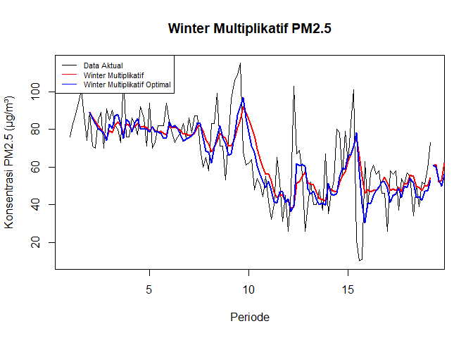<!-- -->

``` r
# Akurasi Data Latih
SSE_hw2 <- winter2$SSE

MSE_hw2 <-
  SSE_hw2 /
  length(train_hw.ts)

RMSE_hw2 <-
  sqrt(MSE_hw2)

SSE_hw2.opt <-
  winter2.opt$SSE

MSE_hw2.opt <-
  SSE_hw2.opt /
  length(train_hw.ts)

RMSE_hw2.opt <-
  sqrt(MSE_hw2.opt)

akurasi_hw2_train <- data.frame(
  Model = c(
    "Winter Multiplikatif",
    "Winter Multiplikatif Optimal"
  ),

  SSE = c(
    SSE_hw2,
    SSE_hw2.opt
  ),

  MSE = c(
    MSE_hw2,
    MSE_hw2.opt
  ),

  RMSE = c(
    RMSE_hw2,
    RMSE_hw2.opt
  )
)

akurasi_hw2_train
```

    ##                          Model      SSE      MSE     RMSE
    ## 1         Winter Multiplikatif 42954.42 335.5814 18.31888
    ## 2 Winter Multiplikatif Optimal 37386.30 292.0804 17.09036

``` r
best_hw2_train <-
  akurasi_hw2_train$Model[
    which.min(
      akurasi_hw2_train$RMSE
    )
  ]

cat(
  "Berdasarkan hasil akurasi data latih,",
  best_hw2_train,
  "memiliki nilai RMSE paling kecil. ",
  "Dengan demikian, model tersebut memberikan",
  "hasil pemulusan yang lebih baik pada data latih."
)
```

    ## Berdasarkan hasil akurasi data latih, Winter Multiplikatif Optimal memiliki nilai RMSE paling kecil.  Dengan demikian, model tersebut memberikan hasil pemulusan yang lebih baik pada data latih.

``` r
# Akurasi Data Uji
error_hw2 <-
  as.numeric(forecast2) -
  as.numeric(test_hw.ts)

error_hw2.opt <-
  as.numeric(forecast2.opt) -
  as.numeric(test_hw.ts)

SSE_hw2.test <-
  sum(error_hw2^2)

MSE_hw2.test <-
  mean(error_hw2^2)

RMSE_hw2.test <-
  sqrt(MSE_hw2.test)

SSE_hw2.opt.test <-
  sum(error_hw2.opt^2)

MSE_hw2.opt.test <-
  mean(error_hw2.opt^2)

RMSE_hw2.opt.test <-
  sqrt(MSE_hw2.opt.test)

akurasi_hw2_test <- data.frame(
  Model = c(
    "Winter Multiplikatif",
    "Winter Multiplikatif Optimal"
  ),

  SSE = c(
    SSE_hw2.test,
    SSE_hw2.opt.test
  ),

  MSE = c(
    MSE_hw2.test,
    MSE_hw2.opt.test
  ),

  RMSE = c(
    RMSE_hw2.test,
    RMSE_hw2.opt.test
  )
)

akurasi_hw2_test
```

    ##                          Model       SSE      MSE     RMSE
    ## 1         Winter Multiplikatif  8264.595 250.4423 15.82537
    ## 2 Winter Multiplikatif Optimal 13918.343 421.7680 20.53699

``` r
best_hw2_test <-
  akurasi_hw2_test$Model[
    which.min(
      akurasi_hw2_test$RMSE
    )
  ]

cat(
  "Berdasarkan hasil akurasi data uji,",
  best_hw2_test,
  "memiliki nilai RMSE paling kecil. ",
  "Dengan demikian, model tersebut memberikan",
  "hasil peramalan yang lebih baik pada data uji."
)
```

    ## Berdasarkan hasil akurasi data uji, Winter Multiplikatif memiliki nilai RMSE paling kecil.  Dengan demikian, model tersebut memberikan hasil peramalan yang lebih baik pada data uji.

## Perbandingan Semua Model

``` r
perbandingan_model <- data.frame(
  Model = c(
    "SMA m=4",
    "DMA m=4",
    "SES Alpha=0.2",
    "SES Alpha=0.7",
    "SES Optimal",
    "DES Skenario 1",
    "DES Skenario 2",
    "DES Optimal",
    "Winter Aditif",
    "Winter Aditif Optimal",
    "Winter Multiplikatif",
    "Winter Multiplikatif Optimal"
  ),

  RMSE = c(
    sqrt(MSE_test.sma),
    sqrt(MSE_test.dma),

    RMSEtesting1,
    RMSEtesting2,
    RMSEtestingopt,

    sqrt(MSEtestingdes1),
    sqrt(MSEtestingdes2),
    sqrt(MSEtestingdesopt),

    RMSE_hw1.test,
    RMSE_hw1.opt.test,

    RMSE_hw2.test,
    RMSE_hw2.opt.test
  )
)

perbandingan_model
```

    ##                           Model      RMSE
    ## 1                       SMA m=4  13.14610
    ## 2                       DMA m=4 118.40504
    ## 3                 SES Alpha=0.2  12.93309
    ## 4                 SES Alpha=0.7  17.52031
    ## 5                   SES Optimal  13.44104
    ## 6                DES Skenario 1  24.73099
    ## 7                DES Skenario 2 107.02265
    ## 8                   DES Optimal  24.03719
    ## 9                 Winter Aditif  14.51854
    ## 10        Winter Aditif Optimal  18.89358
    ## 11         Winter Multiplikatif  15.82537
    ## 12 Winter Multiplikatif Optimal  20.53699

``` r
perbandingan_model <-
  perbandingan_model[
    order(perbandingan_model$RMSE),
  ]

perbandingan_model
```

    ##                           Model      RMSE
    ## 3                 SES Alpha=0.2  12.93309
    ## 1                       SMA m=4  13.14610
    ## 5                   SES Optimal  13.44104
    ## 9                 Winter Aditif  14.51854
    ## 11         Winter Multiplikatif  15.82537
    ## 4                 SES Alpha=0.7  17.52031
    ## 10        Winter Aditif Optimal  18.89358
    ## 12 Winter Multiplikatif Optimal  20.53699
    ## 8                   DES Optimal  24.03719
    ## 6                DES Skenario 1  24.73099
    ## 7                DES Skenario 2 107.02265
    ## 2                       DMA m=4 118.40504

``` r
model_terbaik <-
  perbandingan_model$Model[1]

rmse_terbaik <-
  perbandingan_model$RMSE[1]

cat(
  "Berdasarkan hasil perbandingan pada data uji, model terbaik adalah",
  model_terbaik,
  "dengan nilai RMSE sebesar",
  rmse_terbaik,
  ". Model tersebut dipilih karena memiliki nilai RMSE paling kecil dibandingkan model lainnya."
)
```

    ## Berdasarkan hasil perbandingan pada data uji, model terbaik adalah SES Alpha=0.2 dengan nilai RMSE sebesar 12.93309 . Model tersebut dipilih karena memiliki nilai RMSE paling kecil dibandingkan model lainnya.
