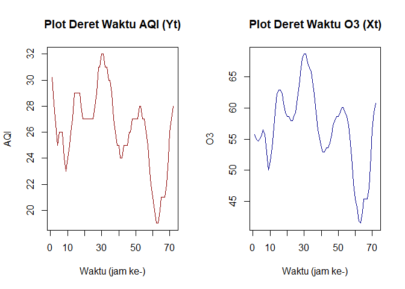
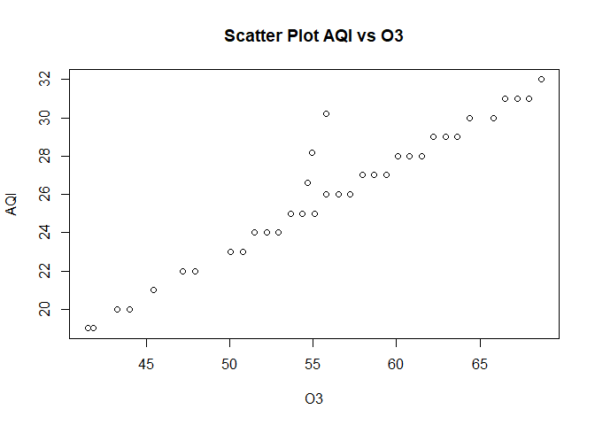
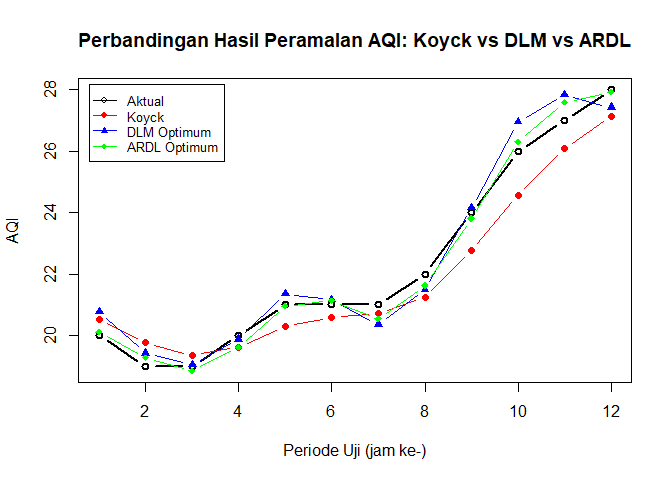

Regresi dengan Peubah Lag: Pemodelan AQI terhadap Ozon (O3) di New Delhi
================
Fadly Syabani
22 September 2026

# Pendahuluan

Kualitas udara di kota-kota besar seperti New Delhi dipengaruhi oleh
berbagai polutan, salah satunya ozon permukaan (O3). Selain berpengaruh
secara instan, konsentrasi ozon pada beberapa periode (jam) sebelumnya
juga dapat memengaruhi nilai *Air Quality Index* (AQI) pada waktu
sekarang karena proses pembentukan dan penyebaran ozon di atmosfer
bersifat dinamis. Oleh karena itu, hubungan antara AQI dan O3 dicoba
dimodelkan menggunakan regresi dengan peubah lag (*distributed lag
model*).

Pada kajian ini:

- Peubah dependen (Y): AQI (Air Quality Index)
- Peubah independen (X): O3 (Ozon) <!-- [REVISI] sebelumnya PM2.5 -->

Tiga pendekatan regresi lag yang akan diterapkan dan dibandingkan adalah
Model Koyck, Distributed Lag Model (DLM), dan Autoregressive Distributed
Lag (ARDL).

# Persiapan Data dan Library

``` r
# install.packages(c("dLagM", "dynlm", "MLmetrics", "lmtest", "car")) 
library(dLagM)
library(dynlm)
library(MLmetrics)
library(lmtest)
library(car)
```

``` r
data_raw <- read.csv("NewDelhi_Air_quality.csv")
str(data_raw)
```

    ## 'data.frame':    72 obs. of  12 variables:
    ##  $ X              : int  0 1 2 3 4 5 6 7 8 9 ...
    ##  $ AQI            : num  30.2 28.2 26.6 25 26 26 26 24 23 24 ...
    ##  $ CO             : num  199 198 199 202 205 ...
    ##  $ datetime       : chr  "2022-10-21:18" "2022-10-21:19" "2022-10-21:20" "2022-10-21:21" ...
    ##  $ no2            : num  0.0469 0.0465 0.0469 0.0482 0.0489 ...
    ##  $ o3             : num  55.8 54.9 54.6 55.1 55.8 ...
    ##  $ pm10           : num  10.5 10.7 11.2 11.1 10.4 ...
    ##  $ pm25           : num  5.64 4.62 3.52 2.23 1.98 ...
    ##  $ so2            : num  0.387 0.41 0.402 0.376 0.339 ...
    ##  $ timestamp_local: chr  "2022-10-21T23:00:00" "2022-10-22T00:00:00" "2022-10-22T01:00:00" "2022-10-22T02:00:00" ...
    ##  $ timestamp_utc  : chr  "2022-10-21T18:00:00" "2022-10-21T19:00:00" "2022-10-21T20:00:00" "2022-10-21T21:00:00" ...
    ##  $ ts             : int  1666375200 1666378800 1666382400 1666386000 1666389600 1666393200 1666396800 1666400400 1666404000 1666407600 ...

``` r
data <- data.frame(
  Yt = data_raw$AQI,
  Xt = data_raw$o3    
)

colSums(is.na(data))
```

    ## Yt Xt 
    ##  0  0

``` r
summary(data)
```

    ##        Yt              Xt       
    ##  Min.   :19.00   Min.   :41.48  
    ##  1st Qu.:25.00   1st Qu.:53.64  
    ##  Median :27.00   Median :57.22  
    ##  Mean   :26.18   Mean   :56.57  
    ##  3rd Qu.:28.00   3rd Qu.:60.08  
    ##  Max.   :32.00   Max.   :68.66

## Eksplorasi Data

``` r
n <- nrow(data)
n
```

    ## [1] 72

``` r
par(mfrow = c(1, 2))
plot.ts(data$Yt, main = "Plot Deret Waktu AQI (Yt)", ylab = "AQI", xlab = "Waktu (jam ke-)", col = "darkred")
plot.ts(data$Xt, main = "Plot Deret Waktu O3 (Xt)", ylab = "O3", xlab = "Waktu (jam ke-)", col = "darkblue")
```

<!-- -->

``` r
par(mfrow = c(1, 1))

cor_aqi_o3 <- cor(data$Yt, data$Xt)
cat("Korelasi Pearson antara AQI dan O3:", round(cor_aqi_o3, 4), "\n")
```

    ## Korelasi Pearson antara AQI dan O3: 0.9736

Korelasi Pearson antara AQI dan O3 sebesar 0.974 menunjukkan hubungan
linear yang kuat dan searah (positif). Hal ini mengindikasikan bahwa
pada periode data ini, ozon merupakan salah satu komponen dominan yang
menentukan nilai AQI, sehingga relevan dimodelkan dengan pendekatan
peubah lag.

``` r
plot(data$Xt, data$Yt, xlab = "O3", ylab = "AQI",
     main = "Scatter Plot AQI vs O3")
```

<!-- -->

## Pembagian Data Latih dan Uji

Data terdiri atas 72 observasi (data per jam). Sebanyak 60 observasi
pertama digunakan sebagai data latih (training) dan 12 observasi
terakhir digunakan sebagai data uji (testing) untuk mengevaluasi kinerja
peramalan.

``` r
train <- data[1:60, ]
test  <- data[61:72, ]

train.ts <- ts(train)
test.ts  <- ts(test)
data.ts  <- ts(data)

h.test <- nrow(test)
h.test
```

    ## [1] 12

# Model Koyck

Model Koyck mengasumsikan bobot pengaruh lag X terhadap Y menurun secara
geometris sehingga model disederhanakan menjadi bentuk autoregressive
dengan menyertakan lag dari Y
().

``` r
model.koyck <- koyckDlm(x = train$Xt, y = train$Yt)
summary(model.koyck)
```

    ## 
    ## Call:
    ## "Y ~ (Intercept) + Y.1 + X.t"
    ## 
    ## Residuals:
    ##      Min       1Q   Median       3Q      Max 
    ## -1.06671 -0.42354  0.01392  0.24137  1.09456 
    ## 
    ## Coefficients:
    ##             Estimate Std. Error t value Pr(>|t|)    
    ## (Intercept) -0.13603    0.83509  -0.163    0.871    
    ## Y.1          0.44327    0.08853   5.007 5.85e-06 ***
    ## X.t          0.25837    0.04222   6.119 9.71e-08 ***
    ## ---
    ## Signif. codes:  0 '***' 0.001 '**' 0.01 '*' 0.05 '.' 0.1 ' ' 1
    ## 
    ## Residual standard error: 0.5209 on 56 degrees of freedom
    ## Multiple R-Squared: 0.954,   Adjusted R-squared: 0.9523 
    ## Wald test: 529.1 on 2 and 56 DF,  p-value: < 2.2e-16 
    ## 
    ## Diagnostic tests:
    ## NULL
    ## 
    ##                               alpha      beta       phi
    ## Geometric coefficients:  -0.2443305 0.2583708 0.4432741

``` r
AIC(model.koyck)
```

    ## [1] 95.39036

``` r
BIC(model.koyck)
```

    ## [1] 103.7005

``` r
coef_koyck <- coef(model.koyck$model)
```

Koefisien  sebesar
0.25837 dan koefisien

sebesar 0.44327. Tanda koefisien
 yang positif
konsisten dengan arah korelasi AQI-O3 pada bagian eksplorasi data.

## Peramalan dan Akurasi Model Koyck

``` r
fore.koyck <- forecast(model = model.koyck, x = test$Xt, h = h.test)
fore.koyck
```

    ## $forecasts
    ##  [1] 20.53801 19.77881 19.34988 19.62175 20.29667 20.59584 20.72845 21.24924
    ##  [9] 22.77370 24.55826 26.08852 27.13644
    ## 
    ## $call
    ## forecast.koyckDlm(model = model.koyck, x = test$Xt, h = h.test)
    ## 
    ## attr(,"class")
    ## [1] "forecast.koyckDlm" "dLagM"

``` r
mape.koyck <- MAPE(fore.koyck$forecasts, test$Yt)
cat("MAPE Model Koyck (data uji):", round(mape.koyck * 100, 3), "%\n")
```

    ## MAPE Model Koyck (data uji): 3.135 %

# Distributed Lag Model (DLM)

Model DLM memodelkan Y sebagai fungsi dari X pada waktu sekarang beserta
beberapa lag X sebelumnya, tanpa melibatkan lag dari Y itu sendiri.

## Penentuan Lag Optimum DLM

``` r
dlm.search <- finiteDLMauto(
  formula = Yt ~ Xt,
  data = data.frame(train),
  q.min = 1, q.max = 20,
  model.type = "dlm", error.type = "AIC", trace = TRUE
)
dlm.search
```

    ##    q - k    MASE      AIC       BIC     GMRAE   MBRAE R.Adj.Sq  Ljung-Box
    ## 20    20 0.20461 10.50183  49.34606  3506.910 0.46087  0.99214 0.02473550
    ## 14    14 0.30386 18.15688  49.24379  9892.258 0.48717  0.98967 0.43343057
    ## 18    18 0.26545 19.28488  55.77594  8455.579 0.48949  0.98996 0.02110853
    ## 19    19 0.24484 19.38361  57.08219  5042.341 0.47975  0.99009 0.03532925
    ## 15    15 0.29370 20.56432  53.08425  7427.548 0.47554  0.98927 0.45609978
    ## 17    17 0.27362 21.82289  57.04690  5715.919 0.47807  0.98918 0.11420285
    ## 16    16 0.28845 22.90964  56.80924  5267.021 0.46405  0.98882 0.41834134
    ## 10    10 0.32961 24.00608  48.86238  6976.708 0.46014  0.98735 0.39692632
    ## 12    12 0.33658 24.94825  53.01626 12163.320 0.49168  0.98753 0.40387381
    ## 5      5 0.35026 25.86841  41.92707  4125.769 0.46270  0.98661 0.17857837
    ## 3      3 0.36862 26.27835  38.53666  3836.000 0.46275  0.98593 0.10233137
    ## 11    11 0.33515 26.48232  52.96781  9043.514 0.47277  0.98685 0.42871589
    ## 4      4 0.36754 27.03577  41.21323  4974.052 0.46558  0.98597 0.16054468
    ## 13    13 0.35944 27.64293  57.24529 14969.333 0.49751  0.98714 0.45812320
    ## 6      6 0.34803 28.50797  46.40883  3198.518 0.45243  0.98629 0.18765677
    ## 9      9 0.35059 28.94640  52.12831  5730.892 0.46613  0.98613 0.73691560
    ## 7      7 0.35812 29.52828  49.23120  3827.478 0.45741  0.98636 0.26785094
    ## 8      8 0.36221 29.94617  51.40985  4857.959 0.47703  0.98624 0.41190621
    ## 2      2 0.39342 46.54734  56.84956  3428.508 0.45674  0.97949 0.08540349
    ## 1      1 0.46442 92.75107 101.06122  3656.581 0.36990  0.95439 0.14844739

``` r
q.opt.dlm <- dlm.search$q[which.min(dlm.search$AIC)]
cat("Lag optimum DLM (q) berdasarkan AIC minimum adalah q =", q.opt.dlm, "\n")
```

    ## Lag optimum DLM (q) berdasarkan AIC minimum adalah q = 20

## Model DLM dengan Lag Optimum

``` r
model.dlm.opt <- dlm(x = train$Xt, y = train$Yt, q = q.opt.dlm)
summary(model.dlm.opt)
```

    ## 
    ## Call:
    ## lm(formula = model.formula, data = design)
    ## 
    ## Residuals:
    ##     Min      1Q  Median      3Q     Max 
    ## -0.3023 -0.1269  0.0215  0.1113  0.4069 
    ## 
    ## Coefficients:
    ##             Estimate Std. Error t value Pr(>|t|)    
    ## (Intercept)  0.59921    1.23311   0.486  0.63288    
    ## x.t          0.44754    0.05972   7.493 6.14e-07 ***
    ## x.1          0.10408    0.13193   0.789  0.44044    
    ## x.2         -0.10744    0.14405  -0.746  0.46538    
    ## x.3         -0.07529    0.14392  -0.523  0.60723    
    ## x.4          0.05890    0.14352   0.410  0.68638    
    ## x.5          0.09843    0.14390   0.684  0.50269    
    ## x.6         -0.13503    0.14352  -0.941  0.35924    
    ## x.7          0.26539    0.14286   1.858  0.07965 .  
    ## x.8         -0.45019    0.14127  -3.187  0.00511 ** 
    ## x.9          0.39037    0.14270   2.736  0.01359 *  
    ## x.10         0.05210    0.13569   0.384  0.70551    
    ## x.11        -0.44607    0.14568  -3.062  0.00672 ** 
    ## x.12         0.35901    0.12284   2.922  0.00909 ** 
    ## x.13        -0.22529    0.11591  -1.944  0.06774 .  
    ## x.14         0.20529    0.12158   1.689  0.10855    
    ## x.15        -0.12810    0.12020  -1.066  0.30063    
    ## x.16         0.05010    0.11973   0.418  0.68056    
    ## x.17        -0.04587    0.11817  -0.388  0.70245    
    ## x.18         0.17248    0.11935   1.445  0.16557    
    ## x.19        -0.16376    0.09967  -1.643  0.11772    
    ## x.20         0.02417    0.04626   0.523  0.60764    
    ## ---
    ## Signif. codes:  0 '***' 0.001 '**' 0.01 '*' 0.05 '.' 0.1 ' ' 1
    ## 
    ## Residual standard error: 0.2314 on 18 degrees of freedom
    ## Multiple R-squared:  0.9964, Adjusted R-squared:  0.9921 
    ## F-statistic: 235.5 on 21 and 18 DF,  p-value: < 2.2e-16
    ## 
    ## AIC and BIC values for the model:
    ##        AIC      BIC
    ## 1 10.50183 49.34606

``` r
AIC(model.dlm.opt)
```

    ## [1] 10.50183

``` r
BIC(model.dlm.opt)
```

    ## [1] 49.34606

## Peramalan dan Akurasi Model DLM Optimum

``` r
fore.dlm.opt <- forecast(model = model.dlm.opt, x = test$Xt, h = h.test)
fore.dlm.opt
```

    ## $forecasts
    ##  [1] 20.77662 19.42730 19.05473 19.88198 21.36480 21.16149 20.36321 21.48611
    ##  [9] 24.15492 26.96175 27.83821 27.42782
    ## 
    ## $call
    ## forecast.dlm(model = model.dlm.opt, x = test$Xt, h = h.test)
    ## 
    ## attr(,"class")
    ## [1] "forecast.dlm" "dLagM"

``` r
mape.dlm.opt <- MAPE(fore.dlm.opt$forecasts, test$Yt)
cat("MAPE Model DLM Optimum (q =", q.opt.dlm, "):", round(mape.dlm.opt * 100, 3), "%\n")
```

    ## MAPE Model DLM Optimum (q = 20 ): 2.031 %

# Autoregressive Distributed Lag (ARDL)

Model ARDL menggabungkan lag dari peubah independen (X) *dan* lag dari
peubah dependen (Y) sekaligus, sehingga merupakan generalisasi dari
model Koyck maupun DLM.

## Model ARDL Awal (p = 1, q = 1)

``` r
model.ardl <- ardlDlm(formula = Yt ~ Xt, data = train, p = 1, q = 1)
summary(model.ardl)
```

    ## 
    ## Time series regression with "ts" data:
    ## Start = 2, End = 60
    ## 
    ## Call:
    ## dynlm(formula = as.formula(model.text), data = data)
    ## 
    ## Residuals:
    ##     Min      1Q  Median      3Q     Max 
    ## -1.0293 -0.2749  0.1206  0.2801  0.8761 
    ## 
    ## Coefficients:
    ##             Estimate Std. Error t value Pr(>|t|)    
    ## (Intercept) -0.06906    0.60255  -0.115    0.909    
    ## Xt.t         0.47975    0.03029  15.838  < 2e-16 ***
    ## Xt.1        -0.22506    0.04359  -5.163 3.45e-06 ***
    ## Yt.1         0.45020    0.06453   6.976 4.12e-09 ***
    ## ---
    ## Signif. codes:  0 '***' 0.001 '**' 0.01 '*' 0.05 '.' 0.1 ' ' 1
    ## 
    ## Residual standard error: 0.3744 on 55 degrees of freedom
    ## Multiple R-squared:  0.9766, Adjusted R-squared:  0.9754 
    ## F-statistic: 766.5 on 3 and 55 DF,  p-value: < 2.2e-16

``` r
AIC(model.ardl)
```

    ## [1] 57.35211

``` r
BIC(model.ardl)
```

    ## [1] 67.7398

## Penentuan Orde Lag Optimum ARDL

``` r
model.ardl.opt.search <- ardlBoundOrders(data = data.frame(data), ic = "AIC", formula = Yt ~ Xt)

min_p <- c()
for (i in 1:length(model.ardl.opt.search$Stat.table)) {
  min_p[i] <- min(model.ardl.opt.search$Stat.table[[i]])
}
q_opt <- which(min_p == min(min_p, na.rm = TRUE))
p_opt <- which(model.ardl.opt.search$Stat.table[[q_opt]] == min(model.ardl.opt.search$Stat.table[[q_opt]], na.rm = TRUE))

data.frame("Lag_Y_opt(q)" = q_opt, "Lag_X_opt(p)" = p_opt, "AIC" = model.ardl.opt.search$min.Stat)
```

    ##   Lag_Y_opt.q. Lag_X_opt.p.      AIC
    ## 1            2           13 16.55044

``` r
cat("Orde lag optimum ARDL yang terpilih: p (lag O3) =", p_opt, ", q (lag AQI) =", q_opt, "\n")
```

    ## Orde lag optimum ARDL yang terpilih: p (lag O3) = 13 , q (lag AQI) = 2

``` r
n_obs_efektif <- nrow(train) - max(p_opt, q_opt)
n_param       <- 1 + (p_opt + 1) + q_opt
rasio_param_obs <- n_param / n_obs_efektif

cat("Jumlah parameter model ARDL optimum:", n_param, "\n")
```

    ## Jumlah parameter model ARDL optimum: 17

``` r
cat("Jumlah observasi efektif data latih:", n_obs_efektif, "\n")
```

    ## Jumlah observasi efektif data latih: 47

``` r
cat("Rasio parameter terhadap observasi efektif:", round(rasio_param_obs, 3), "\n")
```

    ## Rasio parameter terhadap observasi efektif: 0.362

## Model ARDL dengan Lag Optimum

``` r
model.ardl.opt <- ardlDlm(formula = Yt ~ Xt, data = train, p = p_opt, q = q_opt)
summary(model.ardl.opt)
```

    ## 
    ## Time series regression with "ts" data:
    ## Start = 14, End = 60
    ## 
    ## Call:
    ## dynlm(formula = as.formula(model.text), data = data)
    ## 
    ## Residuals:
    ##      Min       1Q   Median       3Q      Max 
    ## -0.49429 -0.23773  0.06572  0.20021  0.44946 
    ## 
    ## Coefficients:
    ##             Estimate Std. Error t value Pr(>|t|)    
    ## (Intercept) -0.54198    1.00912  -0.537   0.5952    
    ## Xt.t         0.40847    0.06959   5.870 2.01e-06 ***
    ## Xt.1         0.19000    0.18194   1.044   0.3047    
    ## Xt.2        -0.08437    0.20101  -0.420   0.6777    
    ## Xt.3        -0.10327    0.15764  -0.655   0.5174    
    ## Xt.4         0.09040    0.15833   0.571   0.5723    
    ## Xt.5         0.03156    0.14309   0.221   0.8269    
    ## Xt.6        -0.16012    0.13466  -1.189   0.2437    
    ## Xt.7         0.26079    0.13492   1.933   0.0627 .  
    ## Xt.8        -0.28273    0.14023  -2.016   0.0528 .  
    ## Xt.9         0.14202    0.14978   0.948   0.3506    
    ## Xt.10        0.09820    0.15379   0.639   0.5280    
    ## Xt.11       -0.18068    0.14495  -1.246   0.2222    
    ## Xt.12        0.06211    0.11962   0.519   0.6074    
    ## Xt.13        0.01243    0.05393   0.231   0.8193    
    ## Yt.1        -0.11189    0.18739  -0.597   0.5549    
    ## Yt.2         0.07934    0.18346   0.432   0.6685    
    ## ---
    ## Signif. codes:  0 '***' 0.001 '**' 0.01 '*' 0.05 '.' 0.1 ' ' 1
    ## 
    ## Residual standard error: 0.2862 on 30 degrees of freedom
    ## Multiple R-squared:  0.9912, Adjusted R-squared:  0.9866 
    ## F-statistic: 212.1 on 16 and 30 DF,  p-value: < 2.2e-16

``` r
AIC(model.ardl.opt)
```

    ## [1] 30.68323

``` r
BIC(model.ardl.opt)
```

    ## [1] 63.98588

## Peramalan dan Akurasi Model ARDL Optimum

``` r
fore.ardl <- forecast(model = model.ardl.opt, x = test$Xt, h = h.test)
fore.ardl
```

    ## $forecasts
    ##  [1] 20.11693 19.27582 18.85467 19.62211 20.96154 21.13103 20.55395 21.63110
    ##  [9] 23.81637 26.31573 27.59519 27.92072
    ## 
    ## $call
    ## forecast.ardlDlm(model = model.ardl.opt, x = test$Xt, h = h.test)
    ## 
    ## attr(,"class")
    ## [1] "forecast.ardlDlm" "dLagM"

``` r
mape.ardl <- MAPE(fore.ardl$forecasts, test$Yt)
cat("MAPE Model ARDL (p =", p_opt, ", q =", q_opt, "):", round(mape.ardl * 100, 3), "%\n")
```

    ## MAPE Model ARDL (p = 13 , q = 2 ): 1.147 %

# Uji Asumsi Model

Pengujian asumsi dilakukan pada model terbaik menggunakan pendekatan
`dynlm` yang setara secara matematis dengan spesifikasi lag Model ARDL
optimum.

``` r
cons_lm1 <- dynlm(Yt ~ Xt + L(Xt), data = train.ts)                 # setara DLM (q=1)
cons_lm2 <- dynlm(Yt ~ Xt + L(Yt), data = train.ts)                 # setara model autoregressive murni
cons_lm3 <- dynlm(Yt ~ Xt + L(Xt) + L(Yt), data = train.ts)         # setara ARDL (p=1, q=1)

formula.dynlm.opt <- as.formula(
  paste("Yt ~", paste(c(paste0("L(Xt,", 0:p_opt, ")"), paste0("L(Yt,", 1:q_opt, ")")), collapse = " + "))
)
model.diagnostik <- dynlm(formula.dynlm.opt, data = train.ts)
summary(model.diagnostik)
```

    ## 
    ## Time series regression with "ts" data:
    ## Start = 14, End = 60
    ## 
    ## Call:
    ## dynlm(formula = formula.dynlm.opt, data = train.ts)
    ## 
    ## Residuals:
    ##      Min       1Q   Median       3Q      Max 
    ## -0.49429 -0.23773  0.06572  0.20021  0.44946 
    ## 
    ## Coefficients:
    ##             Estimate Std. Error t value Pr(>|t|)    
    ## (Intercept) -0.54198    1.00912  -0.537   0.5952    
    ## L(Xt, 0)     0.40847    0.06959   5.870 2.01e-06 ***
    ## L(Xt, 1)     0.19000    0.18194   1.044   0.3047    
    ## L(Xt, 2)    -0.08437    0.20101  -0.420   0.6777    
    ## L(Xt, 3)    -0.10327    0.15764  -0.655   0.5174    
    ## L(Xt, 4)     0.09040    0.15833   0.571   0.5723    
    ## L(Xt, 5)     0.03156    0.14309   0.221   0.8269    
    ## L(Xt, 6)    -0.16012    0.13466  -1.189   0.2437    
    ## L(Xt, 7)     0.26079    0.13492   1.933   0.0627 .  
    ## L(Xt, 8)    -0.28273    0.14023  -2.016   0.0528 .  
    ## L(Xt, 9)     0.14202    0.14978   0.948   0.3506    
    ## L(Xt, 10)    0.09820    0.15379   0.639   0.5280    
    ## L(Xt, 11)   -0.18068    0.14495  -1.246   0.2222    
    ## L(Xt, 12)    0.06211    0.11962   0.519   0.6074    
    ## L(Xt, 13)    0.01243    0.05393   0.231   0.8193    
    ## L(Yt, 1)    -0.11189    0.18739  -0.597   0.5549    
    ## L(Yt, 2)     0.07934    0.18346   0.432   0.6685    
    ## ---
    ## Signif. codes:  0 '***' 0.001 '**' 0.01 '*' 0.05 '.' 0.1 ' ' 1
    ## 
    ## Residual standard error: 0.2862 on 30 degrees of freedom
    ## Multiple R-squared:  0.9912, Adjusted R-squared:  0.9866 
    ## F-statistic: 212.1 on 16 and 30 DF,  p-value: < 2.2e-16

## Uji Autokorelasi (Durbin-Watson & Breusch-Godfrey)

``` r
dw_res <- dwtest(model.diagnostik)
dw_res
```

    ## 
    ##  Durbin-Watson test
    ## 
    ## data:  model.diagnostik
    ## DW = 1.9342, p-value = 0.2619
    ## alternative hypothesis: true autocorrelation is greater than 0

``` r
bg_res <- bgtest(model.diagnostik)
bg_res
```

    ## 
    ##  Breusch-Godfrey test for serial correlation of order up to 1
    ## 
    ## data:  model.diagnostik
    ## LM test = 0.24648, df = 1, p-value = 0.6196

Uji Durbin-Watson menghasilkan p-value = 0.2619, sedangkan uji
Breusch-Godfrey menghasilkan p-value = 0.6196. Karena model menyertakan
lag dari peubah dependen
(),
uji Breusch-Godfrey lebih sesuai dijadikan acuan pada kasus ini. Pada
taraf nyata 5%, tidak terdapat cukup bukti untuk menolak H0, sehingga
residual model tidak menunjukkan autokorelasi yang signifikan.

## Uji Homoskedastisitas (Breusch-Pagan)

``` r
bp_test2 <- bptest(model.diagnostik)
bp_test2
```

    ## 
    ##  studentized Breusch-Pagan test
    ## 
    ## data:  model.diagnostik
    ## BP = 18.867, df = 16, p-value = 0.2756

Uji Breusch-Pagan menghasilkan p-value = 0.2756. Pada taraf nyata 5%,
tidak terdapat cukup bukti untuk menolak H0, sehingga ragam sisaan model
dapat dikatakan bersifat homoskedastik.

## Uji Kenormalan Sisaan (Shapiro-Wilk)

``` r
sw_test <- shapiro.test(residuals(model.diagnostik))
sw_test
```

    ## 
    ##  Shapiro-Wilk normality test
    ## 
    ## data:  residuals(model.diagnostik)
    ## W = 0.94386, p-value = 0.02502

Uji Shapiro-Wilk menghasilkan p-value = 0.025. Pada taraf nyata 5%,
terdapat cukup bukti untuk menolak H0, sehingga sisaan model tidak
menyebar normal.

# Perbandingan Kinerja Model

## Perbandingan MAPE

``` r
akurasi <- matrix(c(mape.koyck, mape.dlm.opt, mape.ardl) * 100, ncol = 1)
row.names(akurasi) <- c(
  "Koyck",
  paste0("DLM Optimum (q=", q.opt.dlm, ")"),
  paste0("ARDL Optimum (p=", p_opt, ", q=", q_opt, ")")
)
colnames(akurasi) <- c("MAPE (%)")
print(round(akurasi, 3))
```

    ##                          MAPE (%)
    ## Koyck                       3.135
    ## DLM Optimum (q=20)          2.031
    ## ARDL Optimum (p=13, q=2)    1.147

## Perbandingan SSE, Kriteria Informasi, dan MAPE

``` r
SSE.koyck <- sum(residuals(model.koyck$model)^2)
SSE.dlm   <- sum(residuals(model.dlm.opt$model)^2)
SSE.ardl  <- sum(residuals(model.ardl.opt$model)^2)

ringkasan <- data.frame(
  Model = c(
    "Koyck",
    paste0("DLM Optimum (q=", q.opt.dlm, ")"),
    paste0("ARDL Optimum (p=", p_opt, ", q=", q_opt, ")")
  ),
  SSE = c(SSE.koyck, SSE.dlm, SSE.ardl),
  AIC = c(AIC(model.koyck), AIC(model.dlm.opt), AIC(model.ardl.opt)),
  BIC = c(BIC(model.koyck), BIC(model.dlm.opt), BIC(model.ardl.opt)),
  `MAPE(%)` = c(mape.koyck, mape.dlm.opt, mape.ardl) * 100,
  check.names = FALSE
)
```

    ## [1] 95.39036
    ## [1] 10.50183
    ## [1] 30.68323
    ## [1] 103.7005
    ## [1] 49.34606
    ## [1] 63.98588

``` r
ringkasan
```

    ##                      Model        SSE      AIC       BIC  MAPE(%)
    ## 1                    Koyck 15.1932763 95.39036 103.70051 3.134655
    ## 2       DLM Optimum (q=20)  0.9642046 10.50183  49.34606 2.031425
    ## 3 ARDL Optimum (p=13, q=2)  2.4575077 30.68323  63.98588 1.147144

Model dengan MAPE terkecil pada data uji adalah **ARDL Optimum (p=13,
q=2)**, sedangkan model dengan SSE terkecil pada data latih adalah **DLM
Optimum (q=20)**. SSE mengukur kesesuaian model pada data latih
(*in-sample*), sedangkan MAPE mengukur akurasi peramalan pada data uji
(*out-of-sample*); model dengan parameter lebih banyak (rasio parameter
terhadap observasi = 0.36 pada model ARDL, lihat bagian sebelumnya)
wajar unggul di SSE/AIC namun belum tentu unggul di MAPE, sehingga
pemilihan model akhir untuk tujuan peramalan sebaiknya mengutamakan
MAPE.

## Visualisasi Perbandingan Hasil Peramalan

``` r
plot(x = 1:h.test, y = test$Yt, type = "b", col = "black", pch = 1, lwd = 2,
     ylim = range(c(test$Yt, fore.koyck$forecasts, fore.dlm.opt$forecasts, fore.ardl$forecasts)),
     ylab = "AQI", xlab = "Periode Uji (jam ke-)",
     main = "Perbandingan Hasil Peramalan AQI: Koyck vs DLM vs ARDL")

lines(1:h.test, fore.koyck$forecasts,   col = "red",   type = "b", pch = 16)
lines(1:h.test, fore.dlm.opt$forecasts, col = "blue",  type = "b", pch = 17)
lines(1:h.test, fore.ardl$forecasts,    col = "green", type = "b", pch = 18)

legend("topleft", legend = c("Aktual", "Koyck", "DLM Optimum", "ARDL Optimum"),
       col = c("black", "red", "blue", "green"), lty = 1, pch = c(1, 16, 17, 18),
       cex = 0.8, inset = 0.02)
```

<!-- -->

# Kesimpulan

Berdasarkan hasil analisis regresi peubah lag pada data kualitas udara
New Delhi (AQI terhadap O3):

- Model Koyck menghasilkan MAPE sebesar 3.135%.
- Model DLM dengan lag optimum q = 20 menghasilkan MAPE sebesar 2.031%.
- Model ARDL dengan lag optimum (p = 13, q = 2) menghasilkan MAPE
  sebesar 1.147%.

Model dengan kinerja peramalan terbaik pada data uji adalah **ARDL
Optimum (p=13, q=2)**.
