Pemodelan ARIMA - Pendugaan Parameter, Diagnostik Model, dan Peramalan
================
Fadly Syabani
29 September 2026

## Packages

``` r
library(ggplot2)
```

    ## Warning: package 'ggplot2' was built under R version 4.5.3

``` r
library(tsibble)
```

    ## Warning: package 'tsibble' was built under R version 4.5.3

    ## 
    ## Attaching package: 'tsibble'

    ## The following objects are masked from 'package:base':
    ## 
    ##     intersect, setdiff, union

``` r
library(tseries)
```

    ## Warning: package 'tseries' was built under R version 4.5.3

    ## Registered S3 method overwritten by 'quantmod':
    ##   method            from
    ##   as.zoo.data.frame zoo

``` r
library(MASS)
```

    ## Warning: package 'MASS' was built under R version 4.5.3

``` r
library(forecast)
```

    ## Warning: package 'forecast' was built under R version 4.5.3

``` r
library(TSA)
```

    ## Warning: package 'TSA' was built under R version 4.5.3

    ## Registered S3 methods overwritten by 'TSA':
    ##   method       from    
    ##   fitted.Arima forecast
    ##   plot.Arima   forecast

    ## 
    ## Attaching package: 'TSA'

    ## The following objects are masked from 'package:stats':
    ## 
    ##     acf, arima

    ## The following object is masked from 'package:utils':
    ## 
    ##     tar

``` r
library(TTR)
```

    ## Warning: package 'TTR' was built under R version 4.5.3

``` r
library(aTSA)
```

    ## Warning: package 'aTSA' was built under R version 4.5.2

    ## 
    ## Attaching package: 'aTSA'

    ## The following object is masked from 'package:forecast':
    ## 
    ##     forecast

    ## The following objects are masked from 'package:tseries':
    ## 
    ##     adf.test, kpss.test, pp.test

    ## The following object is masked from 'package:graphics':
    ## 
    ##     identify

``` r
library(graphics)
library(readxl)
```

    ## Warning: package 'readxl' was built under R version 4.5.2

## Data

### Input Data

Data yang akan digunakan adalah data kualitas udara **PM2.5** harian
dari stasiun **DKI 1 (Bunderan HI)** yang berisi 781 pengamatan dari
tanggal 1 Januari 2023 hingga 28 Februari 2025 (terdapat 9 hari yang
datanya tidak tercatat dari total 790 hari kalender pada rentang
tersebut, sehingga data diperlakukan sebagai deret waktu berurutan
berdasarkan urutan pengamatan yang tersedia).

``` r
datapm25 <- read_excel("dataset_pm25.xlsx", sheet = "FULL")

colnames(datapm25) <- c("tanggal", "stasiun", "pm25")

datapm25$tanggal <- as.Date(datapm25$tanggal, format = "%m/%d/%Y")

pm25.ts <- ts(datapm25$pm25)

str(datapm25)
```

    ## tibble [781 × 3] (S3: tbl_df/tbl/data.frame)
    ##  $ tanggal: Date[1:781], format: "2023-01-01" "2023-01-02" ...
    ##  $ stasiun: chr [1:781] "DKI1 (Bunderan HI)" "DKI1 (Bunderan HI)" "DKI1 (Bunderan HI)" "DKI1 (Bunderan HI)" ...
    ##  $ pm25   : num [1:781] 55 43 35 47 50 48 42 49 39 44 ...

Data kemudian dibagi menjadi data latih dan data uji dengan proporsi
80:20, yaitu 625 data latih dan 156 data uji.

``` r
n <- length(pm25.ts)
ntrain <- round(0.8 * n)

train.ts <- ts(datapm25$pm25[1:ntrain])
test.ts  <- ts(datapm25$pm25[(ntrain + 1):n])

c(Total = n, Train = length(train.ts), Test = length(test.ts))
```

    ## Total Train  Test 
    ##   781   625   156

### Eksplorasi Data

#### Plot Data Penuh

``` r
plot.ts(pm25.ts, 
        lty = 1, 
        xlab = "Waktu (hari ke-)", 
        ylab = "PM2.5", 
        main = "Plot Data PM2.5 (DKI1 Bunderan HI)")
```

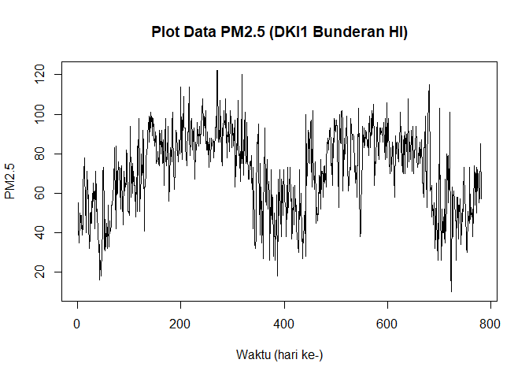<!-- -->

Berdasarkan plot data deret waktu, konsentrasi PM2.5 memperlihatkan pola
naik turun yang berulang menyerupai gelombang musiman tahunan: level
relatif rendah di awal tahun (sekitar 40-60 µg/m³), meningkat ke level
tinggi pada pertengahan tahun (mencapai 100-120 µg/m³), lalu turun
kembali ke level rendah menjelang akhir/awal tahun berikutnya, dan pola
ini berulang setiap tahun selama periode pengamatan (2023-2025). Pola
ini mengindikasikan bahwa data belum tentu stasioner dalam rataan,
karena rata-rata data bergeser naik-turun mengikuti waktu, bukan konstan
di sekitar satu nilai tengah tertentu.

#### Plot Data Latih

``` r
plot.ts(train.ts, lty = 1, xlab = "Waktu", ylab = "PM2.5", main = "Plot PM2.5 Data Latih")
```

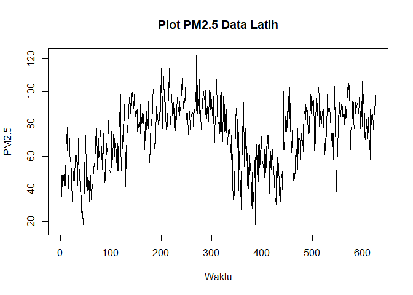<!-- -->

#### Plot Data Uji

``` r
plot.ts(test.ts, lty = 1, xlab = "Waktu", ylab = "PM2.5", main = "Plot PM2.5 Data Uji")
```

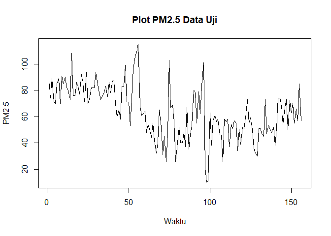<!-- -->

Data uji berada pada periode September 2024 - Februari 2025, yang
mencakup fase penurunan konsentrasi PM2.5 dari level tinggi menuju
rendah sesuai pola musiman yang teridentifikasi pada data penuh.

### Uji Stasioneritas Data

#### Plot ACF

``` r
acf(train.ts, lag.max = 40, main = "ACF Data Latih")
```

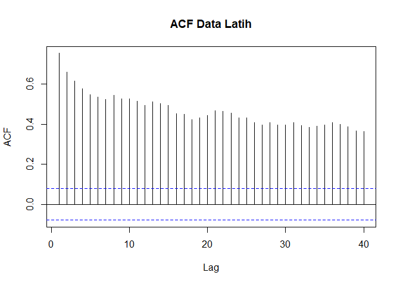<!-- -->

Plot ACF menurun secara sangat perlahan (*tails off slowly*) dan masih
bernilai cukup tinggi (di atas 0,35) hingga lag ke-40. Hal ini menjadi
indikasi kuat bahwa data tidak stasioner dalam rataan.

#### Uji ADF

``` r
tseries::adf.test(train.ts)
```

    ## 
    ##  Augmented Dickey-Fuller Test
    ## 
    ## data:  train.ts
    ## Dickey-Fuller = -3.3948, Lag order = 8, p-value = 0.05435
    ## alternative hypothesis: stationary

 : Data tidak
stasioner dalam rataan

 : Data stasioner
dalam rataan

Berdasarkan uji ADF, diperoleh *p-value* sebesar 0,0544 yang lebih besar
dari taraf nyata 5% sehingga tak tolak
 dan disimpulkan
bahwa **data tidak stasioner dalam rataan**. Hal ini sesuai dengan hasil
eksplorasi menggunakan plot deret waktu dan plot ACF, sehingga
ketidakstasioneran data perlu ditangani sebelum masuk ke tahap
identifikasi model.

#### Plot Box-Cox

``` r
index <- seq(1:length(train.ts))

bc <- boxcox(train.ts ~ index, lambda = seq(-2, 4, by = 0.1))
```

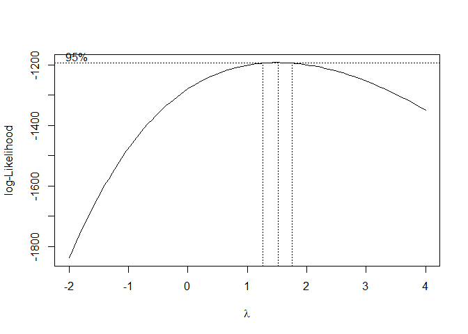<!-- -->

``` r
lambda_opt <- bc$x[which.max(bc$y)]
lambda_opt
```

    ## [1] 1.515152

``` r
ci_lambda <- bc$x[bc$y > max(bc$y) - 0.5 * qchisq(0.95, df = 1)]

ci_lower <- min(ci_lambda)
ci_upper <- max(ci_lambda)

c(Batas_Bawah = ci_lower, Batas_Atas = ci_upper)
```

    ## Batas_Bawah  Batas_Atas 
    ##    1.272727    1.696970

Nilai *rounded value*
()
optimum berada di sekitar 1,52 dengan selang kepercayaan 95% antara 1,27
dan 1,70. Karena selang tersebut **tidak memuat nilai satu**, data juga
belum stasioner dalam ragam. Kedua bentuk ketidakstasioneran ini (rataan
dan ragam) akan ditangani sekaligus melalui proses *differencing*.

### Penanganan Ketidakstasioneran Data

``` r
# Differencing pertama
train.diff <- diff(train.ts, differences = 1)

# Plot hasil differencing
plot.ts(train.diff, lty = 1, xlab = "Waktu", ylab = "PM2.5 Differencing 1",
        main = "Plot Data PM2.5 Differencing 1")
abline(h = 0, col = "red", lty = 2)
```

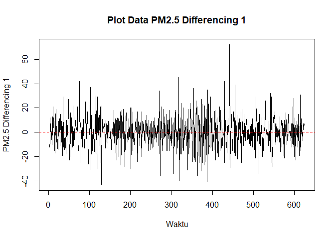<!-- -->

Berdasarkan plot data deret waktu hasil *differencing* orde pertama,
terlihat bahwa data sudah bergerak stabil di sekitar nilai nol tanpa
memperlihatkan tren maupun pola musiman jangka panjang, mengindikasikan
data sudah stasioner dalam rataan.

#### Plot ACF Setelah Differencing

``` r
acf(train.diff, lag.max = 40, main = "ACF Data Differencing 1")
```

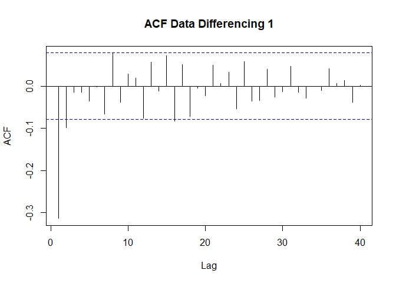<!-- -->

Plot ACF data hasil *differencing* menurun tajam dan berada dalam selang
tidak signifikan setelah lag ke-1, menandakan ketidakstasioneran dalam
rataan telah berhasil ditangani.

#### Uji ADF Setelah Differencing

``` r
tseries::adf.test(train.diff)
```

    ## Warning in tseries::adf.test(train.diff): p-value smaller than printed p-value

    ## 
    ##  Augmented Dickey-Fuller Test
    ## 
    ## data:  train.diff
    ## Dickey-Fuller = -12.88, Lag order = 8, p-value = 0.01
    ## alternative hypothesis: stationary

Berdasarkan uji ADF pada data hasil *differencing*, diperoleh *p-value*
sebesar 0,01 yang lebih kecil dari taraf nyata 5% sehingga tolak
; **data sudah
stasioner dalam rataan** setelah dilakukan *differencing* satu kali
(d=1).

#### Plot Box-Cox Setelah Differencing

``` r
# Sesuaikan panjang index karena differencing menghilangkan 1 observasi awal
index_diff <- seq(1:length(train.diff))

# Cek nilai negatif/nol, tambahkan konstanta agar semua nilai > 0
min_val <- min(train.diff)
if (min_val <= 0) {
  konstanta <- abs(min_val) + 1
  train.diff_shifted <- train.diff + konstanta
} else {
  train.diff_shifted <- train.diff
}

bc_diff <- boxcox(train.diff_shifted ~ index_diff, lambda = seq(0.5, 2, by = 0.1))
```

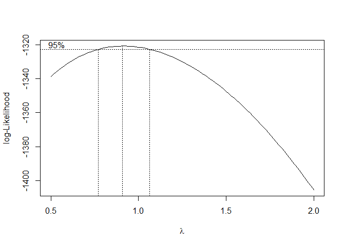<!-- -->

``` r
lambda_opt_diff <- bc_diff$x[which.max(bc_diff$y)]
lambda_opt_diff
```

    ## [1] 0.9090909

``` r
ci_lambda_diff <- bc_diff$x[bc_diff$y > max(bc_diff$y) - 0.5 * qchisq(0.95, df = 1)]

c(Batas_Bawah = min(ci_lambda_diff), Batas_Atas = max(ci_lambda_diff))
```

    ## Batas_Bawah  Batas_Atas 
    ##   0.7727273   1.0606061

Setelah *differencing*, nilai

optimum menjadi sekitar 0,91 dengan selang kepercayaan 95% antara 0,77
dan 1,06. Selang ini **memuat nilai satu**, sehingga data hasil
*differencing* juga sudah stasioner dalam ragam. Dengan demikian, proses
*differencing* satu kali (d=1) berhasil menangani ketidakstasioneran
baik dalam rataan maupun ragam, dan analisis dapat dilanjutkan ke tahap
identifikasi model dengan model ARIMA(p,1,q).

### Identifikasi Model

#### Plot ACF dan PACF

``` r
par(mfrow = c(1,2))
acf(train.diff, lag.max = 40, main = "ACF")
pacf(train.diff, lag.max = 40, main = "PACF")
```

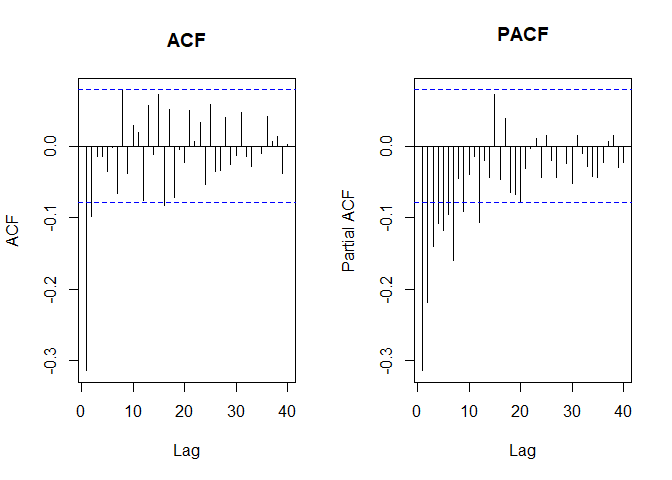<!-- -->

``` r
par(mfrow = c(1,1))
```

Plot ACF *cuts off* tegas pada lag pertama (nilai negatif signifikan),
sedangkan plot PACF meluruh secara berangsur (*tails off*) pada beberapa
lag pertama sebelum masuk ke selang tidak signifikan. Pola ini
mengindikasikan model tentatif ARIMA(0,1,1) atau, jika PACF turut
dianggap *cuts off* pada lag pertama, model ARIMA(1,1,1).

#### Plot EACF

``` r
eacf(train.diff)
```

    ## AR/MA
    ##   0 1 2 3 4 5 6 7 8 9 10 11 12 13
    ## 0 x x o o o o o o o o o  o  o  o 
    ## 1 x o o o o o o o o o o  o  o  o 
    ## 2 x x o o o o o o o o o  o  o  o 
    ## 3 x x x o o o x o o o o  o  o  o 
    ## 4 x x x o o o o o o o o  o  o  o 
    ## 5 x x o o x o o o o o o  o  o  o 
    ## 6 x x o x x x o o o o o  o  o  o 
    ## 7 x x x x x x x o o o o  o  o  o

Berdasarkan pola segitiga nol pada plot EACF, diperoleh beberapa model
tentatif tambahan, yaitu ARIMA(0,1,2), ARIMA(2,1,1), dan ARIMA(1,1,2).

### Pendugaan Parameter Model Tentatif

``` r
#---PENDUGAAN PARAMETER MODEL---#
model1.pm=Arima(train.diff, order=c(0,0,1), method="ML")
summary(model1.pm) #AIC=4938.02
```

    ## Series: train.diff 
    ## ARIMA(0,0,1) with non-zero mean 
    ## 
    ## Coefficients:
    ##           ma1    mean
    ##       -0.5711  0.0737
    ## s.e.   0.0510  0.2166
    ## 
    ## sigma^2 = 158.9:  log likelihood = -2466.01
    ## AIC=4938.02   AICc=4938.06   BIC=4951.33
    ## 
    ## Training set error measures:
    ##                       ME     RMSE      MAE MPE MAPE      MASE      ACF1
    ## Training set -0.01555402 12.58729 9.735688 NaN  Inf 0.5695684 0.1124816

``` r
lmtest::coeftest(model1.pm) #ma1 signifikan
```

    ## 
    ## z test of coefficients:
    ## 
    ##            Estimate Std. Error  z value Pr(>|z|)    
    ## ma1       -0.571100   0.050958 -11.2074   <2e-16 ***
    ## intercept  0.073737   0.216585   0.3405   0.7335    
    ## ---
    ## Signif. codes:  0 '***' 0.001 '**' 0.01 '*' 0.05 '.' 0.1 ' ' 1

``` r
model2.pm=Arima(train.diff, order=c(1,0,0), method="ML")
summary(model2.pm) #AIC=4985.38
```

    ## Series: train.diff 
    ## ARIMA(1,0,0) with non-zero mean 
    ## 
    ## Coefficients:
    ##           ar1    mean
    ##       -0.3141  0.0753
    ## s.e.   0.0380  0.3985
    ## 
    ## sigma^2 = 171.6:  log likelihood = -2489.69
    ## AIC=4985.38   AICc=4985.42   BIC=4998.69
    ## 
    ## Training set error measures:
    ##                        ME     RMSE      MAE MPE MAPE      MASE        ACF1
    ## Training set -0.004642849 13.07719 10.16451 NaN  Inf 0.5946557 -0.06874181

``` r
lmtest::coeftest(model2.pm) #ar1 signifikan
```

    ## 
    ## z test of coefficients:
    ## 
    ##            Estimate Std. Error z value Pr(>|z|)    
    ## ar1       -0.314058   0.038010 -8.2626   <2e-16 ***
    ## intercept  0.075344   0.398542  0.1890   0.8501    
    ## ---
    ## Signif. codes:  0 '***' 0.001 '**' 0.01 '*' 0.05 '.' 0.1 ' ' 1

``` r
model3.pm=Arima(train.diff, order=c(1,0,1), method="ML")
summary(model3.pm) #AIC=4896.62
```

    ## Series: train.diff 
    ## ARIMA(1,0,1) with non-zero mean 
    ## 
    ## Coefficients:
    ##          ar1      ma1    mean
    ##       0.4174  -0.9026  0.0577
    ## s.e.  0.0494   0.0253  0.0825
    ## 
    ## sigma^2 = 148.4:  log likelihood = -2444.31
    ## AIC=4896.62   AICc=4896.68   BIC=4914.36
    ## 
    ## Training set error measures:
    ##                         ME     RMSE     MAE MPE MAPE      MASE        ACF1
    ## Training set -0.0001305516 12.15181 9.40593 NaN  Inf 0.5502765 -0.01783384

``` r
lmtest::coeftest(model3.pm) #ar1 dan ma1 signifikan
```

    ## 
    ## z test of coefficients:
    ## 
    ##            Estimate Std. Error  z value Pr(>|z|)    
    ## ar1        0.417402   0.049365   8.4555   <2e-16 ***
    ## ma1       -0.902583   0.025333 -35.6290   <2e-16 ***
    ## intercept  0.057699   0.082493   0.6994   0.4843    
    ## ---
    ## Signif. codes:  0 '***' 0.001 '**' 0.01 '*' 0.05 '.' 0.1 ' ' 1

``` r
model4.pm=Arima(train.diff, order=c(0,0,2), method="ML")
summary(model4.pm) #AIC=4908.39
```

    ## Series: train.diff 
    ## ARIMA(0,0,2) with non-zero mean 
    ## 
    ## Coefficients:
    ##           ma1      ma2    mean
    ##       -0.5171  -0.2431  0.0636
    ## s.e.   0.0378   0.0405  0.1186
    ## 
    ## sigma^2 = 151.2:  log likelihood = -2450.19
    ## AIC=4908.39   AICc=4908.45   BIC=4926.13
    ## 
    ## Training set error measures:
    ##                        ME     RMSE      MAE MPE MAPE      MASE       ACF1
    ## Training set -0.009667492 12.26871 9.498239 NaN  Inf 0.5556769 0.02703198

``` r
lmtest::coeftest(model4.pm) #ma1 dan ma2 signifikan
```

    ## 
    ## z test of coefficients:
    ## 
    ##            Estimate Std. Error  z value  Pr(>|z|)    
    ## ma1       -0.517071   0.037784 -13.6849 < 2.2e-16 ***
    ## ma2       -0.243056   0.040534  -5.9963 2.018e-09 ***
    ## intercept  0.063629   0.118641   0.5363    0.5917    
    ## ---
    ## Signif. codes:  0 '***' 0.001 '**' 0.01 '*' 0.05 '.' 0.1 ' ' 1

``` r
model5.pm=Arima(train.diff, order=c(2,0,1), method="ML")
summary(model5.pm) #AIC=4897.24
```

    ## Series: train.diff 
    ## ARIMA(2,0,1) with non-zero mean 
    ## 
    ## Coefficients:
    ##          ar1     ar2      ma1    mean
    ##       0.4135  0.0525  -0.9162  0.0575
    ## s.e.  0.0468  0.0445   0.0236  0.0775
    ## 
    ## sigma^2 = 148.3:  log likelihood = -2443.62
    ## AIC=4897.24   AICc=4897.34   BIC=4919.42
    ## 
    ## Training set error measures:
    ##                         ME     RMSE      MAE MPE MAPE      MASE         ACF1
    ## Training set -0.0008932639 12.13824 9.398676 NaN  Inf 0.5498521 -0.001893751

``` r
lmtest::coeftest(model5.pm) #ar2 tidak signifikan
```

    ## 
    ## z test of coefficients:
    ## 
    ##            Estimate Std. Error  z value Pr(>|z|)    
    ## ar1        0.413509   0.046786   8.8382   <2e-16 ***
    ## ar2        0.052466   0.044471   1.1798   0.2381    
    ## ma1       -0.916181   0.023571 -38.8690   <2e-16 ***
    ## intercept  0.057513   0.077520   0.7419   0.4581    
    ## ---
    ## Signif. codes:  0 '***' 0.001 '**' 0.01 '*' 0.05 '.' 0.1 ' ' 1

``` r
model6.pm=Arima(train.diff, order=c(1,0,2), method="ML")
summary(model6.pm) #AIC=4897.01
```

    ## Series: train.diff 
    ## ARIMA(1,0,2) with non-zero mean 
    ## 
    ## Coefficients:
    ##          ar1      ma1     ma2    mean
    ##       0.5524  -1.0580  0.1273  0.0575
    ## s.e.  0.1035   0.1163  0.0966  0.0764
    ## 
    ## sigma^2 = 148.2:  log likelihood = -2443.51
    ## AIC=4897.01   AICc=4897.11   BIC=4919.19
    ## 
    ## Training set error measures:
    ##                        ME   RMSE      MAE MPE MAPE      MASE        ACF1
    ## Training set -0.001015163 12.136 9.393827 NaN  Inf 0.5495684 0.001016526

``` r
lmtest::coeftest(model6.pm) #ma2 tidak signifikan
```

    ## 
    ## z test of coefficients:
    ## 
    ##            Estimate Std. Error z value  Pr(>|z|)    
    ## ar1        0.552383   0.103508  5.3366 9.468e-08 ***
    ## ma1       -1.058034   0.116340 -9.0944 < 2.2e-16 ***
    ## ma2        0.127257   0.096644  1.3168    0.1879    
    ## intercept  0.057538   0.076418  0.7529    0.4515    
    ## ---
    ## Signif. codes:  0 '***' 0.001 '**' 0.01 '*' 0.05 '.' 0.1 ' ' 1

``` r
#model yang dipilih adalah model 3, yaitu ARIMA(1,1,1)
```

### Ringkasan AIC dan BIC

``` r
model_tentatif <- data.frame(
  Model = c("ARIMA(0,1,1)", "ARIMA(1,1,0)", "ARIMA(1,1,1)",
            "ARIMA(0,1,2)", "ARIMA(2,1,1)", "ARIMA(1,1,2)"),
  AIC   = c(AIC(model1.pm), AIC(model2.pm), AIC(model3.pm),
            AIC(model4.pm), AIC(model5.pm), AIC(model6.pm)),
  BIC   = c(BIC(model1.pm), BIC(model2.pm), BIC(model3.pm),
            BIC(model4.pm), BIC(model5.pm), BIC(model6.pm))
)

model_tentatif
```

    ##          Model      AIC      BIC
    ## 1 ARIMA(0,1,1) 4938.024 4951.333
    ## 2 ARIMA(1,1,0) 4985.384 4998.693
    ## 3 ARIMA(1,1,1) 4896.620 4914.364
    ## 4 ARIMA(0,1,2) 4908.387 4926.131
    ## 5 ARIMA(2,1,1) 4897.240 4919.421
    ## 6 ARIMA(1,1,2) 4897.011 4919.191

Berdasarkan pendugaan parameter di atas, nilai AIC dan BIC terkecil
dimiliki oleh model **ARIMA(1,1,1)**, dengan parameter ar1 dan ma1 yang
keduanya signifikan pada taraf nyata 5%, sehingga model ARIMA(1,1,1)
dipilih sebagai model terbaik.

### Analisis Sisaan

#### Eksplorasi Sisaan

``` r
model.terbaik.pm <- Arima(train.diff, order = c(1,0,1), method = "ML")
sisaan.pm <- model.terbaik.pm$residuals

par(mfrow = c(2,2),
    mar = c(4,4,2,1),
    oma = c(0,0,2,0))

qqnorm(sisaan.pm, main = "Normal Q-Q Plot")
qqline(sisaan.pm, col = "blue", lwd = 2)

plot(sisaan.pm, type = "p",
     main = "Plot Sisaan vs Waktu",
     xlab = "Waktu", ylab = "Sisaan")

acf(sisaan.pm, main = "ACF Sisaan")
pacf(sisaan.pm, main = "PACF Sisaan")
```

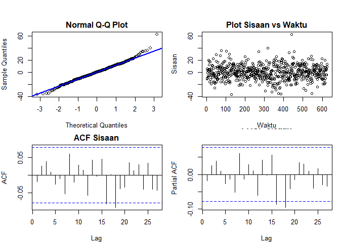<!-- -->

``` r
par(mfrow = c(1,1))
```

Berdasarkan plot kuantil-kuantil normal, titik-titik sisaan mengikuti
garis

dengan cukup baik, hanya menyimpang sedikit di kedua ujung. Plot sisaan
terhadap waktu memperlihatkan lebar pita yang relatif seragam sepanjang
waktu, mengindikasikan ragam yang homogen. Plot ACF dan PACF sisaan
tidak menunjukkan *spike* yang signifikan, sehingga secara visual sisaan
sudah saling bebas.

#### Uji Formal

``` r
#1) Sisaan Menyebar Normal
ks.test(sisaan.pm, "pnorm", mean(sisaan.pm), sd(sisaan.pm))
```

    ## 
    ##  Asymptotic one-sample Kolmogorov-Smirnov test
    ## 
    ## data:  sisaan.pm
    ## D = 0.026059, p-value = 0.7905
    ## alternative hypothesis: two-sided

 : Sisaan menyebar
normal

 : Sisaan tidak
menyebar normal

*P-value* uji KS sebesar 0,791 (\> 5%) sehingga gagal tolak
; sisaan menyebar
normal.

``` r
#2) Sisaan saling bebas/tidak ada autokorelasi
Box.test(sisaan.pm, type = "Ljung")
```

    ## 
    ##  Box-Ljung test
    ## 
    ## data:  sisaan.pm
    ## X-squared = 0.19942, df = 1, p-value = 0.6552

 : Sisaan saling
bebas

 : Sisaan tidak
saling bebas

*P-value* uji Ljung-Box sebesar 0,655 (\> 5%) sehingga gagal tolak
; sisaan saling
bebas.

``` r
#3) Sisaan homogen
Box.test((sisaan.pm)^2, type = "Ljung")
```

    ## 
    ##  Box-Ljung test
    ## 
    ## data:  (sisaan.pm)^2
    ## X-squared = 0.51436, df = 1, p-value = 0.4733

 : Ragam sisaan
homogen

 : Ragam sisaan
tidak homogen

*P-value* uji Ljung-Box pada sisaan kuadrat sebesar 0,473 (\> 5%)
sehingga gagal tolak
; ragam sisaan
**homogen**.

``` r
#4) Nilai tengah sisaan sama dengan nol
t.test(sisaan.pm, mu = 0, conf.level = 0.95)
```

    ## 
    ##  One Sample t-test
    ## 
    ## data:  sisaan.pm
    ## t = -0.00026815, df = 623, p-value = 0.9998
    ## alternative hypothesis: true mean is not equal to 0
    ## 95 percent confidence interval:
    ##  -0.9562005  0.9559394
    ## sample estimates:
    ##     mean of x 
    ## -0.0001305516

 : nilai tengah
sisaan sama dengan 0

 : nilai tengah
sisaan tidak sama dengan 0

*P-value* uji-t sebesar 0,9998 (\> 5%) sehingga gagal tolak
; nilai tengah
sisaan sama dengan nol.

Dengan demikian, model ARIMA(1,1,1) memenuhi **seluruh** asumsi
diagnostik sisaan: normalitas, kebebasan, kehomogenan ragam, dan nilai
tengah nol.

### Overfitting

``` r
#---OVERFITTING---#
model3a.pm=Arima(train.diff, order=c(2,0,1),method="ML")
summary(model3a.pm) #AIC=4897.24
```

    ## Series: train.diff 
    ## ARIMA(2,0,1) with non-zero mean 
    ## 
    ## Coefficients:
    ##          ar1     ar2      ma1    mean
    ##       0.4135  0.0525  -0.9162  0.0575
    ## s.e.  0.0468  0.0445   0.0236  0.0775
    ## 
    ## sigma^2 = 148.3:  log likelihood = -2443.62
    ## AIC=4897.24   AICc=4897.34   BIC=4919.42
    ## 
    ## Training set error measures:
    ##                         ME     RMSE      MAE MPE MAPE      MASE         ACF1
    ## Training set -0.0008932639 12.13824 9.398676 NaN  Inf 0.5498521 -0.001893751

``` r
lmtest::coeftest(model3a.pm) #ar2 tidak signifikan
```

    ## 
    ## z test of coefficients:
    ## 
    ##            Estimate Std. Error  z value Pr(>|z|)    
    ## ar1        0.413509   0.046786   8.8382   <2e-16 ***
    ## ar2        0.052466   0.044471   1.1798   0.2381    
    ## ma1       -0.916181   0.023571 -38.8690   <2e-16 ***
    ## intercept  0.057513   0.077520   0.7419   0.4581    
    ## ---
    ## Signif. codes:  0 '***' 0.001 '**' 0.01 '*' 0.05 '.' 0.1 ' ' 1

``` r
model3b.pm=Arima(train.diff, order=c(1,0,2),method="ML")
summary(model3b.pm) #AIC=4897.01
```

    ## Series: train.diff 
    ## ARIMA(1,0,2) with non-zero mean 
    ## 
    ## Coefficients:
    ##          ar1      ma1     ma2    mean
    ##       0.5524  -1.0580  0.1273  0.0575
    ## s.e.  0.1035   0.1163  0.0966  0.0764
    ## 
    ## sigma^2 = 148.2:  log likelihood = -2443.51
    ## AIC=4897.01   AICc=4897.11   BIC=4919.19
    ## 
    ## Training set error measures:
    ##                        ME   RMSE      MAE MPE MAPE      MASE        ACF1
    ## Training set -0.001015163 12.136 9.393827 NaN  Inf 0.5495684 0.001016526

``` r
lmtest::coeftest(model3b.pm) #ma2 tidak signifikan
```

    ## 
    ## z test of coefficients:
    ## 
    ##            Estimate Std. Error z value  Pr(>|z|)    
    ## ar1        0.552383   0.103508  5.3366 9.468e-08 ***
    ## ma1       -1.058034   0.116340 -9.0944 < 2.2e-16 ***
    ## ma2        0.127257   0.096644  1.3168    0.1879    
    ## intercept  0.057538   0.076418  0.7529    0.4515    
    ## ---
    ## Signif. codes:  0 '***' 0.001 '**' 0.01 '*' 0.05 '.' 0.1 ' ' 1

``` r
#model yang dipilih tetap model awal, yaitu ARIMA(1,1,1)
```

``` r
overfitting.pm <- data.frame(
  Model = c("ARIMA(1,1,1)", "ARIMA(2,1,1)", "ARIMA(1,1,2)"),
  AIC   = c(AIC(model.terbaik.pm), AIC(model3a.pm), AIC(model3b.pm)),
  BIC   = c(BIC(model.terbaik.pm), BIC(model3a.pm), BIC(model3b.pm))
)

overfitting.pm
```

    ##          Model      AIC      BIC
    ## 1 ARIMA(1,1,1) 4896.620 4914.364
    ## 2 ARIMA(2,1,1) 4897.240 4919.421
    ## 3 ARIMA(1,1,2) 4897.011 4919.191

Kedua model hasil *overfitting* memiliki AIC dan BIC yang lebih besar
dibandingkan ARIMA(1,1,1), dan parameter tambahan pada masing-masing
model (ar2 pada ARIMA(2,1,1) dan ma2 pada ARIMA(1,1,2)) tidak
signifikan. Oleh karena itu, model **ARIMA(1,1,1)** tetap dipilih
sebagai model terbaik.

### Model Terbaik: ARIMA(1,1,1)

``` r
model.terbaik.pm <- Arima(train.diff, order = c(1,0,1), method = "ML")
summary(model.terbaik.pm)
```

    ## Series: train.diff 
    ## ARIMA(1,0,1) with non-zero mean 
    ## 
    ## Coefficients:
    ##          ar1      ma1    mean
    ##       0.4174  -0.9026  0.0577
    ## s.e.  0.0494   0.0253  0.0825
    ## 
    ## sigma^2 = 148.4:  log likelihood = -2444.31
    ## AIC=4896.62   AICc=4896.68   BIC=4914.36
    ## 
    ## Training set error measures:
    ##                         ME     RMSE     MAE MPE MAPE      MASE        ACF1
    ## Training set -0.0001305516 12.15181 9.40593 NaN  Inf 0.5502765 -0.01783384

``` r
lmtest::coeftest(model.terbaik.pm)
```

    ## 
    ## z test of coefficients:
    ## 
    ##            Estimate Std. Error  z value Pr(>|z|)    
    ## ar1        0.417402   0.049365   8.4555   <2e-16 ***
    ## ma1       -0.902583   0.025333 -35.6290   <2e-16 ***
    ## intercept  0.057699   0.082493   0.6994   0.4843    
    ## ---
    ## Signif. codes:  0 '***' 0.001 '**' 0.01 '*' 0.05 '.' 0.1 ' ' 1

### Peramalan

Peramalan dilakukan menggunakan fungsi `forecast()` sepanjang data uji
(156 hari ke depan), kemudian hasil ramalan pada skala *differencing*
dikembalikan ke skala data asli menggunakan `diffinv()` dengan titik
awal berupa nilai terakhir data latih.

``` r
#---FORECAST---#
ramalan.pm <- forecast::forecast(model.terbaik.pm, h = length(test.ts))
plot(ramalan.pm)
```

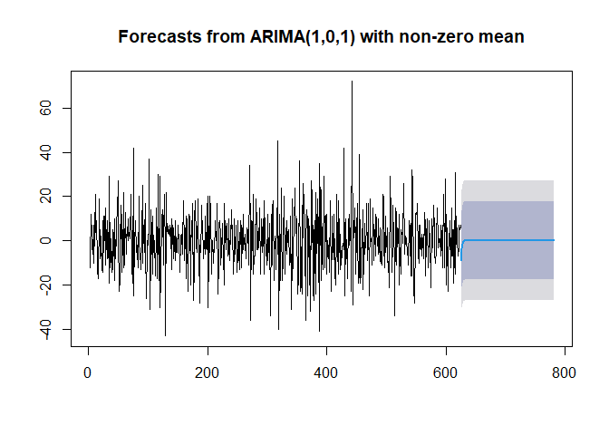<!-- -->

``` r
# Inverse differencing
pt_akhir_train <- tail(train.ts, 1)

forecast_level <- diffinv(ramalan.pm$mean, differences = 1, xi = pt_akhir_train)
hasil.pm <- forecast_level[-1]

perbandingan.pm <- data.frame(
  Aktual   = as.numeric(test.ts),
  Forecast = as.numeric(hasil.pm)
)
head(perbandingan.pm, 10)
```

    ##    Aktual Forecast
    ## 1      87 92.28889
    ## 2      74 88.68647
    ## 3      89 87.21643
    ## 4      71 86.63645
    ## 5      70 86.42798
    ## 6      85 86.37458
    ## 7      89 86.38590
    ## 8      70 86.42425
    ## 9      91 86.47387
    ## 10     85 86.52819

``` r
# Akurasi
accuracy(as.numeric(hasil.pm), as.numeric(test.ts))
```

    ##                 ME     RMSE      MAE       MPE     MAPE
    ## Test set -27.08573 34.55516 29.05362 -66.87071 68.77467

``` r
# Plot perbandingan data aktual penuh dengan hasil forecast
ts.plot(pm25.ts, col = "black", lty = 1,
        xlab = "Waktu (hari ke-)", ylab = "PM2.5",
        main = "Aktual vs Forecast PM2.5 (DKI1 Bunderan HI)")

lines((ntrain + 1):n, as.numeric(hasil.pm), col = "blue", lty = 2, lwd = 2)
legend("topleft", 
       legend = c("Data Aktual", "Forecast"),
       col = c("black", "blue"),
       lty = c(1,2), lwd = c(1,2), bty = "n")
```

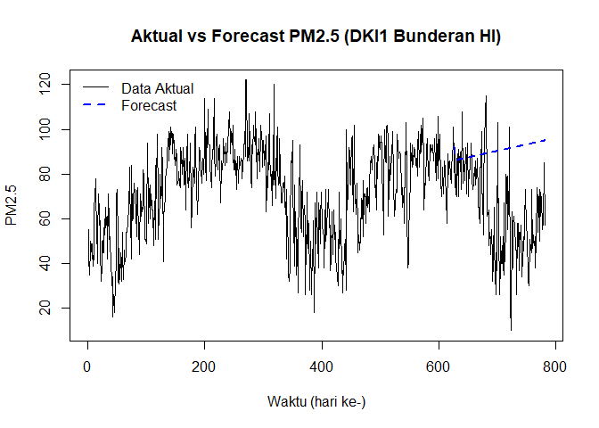<!-- -->

Nilai ramalan model ARIMA(1,1,1) memperlihatkan tren yang meningkat
secara perlahan dan cenderung linier mengikuti rataan perubahan
(*drift*) harian pada data latih. Pada horizon peramalan yang panjang
(156 hari), pola ini tidak mampu mengikuti pola musiman turun-naik pada
data uji (yang justru berada pada fase penurunan musiman menuju awal
tahun 2025), sehingga akurasi peramalan untuk horizon sepanjang ini
relatif rendah (RMSE

34,6 dan MAPE

68,8%).

### Kesimpulan

Data PM2.5 stasiun DKI1 (Bunderan HI) **tidak stasioner** baik dalam
rataan (uji ADF: p-value = 0,0544) maupun ragam (Box-Cox:
,
selang kepercayaan tidak memuat satu) pada kondisi awal. Setelah
dilakukan *differencing* satu kali (d=1), data menjadi stasioner dalam
rataan (uji ADF: p-value = 0,01) sekaligus dalam ragam (Box-Cox pada
data
ter-*shift*:,
selang memuat satu), sehingga tidak diperlukan transformasi Box-Cox
tambahan.

Model **ARIMA(1,1,1)** terpilih sebagai model terbaik karena memiliki
AIC dan BIC terendah di antara model tentatif, seluruh parameter AR dan
MA signifikan, tidak terkalahkan oleh model hasil *overfitting*, serta
**lolos seluruh uji diagnostik sisaan** (normalitas, kebebasan,
kehomogenan ragam, dan nilai tengah nol) di mana hal tersebut merupakan
hasil yang sangat baik untuk kecocokan model dalam sampel (*in-sample
fit*).

Namun demikian, pada horizon peramalan yang panjang (156 hari), performa
ramalan model ini relatif kurang baik (RMSE

34,6;MAPE

68,8%) karena data memiliki pola musiman tahunan yang tidak dapat
ditangkap oleh model ARIMA non-musiman. Model ARIMA(1,1,1) pada dasarnya
berasumsi bahwa laju perubahan (*drift*) harian bersifat konstan,
sehingga untuk horizon yang panjang, ramalan cenderung bergerak searah
drift tersebut alih-alih mengikuti pola naik-turun musiman yang
sesungguhnya. Untuk hasil peramalan jangka panjang yang lebih akurat
pada data ini, dapat dipertimbangkan pendekatan model musiman seperti
**SARIMA** yang secara eksplisit menangkap pola tahunan tersebut, atau
membatasi horizon peramalan pada jangka yang lebih pendek (misalnya 7-30
hari ke depan) di mana asumsi *drift* konstan lebih realistis.
